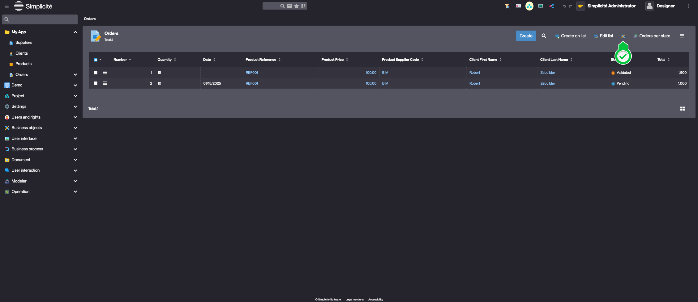
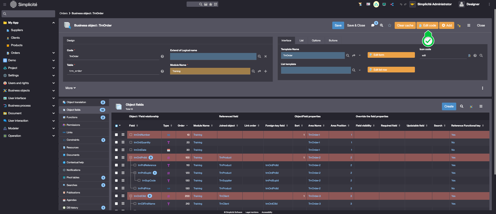
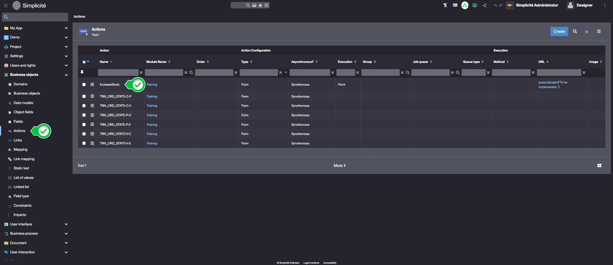
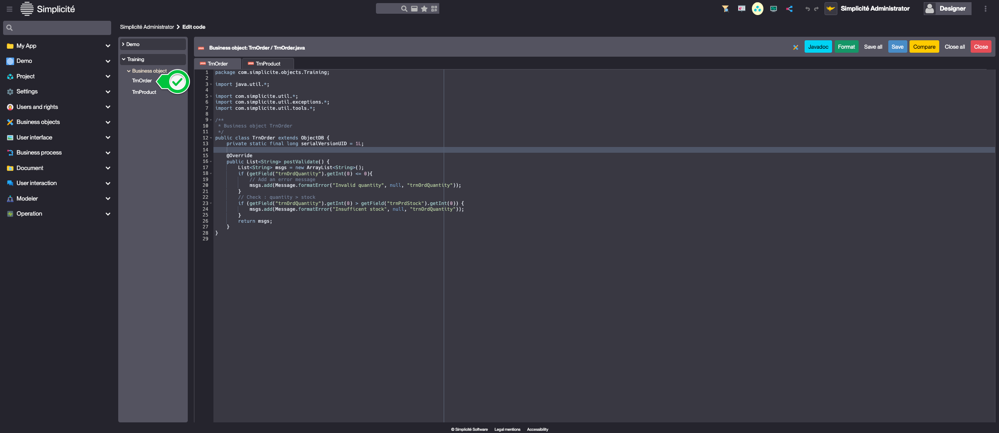
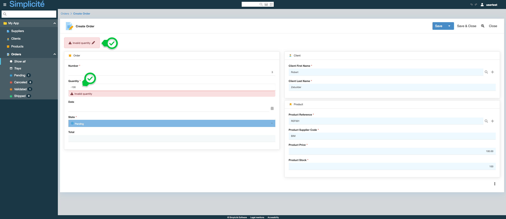
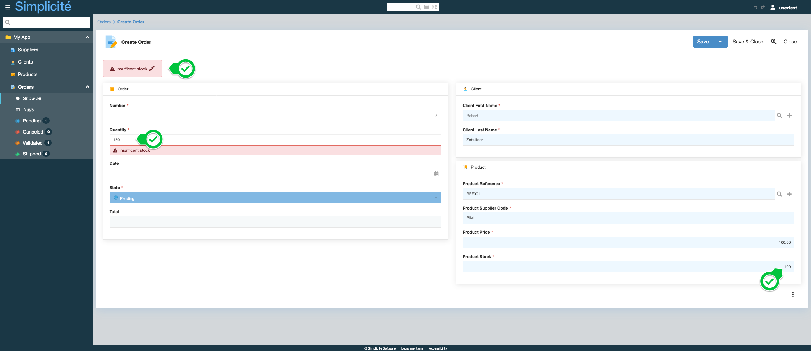

# Building the "Order Management" Training App : Coding business rules - Hooks

> Prerequisite : [The Order object has a state model](/tutorial/expanding/states) and [Product object has an Action](/tutorial/expanding/actions)

## What is a Hook ?

In Simplicité, Hooks allow you to extend the default behavior of business objects by overriding key lifecycle methods in Java or JavaScript, enabling advanced custom logic and processing... [Learn more](/docs/core/objects/businessobject-code-hooks)

## Adding business rules to the Order Business object 

### The order quantity cannot be less than 0

To add this business rule, override the `postValidate` hook by following the steps below :
1. Open the **TrnOrder** Object :
	- Via the list of Orders, click on the *Go to object definition* button  
		
	> This is available if your designer user is granted to TRN_SUPERADMIN
	- Via the **Business objects > Business objects** menu
2. Click **Edit code**, select **Java** and click **Confirm**  
		
3. Override the `postValidate` method with the following implementation :
	> The `postValidate` hook is called after the platform's `validate()` and is used to to add validation rules. For more information, see [Hooks](/docs/core/objects/businessobject-code-hooks#pre-and-post-validation-hooks)
```java 
@Override
public List<String> postValidate() {
	List<String> msgs = new ArrayList<String>();
	if (getField("trnOrdQuantity").getInt(0) <= 0){
		// Add an error message
		msgs.add(Message.formatError("Invalid quantity", null, "trnOrdQuantity"));
	}
	return msgs;
}
```
4. Click **Save** or use the keyboard shortcut : <kbd>Ctrl</kbd>+<kbd>S</kbd>

### The order quantity cannot exceed the product's amount of stock  

To add this business rule, update the `postValidate` hook by following the steps below :

1. Add the Product's **Stock** field to the Order object
	> For a detailed guide, see : [Adding a joined field](/tutorial/expanding/calculated-fields#add-the-product-price-field-to-the-order-business-object)
2. Click **Edit code** on the **TrnOrder** object's form
3. Update the `postValidate()` implementation :
```java
@Override
public List<String> postValidate() {
	List<String> msgs = new ArrayList<String>();
	if (getField("trnOrdQuantity").getInt(0) <= 0){
		// Add an error message
		msgs.add(Message.formatError("Invalid quantity", null, "trnOrdQuantity"));
	}
	// Check : quantity > stock
	if (getField("trnOrdQuantity").getInt(0) > getField("trnPrdStock").getInt(0)) {
		msgs.add(Message.formatError("Insufficient stock", null, "trnOrdQuantity"));
	}
	return msgs;
}
```

### Implement back-end code for the Product's "Increase Stock" action {#increase-stock-method}

To implement back-end code for the Increase stock action, follow the steps below : 
1. In the **Business objects > Actions** menu, open **Increase Stock**  
	 
2. Update the Action's information like so : 
	- Execution : **Back**
	- Method : **increaseStock**  
	- URL : **empty**
	 
3. Click **Save & Close**
4. In the **Business objects > Business objects** menu, open **TrnProduct**
5. Click **Edit code**, select **Java** and click **Confirm**  
6. Declare the `increaseStock` method in the `TrnProduct` class  
```java
public void increaseStock(){
	ObjectField prdStock = this.getField("trnPrdStock");
	prdStock.setValue(prdStock.getInt(0)+10);
	save();
}
```
7. Click **Save** or use the keyboard shortcut : <kbd>Ctrl</kbd>+<kbd>S</kbd>

### Decrease the Product's stock when an Order is validated

To add this business rule, override the `postUpdate` hook by following the steps below :
1. Open the **Code editor** :
	- Via the shortcut :  
		 
	- Via the keyboard shortcut : <kbd>Alt</kbd>+<kbd>X</kbd>
2. Open the **TrnOrder** Class    
	   
3. Override the `postUpdate` hook :
	> Use <kbd>Ctrl</kbd>+<kbd>Space</kbd> to browse code snippets
```java
@Override
public String postUpdate() {
	Grant g = getGrant();
	// Get the TrnProduct's temporary instance
	ObjectDB prd = g.getTmpObject("TrnProduct");
	// Pending -> Validated state transition
	if ("P".equals(getOldStatus()) && "V".equals(getStatus())){
		try {	        
			synchronized(prd.getLock()){
				// select = load into the instance the values in the database corresponding to a technical key (id)
				prd.select(getFieldValue("trnOrdPrdId"));
				// read the quantity ordered on the current instance and the stock of the product on the loaded instance
				int orderedQuantity = getField("trnOrdQuantity").getInt(0);
				int stock = prd.getField("trnPrdStock").getInt(0);
				// change the stock quantity of the loaded instance
				prd.getField("trnPrdStock").setValue(stock-orderedQuantity);
				// write the instances data into the database
				prd.getTool().validateAndSave();
			}
		} catch (ValidateException | SaveException e) {
			AppLog.error(e, g);
		}
	}
	return super.postUpdate();
}
```
## Test the Business rules with the usertest User

Clear the platform's cache and log in using *usertest*
> For a detailed step-by-step, see : [Testing the User](/tutorial/getting-started/user#activating-and-testing-the-user)

:::tip[Success]

- When creating an Order with a negative quantity, an error occurs



-  When creating an Order with a quantity exceeding the product's amount of stock, an error occurs



- When clicking on "Increase stock" on a Product, upon confirmation, it's stock is incremented by 10
- When an Order is Validated the quantity is deducted from the Product's stock

:::
