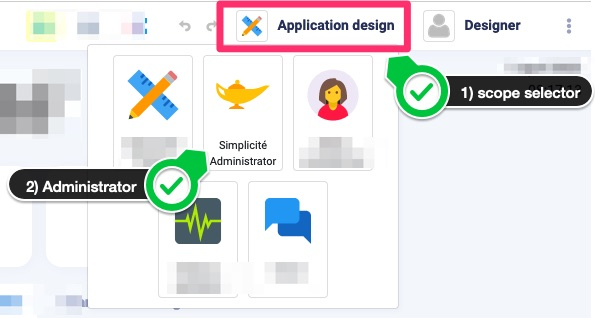
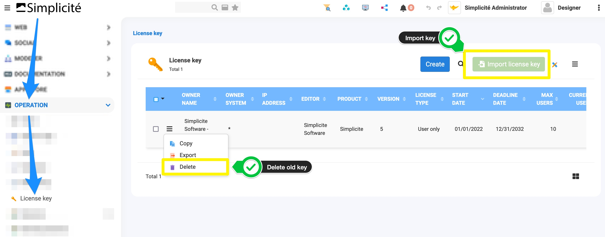

License key installation
========================

License keys are delivered to you as XML files that must be imported in your instance. The import can be done:

- through the UI,
- by calling a webservice

Using the generic web UI
------------------------

> This manual is generic for Simplicité instances, always refer to your app's instructions first.

### 1) Connect to your app

You should connect as the `designer` super-user (or any user that has rights on the `LicenceKey` meta-object).

### 2) Use the right scope

Check the you are on the **“Simplicité Administrator”** scope

:::note
Sometimes, **if the license is expired, the scope selector might not be accessible!!!** In this case, the trick
is to use the address bar to change scope, by adding `/ui?scope=Home` to your app’s URL.
:::

<details>
<summary>See image</summary>



</details>

### 3) Access the **License Key** Object

- Go to Operations > License key



### 4) Delete old key

- delete the old key (see image in #3)

Using a generic service
-----------------------

Call a service interface: I/O (preferred) or API to create or update the license key record
(see [integration interfaces](/docs/integration/webservices/io-commandline) for details).

Example using the I/O service interface:

```shell
curl -u designer:mydesignerpassword --form service=xmlimport --form file=@/my/path/to/license.xml http(s)//myhost[:myport][/mycontextroot]/io
```
