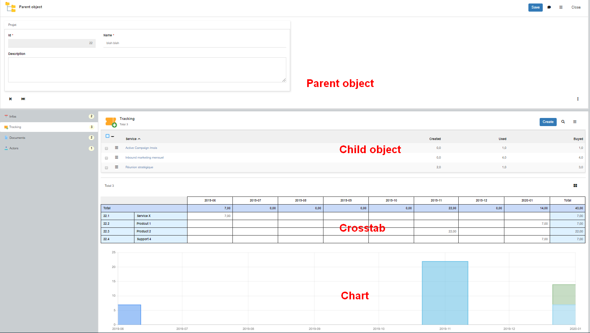
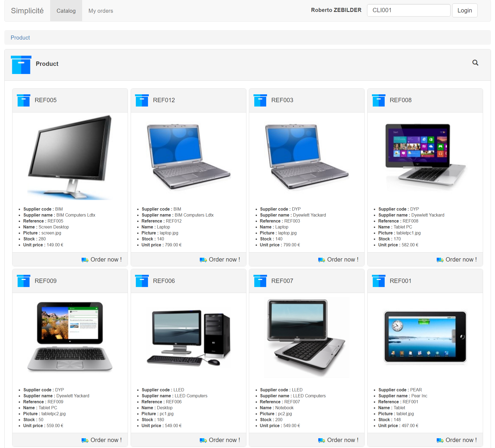
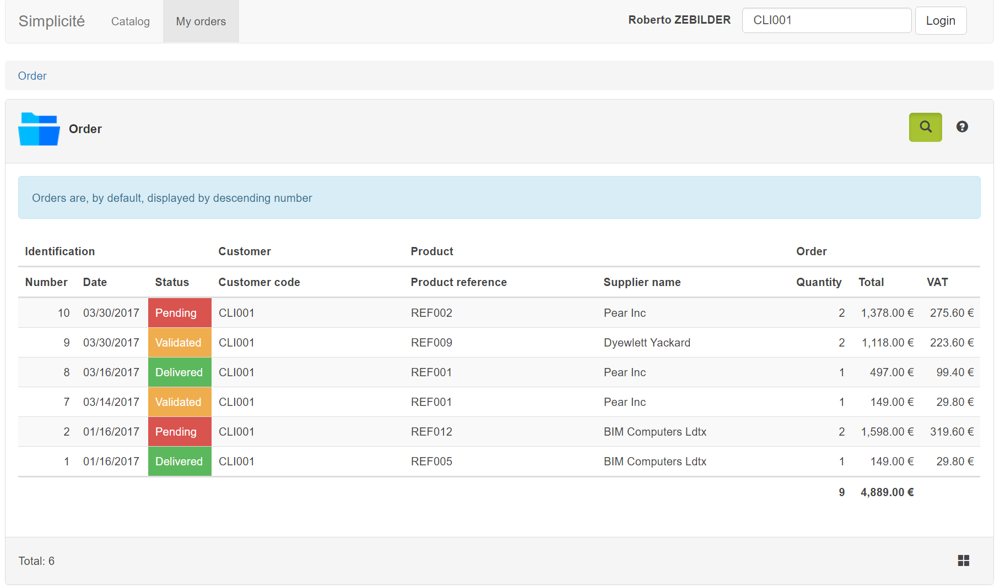
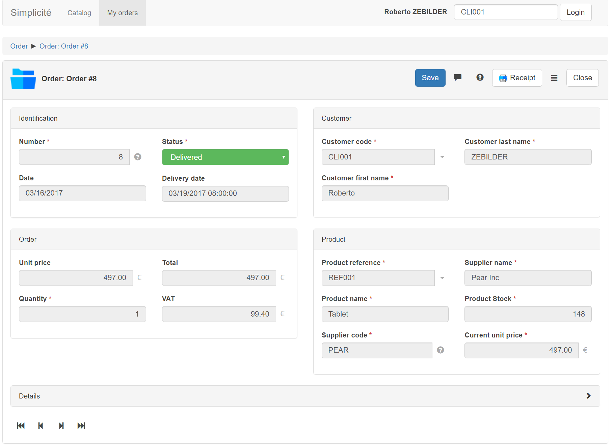
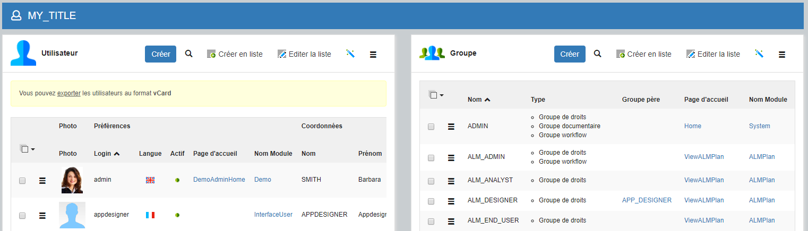

Responsive UI
=============

This document explains the UI engine for responsive usage (applicable to version 4.0 and above).

Conception
----------

The responsive UI is based on the disposition `responsive` with a simple startup and site parts configured as disposition resources:

- HTML part `MAIN`: the main container with parts
- HTML part `HEADER`: logo, global search, shortcuts, profile, multi-apps button
- HTML part `FOOTER`: legals information
- HTML part `MENU`: main site menu
- HTML part `WORK`: work area with navigation and current content
- CSS stylesheet `STYLES`: optional styles
- JavaScript `SCRIPT`: optional javascript

The engine is a common MVC (Model-View-Controller) interface:

### Model

The main site is loaded once with its disposition resources, then the UI exchanges metadata and data with the back-end.

- `Simplicite.Ajax`: the model uses the Ajax services and IO interfaces to dialog with the back-end.

### View

The view layer provides the rendering with several functions:

- `Simplicite.UI.View.Main`: view initialization, global tools
- `Simplicite.UI.View.Form`: displays the object form
- `Simplicite.UI.View.List`: displays the object list, rows or summaries
- `Simplicite.UI.View.Search`: displays the search dialog
- `Simplicite.UI.View.Index`: displays the index searches
- `Simplicite.UI.View.Board`: display the navigation, home page, view of items and metrics
- `Simplicite.UI.View.Menu`: displays the menu
- `Simplicite.UI.View.Social`: displays the social posts and the followers
- `Simplicite.UI.View.Tray`: displays the trays view
- `Simplicite.UI.View.Update`: displays the bulk-update screen
- `Simplicite.UI.View.Workflow`: displays the screen flows with activities
- `Simplicite.UI.View.Prefs`: displays the object preferences
- `Simplicite.UI.View.Widget`: displays some simple widget (i.e. badge, avatar, loader, switch, completion...)
- `Simplicite.UI.View.ZIP`: simple ZIP editor to remove/add file in folders

**Extension**: the engine needs a renderer tool, only one component have been yet released:

- `Simplicite.UI.View.bootstrap`: contains widgets based on bootstrap (i.e. field rendering, dialog box, panels, tabs, buttons...)

**Styles**: the engine loads also the user's theme:

- `default`: Simplicité default theme (grey, blue and green)
- `dark`: black & white theme
- `light`: neutral white & grey theme to customize

### Controller

The controller provides the business logic between the model and the view:

- `Simplicite.UI.Engine`: the main UI controller which loads components, call the Ajax services and manages the View rendering
- `Simplicite.UI.Globals`: global options (see table below)
- `Simplicite.UI.Navigator`: main navigation
- `Simplicite.UI.PlaceMap`: controls the Google Maps rendering
- `Simplicite.UI.Tray`: controls the Tray rendering of state models
- `Simplicite.UI.Charts`: controls the chart rendering provided by ChartJS
- `Simplicite.UI.Workflow`: controls the workflow rendering
- `Simplicite.UI.Calendar`: controls the fullcalendar rendering

All the rendering will be made by the browser in one-page based on JQuery and Bootstrap.
Most functions have been implemented on responsive UI, other functions are only wrapped in an iframe with the backend rendering
(i.e. crosstab, script editor).

External libs
-------------

This engine integrates some popular third party libraries:

- JQuery
- Bootstrap
- Ace editor for code edit
- TinyMCE for rich text edit
- ChartJS for charting
- Etc.

Global properties
-----------------

`Simplicite.UI.Globals` contains all the default options that will be used by each object.
Each UI object gets a copy in `obj.locals.ui` to override the default behaviors.

Options can be changed in :

- Globals: `$ui.options` or `obj.ui.options`
- Locals: globals are copied in `obj.locals.ui`

### Simplicite.UI.Globals

| Name                         | Description                                                             | Default value                              |
|------------------------------|-------------------------------------------------------------------------|--------------------------------------------|
| container                    | Optional UI location                                                    | null = 'body'                              |
| resources                    | Optional list of resources to load                                      | null = [MAIN, HEADER, FOOTER, MENU, WORK]  |
| context                      | UI launcher: object, name, rowId                                        | null = current disposition                 |
| theme                        | CSS theme                                                               | null = 'default'                           |
| themes                       | Themes to switch, null: no switch available                             | ['default','light','dark']                 |
| font                         | Specific Google font name                                               | null = none                                |
| fontSize                     | Specify the default font-size at top level (for rem sizing)             | 100%                                       |
| compact                      | Compacted mode to gain height                                           | false                                      |
| defaultContentLoad           | Optional handler when a content is displayed                            |                                            |
| defaultContentUnload         | Optional handler when a content is replaced                             |                                            |
| onload                       | Optional page loaded called before the ready callback                   |                                            |
| onbeforeunload               | Optional page before unload                                             |                                            |
| onunload                     | Optional page unload                                                    |                                            |
| useMainParts                 | Must the engine load the default main page ?                            | true                                       |
| useSocial                    | Is the social function active ?                                         | true                                       |
| socialShare                  | Sharing options                                                         | SOCIAL_SHARE parameter                     |
| useCopyLink                  | Allows to copy deeplink to objects                                      | true                                       |
| useUndoRedo                  | Allows undo/redo: true, false or "keys" for CTRL-Y/Z only               | true                                       |
| shortcuts                    | true/false or list of shortcuts `{name, label, url, target, icon}`      | true                                       |
| slideNav                     | Slide screen on push/pull navigation ?                                  | true                                       |
| tinymceOptions               | tinymce default options                                                 |                                            |
| ajaxSetup                    | Ajax global options                                                     | see below                                  |
| scope                        | Multi-apps options                                                      | see below                                  |
| exports                      | Export default options `{ CSV, XLS, PDF, ARC, XML, ZIP }`               | see below                                  |
| list                         | Object list default options                                             | see below                                  |
| form                         | Object form default options                                             | see below                                  |
| search                       | Object search default options                                           | see below                                  |
| summary                      | Object summary default options                                          | see below                                  |

### Simplicite.UI.Globals.ajaxSetup

| Name                         | Description                                                             | Default value                              |
|------------------------------|-------------------------------------------------------------------------|--------------------------------------------|
| crossDomain                  | Use CORS HTTP access ?                                                  | true                                       |
| xhrFields                    | Force some xhr values                                                   | `{ withCredentials: true }`                |

### Simplicite.UI.Globals.scope

| Name                         | Description                                                              | Default value                              |
|------------------------------|--------------------------------------------------------------------------|--------------------------------------------|
| enabled                      | true/false or array of authorized scopes `{home, url, icon, label, help}`| true                                       |
| backend                      | allows to return to backend ?                                            | true                                       |

### Simplicite.UI.Globals.exports

| Name                         | Description                                                             | Default value                                              |
|------------------------------|-------------------------------------------------------------------------|------------------------------------------------------------|
| CVS                          | CVS export options                                                      | `{ enabled:true, sep:';' }`                                |
| XLS                          | Excel export options                                                    | `{ enabled:true, formats: { poi: "Excel", html: "HTML" }}` |
| PDF                          | PDF export options                                                      | `{ enabled:true }`                                         |
| ARC                          | Archive export options                                                  | `{ enabled:true }`                                         |
| XML                          | Simplicite XML export options                                           | `{ enabled:true, inline:true, timestamp:false }`           |
| ZIP                          | Simplicite ZIP export options                                           | `{ enabled:true }`                                         |

### Simplicite.UI.Globals.list

<!-- markdownlint-disable table-column-style -->
| Name                               | Description                                                             | Default value                              |
|------------------------------------|-------------------------------------------------------------------------|--------------------------------------------|
| container                          | target container for the list                                           | '#work' if undefined                       |
| beforeload\(ctn,obj\)              | optional trigger before loading the list data                           |                                            |
| preload\(ctn,obj,params\)          | optional trigger before rendering the list (data loaded)                |                                            |
| onload\(ctn,obj,params\)           | optional trigger when list is displayed                                 |                                            |
| onunload\(ctn,obj,params\)         | optional trigger before unloading the list                              |                                            |
| onloadrow\(ctn,obj,id,item,tr\)    | optional trigger when a row is displayed                                |                                            |
| onunloadrow\(ctn,obj,id,item,tr\)  | optional trigger before unloading a row                                 |                                            |
| display\(ctn,obj,params,cbk\)      | optional function to override default rendering                         |                                            |
| title                              | list title                                                              | object label                               |
| minified                           | false: displays rows as table records or true: summaries                | false                                      |
| minifiable                         | allows to switch rendering rows to summaries                            | true                                       |
| layout                             | minified obj-grid layout "article", "masonry", "inline" or "float"      | 'masonry'                                  |
| areas                              | array of field-areas to display on header row                           | visible areas                              |
| columns                            | array of fields/columns to display                                      | visible fields on list                     |
| rows                               | array of rows to display [ items ]                                      | result of search service                   |
| sort                               | allows the sort by columns                                              | true                                       |
| search                             | allows search by 'column', 'popup' or 'docked' dialog                   | 'popup'                                    |
| groupBy                            | flag to group fields if specified                                       | false                                      |
| filters                            | optional filters - override object filters and updatable by user        |                                            |
| fixedFilters                       | optional fixed filters - override filters and not updatable by user     |                                            |
| forceSearch                        | show the search dialog when the list is opened                          |                                            |
| showFilters                        | show each user filter on top of list                                    | true if PANEL_FILTER=yes                   |
| showSearchInlined                  | show/hide the inlined search by columns                                 | false                                      |
| showIndex                          | show the fulltext search                                                | metadata.indexable                         |
| indexRequest                       | current index search request                                            |                                            |
| oncreate                           | create handler, null or false: no creation                              | bind create action if granted              |
| actions                            | arrays `{ list, listPlus, row, rowPlus }` of actions `{name, label, confirm, callback, showLabel, ...}`<br/>null:no action | metadata.actions |
| floating                           | ensure some actions to stay visible during vertical scrolling           | true                                       |
| sticky                             | ensure table header to stay visible during vertical scrolling (V5)      | true                                       |
| onopen\(ctn,obj,rowId\)            | handler when record is opened/clicked                                   | engine.openObject                          |
| onhelp\(ctn,obj\)                  | handler to display the long help                                        | engine.displayHelp                         |
| onsavecell\(ctn,obj,id,f,index\)   | handler to save the editable field by cell                              | engine.saveField                           |
| showAreaTitles                     | show area titles                                                        | true                                       |
| renderTitle\(obj,fld,label\)       | optional title rendering                                                |                                            |
| renderValue\(obj,fld,val\)         | optional cell rendering                                                 |                                            |
| rowActionsRight                    | true to display actions on the right side                               | false                                      |
| followLinks                        | allows references navigation                                            | true                                       |
| rowOpenDocs                        | add links to open documents and images                                  | true                                       |
| isExtended                         | show/hide extended fields on list, except creation                      | false                                      |
| msg                                | array of messages to display on list                                    |                                            |
| msgRow                             | array of row messages `{rowId:[msg]}` to display per rowId              |                                            |
| help                               | contextual help                                                         |                                            |
| nav                                | optional navigation 'new' or 'add'                                      |                                            |
| showNav                            | displays the navigation bar                                             | true                                       |
| showTotals                         | displays the total row if any                                           | true                                       |
| context                            | list context LIST, PANEL, UPDATE                                        | Simplicite.CONTEXT_LIST                    |
| inst                               | optional instance name                                                  | `the\_ajax\_<name>`                        |
| parent                             | optional parent object for panel                                        |                                            |
| view                               | optional view container `{ name, item, home }`                          |                                            |
| edit                               | edit list current mode = 'newline' or 'rows'                            |                                            |
| listEdit                           | allows to edit cells ?                                                  | from metadata                              |
| addEdit                            | allows to add row on list ?                                             | from metadata                              |
| bulkDelete                         | allows bulk deletion on list ?                                          | from metadata                              |
| bulkUpdate                         | allows bulk update on list ?                                            | from metadata                              |
| selectRows                         | can select rows for bulk actions ?                                      |                                            |
| onSelectRow                        | select row handler                                                      | call service                               |
| template                           | list template                                                           | see below                                  |
<!-- markdownlint-enable table-column-style -->

```html
<div class="objlist">
    <div class="panel panel-default panel-list">
        <div class="panel-heading">
            <div class="head">
                <div class="obj-title">
                    <span class="icon-title"/> <!-- object icon/image -->
                    <div>
                        <h4 class="form-title"/> <!-- object title -->
                        <div>
                            <div class="list-count"/> <!-- total rows -->
                            <div class="list-pages"/> <!-- page/nb pages -->
                        </div>
                    </div>
                </div>
                <div class="list-filters"/>   <!-- list filters -->
                <div class="list-actionbar"/> <!-- list actions -->
            </div>
        </div>
        <div class="panel-body">
            <form autocomplete="off" onsubmit="return false;"/> <!-- table or summaries -->
        </div>
        <div class="panel-footer">
            <div class="list-footer">
                <div class="list-count"/>     <!-- total rows -->
                <div class="list-pages"/>     <!-- page/nb pages -->
                <div class="list-more"/>      <!-- more columns toggle -->
                <div class="list-navbar"/>    <!-- pages nav bar -->
                <div class="list-rows"/>      <!-- rows per page -->
                <div class="list-minify"/>    <!-- minify toggle -->
                <div class="list-groupby"/>   <!-- group-by toggle -->
            </div>
        </div>
    </div>
</div>
```

:::note

- if the global template is changed, all lists will be impacted
- elements can be moved or added for specific rendering
- classes are used to map the dynamic contents (icon-title...)
- add classes / media queries to hide sections on XS device (e.g. `hidden-xs` to hide the icon)

:::

### Simplicite.UI.Globals.form

<!-- markdownlint-disable table-column-style -->
| Name                            | Description                                                             | Default value                              |
|---------------------------------|-------------------------------------------------------------------------|--------------------------------------------|
| container                       | target container for the form                                           | '#work' if undefined                       |
| beforeload\(ctn,obj,params\)    | optional trigger before loading the form data                           |                                            |
| preload\(ctn,obj,params\)       | optional trigger before rendering the form (data loaded)                |                                            |
| onload\(ctn,obj,params\)        | optional trigger when form is displayed                                 |                                            |
| onunload\(ctn,obj,params\)      | optional trigger before unloading the form                              |                                            |
| noRowFound\(ctn,obj,id\)        | optional hook if the requested record is not found                      | alert `NO_ROW_FOUND` + redirect to the list|
| display\(ctn,obj,params,cbk\)   | optional function to override default rendering                         |                                            |
| title                           | form title                                                              | userkey label                              |
| titleMax                        | form title max length (ellipsis)                                        | 120                                        |
| values                          | fields values                                                           | result of get service                      |
| beforesave\(ctn,obj,index,cbk\) | handler before save the form, cbk(true/false) to continue, stop save    |                                            |
| aftersave\(ctn,obj,index,msgs\) | handler after save the form, cbk(true/false) to continue, stop          |                                            |
| onsave\(ctn,obj,cbk\)           | handler to save the form                                                | engine.saveForm                            |
| onsaveclose\(ctn,obj,cbk\)      | handler to save and close the form                                      | engine.saveForm + closeForm                |
| onsavenew\(ctn,obj,cbk\)        | handler to save and create                                              | engine.saveForm + create                   |
| onsavecopy\(ctn,obj,cbk\)       | handler to save and copy                                                | engine.saveForm + copy                     |
| onclose\(ctn,obj\)              | handler to close form                                                   | engine.closeForm                           |
| activateSaveOnChange            | activate the save button only on change event ?                         | false                                      |
| actionAutoSave                  | auto-save form on custom action                                         | true                                       |
| onhelp\(ctn,obj\)               | handler to display the long help                                        | engine.displayHelp                         |
| onsocial\(ctn,obj\)             | handler to display the social posts                                     | engine.displaySocial                       |
| actions                         | `{ form, formPlus }` arrays of actions `{name, label, confirm, callback...}`<br />null:no action | metadata.actions  |
| transitions                     | arrays of transition actions `{name, label, confirm, callback...}`<br />null: no transition |                        |
| floating                        | ensure some actions to stay visible during vertical scrolling           | true                                       |
| readonly                        | read only applies on fields<br />use onsave/onclose/actions/transitions to disable buttons |                         |
| isExtended                      | show/Hide extended fields on form                                       | false                                      |
| msg                             | optional array of messages                                              |                                            |
| help                            | contextual help                                                         |                                            |
| nav                             | optional navigation 'new' or 'add'<br />to navigate on list 'first', 'prev', 'next' or 'last' |                      |
| showNav                         | displays the navigation bar                                             | true                                       |
| showOptions                     | displays the options menu                                               | true                                       |
| showAreas                       | displays fields areas in 'tabs' or 'split' mode if no UI template       | 'tabs'                                     |
| showViews                       | displays views/links, true/false,  'tabs', 'vertical' or 'split'        | 'vertical'                                 |
| followLinks                     | allows references navigation                                            | true                                       |
| createLinks                     | allows references creation                                              | true                                       |
| formTab                         | selected tab index per tab area                                         |                                            |
| viewTab                         | selected view                                                           | metadata.defaultView                       |
| inst                            | optional instance name                                                  | `the\_ajax\_<name>`                        |
| copy                            | gets the item for copy                                                  | false                                      |
| workflow                        | displays the form within a workflow                                     | false                                      |
| parent                          | optional parent object `{ name, inst, field, rowId }`                   |                                            |
| constraints                     | applies object constraints                                              | true                                       |
| areaColumn                      | default columns per area without UI template                            | 2                                          |
| template                        | form template                                                           | see below                                  |
<!-- markdownlint-enable table-column-style -->

```html
<div class="objform">
    <div class="panel panel-default">
        <div class="panel-heading">
            <div class="head">
                <div class="obj-title">
                    
                    <h4 class="form-title"/>
                    <div class="obj-usages"/>
                </div>
                <div class="form-actionbar"/>
            </div>
        </div>
        <div class="panel-body">
            <form autocomplete="off" class="panel-form" onsubmit="return false;">
                <div class="form-areas"/>
            </form>
            <div class="form-navbar"/>
        </div>
    </div>
</div>
```

:::note

- if the global template is changed, all forms will be impacted
- classes are used to map the dynamic contents (icon-title...)
- add classes / media queries to hide sections on XS device (ex: `hidden-xs` to hide the icon)
- elements can be moved or added for specific rendering :

:::

| Type      | Element                                                                   |
|-----------|---------------------------------------------------------------------------|
| AREA      | `<div class="area" data-area="2,3,4,view,obj;ref:="/>`                    |
| EXTERN    | `<div class="extern" data-extern="extobjname"/>`                          |
| ACTION    | `<div class="action" data-action="name"/>`                                |
| FIELD     | `<div class="field" data-field="fullinput"></div>`                        |
| LABEL     | `<div\|span class="field" data-field="fullinput" data-display="label"/>`  |
| VALUE     | `<div\|span class="field" data-field="fullinput" data-display="value"/>`  |
| INPUT     | `<div class="field" data-field="fullinput" data-display="input"/>`        |
| IMAGE     | `<div class="field" data-field="fullinput" data-display="image"/>`        |
| DOC       | `<div class="field" data-field="fullinput" data-display="preview"/>`      |
| TEXT      | `<span\|div\|h1... class="text" data-text="code"/>`                       |
| BUTTON    | `<button\|div class="btn" data-obj="" data-rowid=""/>`                    |

### Simplicite.UI.Globals.search

| Name                         | Description                                                             | Default value                              |
|------------------------------|-------------------------------------------------------------------------|--------------------------------------------|
| beforeload\(ctn,obj\)        | optional trigger before loading the search                              |                                            |
| onload\(ctn,obj\)            | optional trigger when form is displayed                                 |                                            |
| onunload\(ctn,obj\)          | optional trigger before unloading the form                              |                                            |
| display\(ctn,obj,params,cbk\)| optional function to override default rendering                         |                                            |
| title                        | form title                                                              | object label                               |
| msg                          | optional messages                                                       |                                            |
| help                         | contextual help                                                         |                                            |
| fields                       | searchable fields                                                       | from metadata                              |
| fixedFilters                 | optional fixed filters - override filters and not updatable by user     |                                            |
| showSorting                  | displays the column sorting                                             | true                                       |
| showIndex                    | displays the fulltext search                                            | metadata.indexable                         |
| isExtended                   | show/hide fields on search form                                         | false                                      |
| minified                     | is parent list minified?                                                | false                                      |
| inst                         | optional instance name                                                  |                                            |
| position                     | 'popup' or 'docked'                                                     |                                            |
| dockable                     | is dockable near the list? (deprecated 6.3)                             | true                                       |
| pinable                      | is pinable on column fields? (deprecated 6.3)                           | false                                      |

### Simplicite.UI.Globals.summary

<!-- markdownlint-disable table-column-style -->
| Name                         | Description                                                             | Default value                              |
|------------------------------|-------------------------------------------------------------------------|--------------------------------------------|
| beforeload\(ctn,obj\)        | optional trigger before loading the summary                             |                                            |
| onload\(ctn,obj\)            | optional trigger when summary is displayed                              |                                            |
| actions                      | `{ row, rowPlus }` of actions `{name, label, confirm, callback...}`<br />null: no action | from metadata             |
| icon                         | show the object icon                                                    | true                                       |
| image                        | show the object first image                                             | true                                       |
| fields                       | list of fields, null: no field                                          | visible on list and not empty              |
| maxFields                    | limit fields size, 0: no field                                          | 10                                         |
| layout                       | search index obj-grid layout 'article', 'masonry', 'inline' or 'float'  | 'masonry'                                  |
| template                     | summary template                                                        | see below                                  |
<!-- markdownlint-enable table-column-style -->

```html
<div class="obj-summary">
    <div class="obj-body">
        <div class="title">
            
            <div>
                <h4 class="obj-title"/>
                <h5 class="obj-label"/>
            </div>
        </div>
        <div class="image">
            
        </div>
        <div class="obj-fields"/>
        <div class="obj-addons"/>
    </div>
    <div class="obj-actions"/>
</div>
```

:::note

- elements can be moved or added for specific rendering:

:::

| Type      | Element                                                  |
|-----------|----------------------------------------------------------|
| ACTION    | `<div class="action" data-action="name"/>`               |
| FIELD     | `<span\|div\|img class="field" data-field="fullinput"/>` |
| TEXT      | `<span\|div class="text" data-text="code"/>`             |
| BUTTON    | `<button\|div class="btn" data-obj="" data-rowid=""/>`   |

### Simplicite.UI.Globals.agenda

<!-- markdownlint-disable table-column-style -->
| Name                         | Description                                                             | Default value                                          |
|------------------------------|-------------------------------------------------------------------------|--------------------------------------------------------|
| beforeload\(ctn,obj,agd\)    | optional trigger before loading the calendar                            |                                                        |
| onload\(ctn,obj,agd\)        | optional trigger when form is displayed                                 |                                                        |
| onunload\(ctn,obj,agd\)      | optional trigger before unloading the form                              |                                                        |
| minTime                      | optional minimum time                                                   | '00:00:00'                                             |
| maxTime                      | optional maximum time \(exclusive\)                                     | '24:00:00'                                             |
| startTime                    | optional work time start                                                | Agenda start or '09:00'                                |
| endTime                      | optional work time end                                                  | Agenda end or '18:00'                                  |
| snap                         | optional snap duration                                                  | Agenda quantum or '00:05:00'                           |
| slot                         | optional slot duration                                                  | Agenda quantum or '00:30:00'                           |
| height                       | optional height \(in px, auto or function\)                             | 800                                                    |
| login                        | optional user login filter                                              |                                                        |
| group                        | optional group name filter                                              |                                                        |
| date                         | optional date to display                                                | today                                                  |
| click\(event\)               | optional open event handler                                             | Open event form                                        |
| select\(start,end\)          | optional range selection handler                                        | Open creation form                                     |
| drop\(event,delta,revert\)   | optional drag&drop handler                                              | Update the event date in DB, revert if no allowed      |
| resize\(event,delta,revert\) | optional event resizing handler                                         | Update the event duration in DB, revert if not allowed |
| title\(obj,item\)            | optional title handler                                                  | Label fields or the user-key label                     |
| editable\(obj,item\)         | optional handler to indicate if a specific event is editable            | true if object is updatable                            |
| classNames\(obj,item\)       | optional handler to get a list of classes to apply to event (override other color handlers) |                                    |
| color\(obj,item\)            | optional handler to color the event                                     | Generate a color per user/group or light grey          |
| borderColor\(obj,item\)      | optional handler of event border color                                  | 'grey'                                                 |
| textColor\(obj,item\)        | optional handler of event text color                                    | 'black'                                                |
| render\(event,element\)      | optional handler to render the event                                    |                                                        |
| column\(moment\)             | optional handler to display the date header                             |                                                        |
<!-- markdownlint-enable table-column-style -->

### Simplicite.UI.Globals.timesheet

| Name                         | Description                                                             | Default value                              |
|------------------------------|-------------------------------------------------------------------------|--------------------------------------------|
| beforeload\(ctn,obj,params\) | optional trigger before loading the data                                |                                            |
| onload\(ctn,obj,ts\)         | optional trigger when timesheet is displayed                            |                                            |
| onunload\(ctn,obj,ts\)       | optional trigger before unloading the timesheet                         |                                            |
| save\(cbk\)                  | optional function to override default save                              |                                            |
| close\(cbk\)                 | optional function to override default close                             |                                            |
| start                        | optional start date                                                     | current period start date                  |
| end                          | optional end date                                                       | current period end date                    |

### Simplicite.UI.Globals.news

| Name                         | Description                                                             | Default value                              |
|------------------------------|-------------------------------------------------------------------------|--------------------------------------------|
| template                     | news template                                                           | see below                                  |

```html
<div class="web-news">
    <div class="news-img"></div>
    <div class="news-body">
        <div class="news-title"></div>
        <div class="news-date"></div>
        <div class="news-desc"></div>
    </div>
</div>
```

Devices
-------

### Desktop

Default behaviors on large desktop :

- Header with logo, global search, scope label and logged user
- Plain accordion menu on the left side
- Home page and Domain home page
- Global search
  - Last session accesses
  - Fulltext search in indexed fields
  - Domain search for last updated object
  - Document search in indexed documents
  - Masonry layout
- Lists are displayed in table
- Search form can be docked beside the list or under the columns
- Object form uses the UI template if defined, otherwise it converts only the back-end AREAs into simple interface (panel+tabs)
- State models are displayed in trays with drag&drop abilities
- Object history can be displayed in 4 charts:
  - count per status
  - duration per state
  - count per period and per status
  - global duration of processes

### Tablet

Almost similar as desktop, except :

- Menu is minified by default and displays only domain icons
- Plain button can be simplified into icon+tooltip, or deported in "Plus" button
- List can be switched into summaries of rows
- gesture (swipe event) can close dialog boxes

### Mobile

- Menu is hidden by default
- The header is simplified with icons
- The footer is hidden
- All panels/fields/tabs/charts are displayed/split in one column
- List are displayed as object summaries
- Search are available in dialog box only
- Most actions are deported in "plus" button

Global events
-------------

Some common events are triggered by the UI to predefined classes.
A specific component can implement some of then to add dynamic behaviors.

| Class name                   | Trigger name                        | Occurs when                                  | Arguments                                            |
|------------------------------|-------------------------------------|----------------------------------------------|------------------------------------------------------|
| js-content-load              | ui.content.load                     | a common content is loaded (form, list...)   |                                                      |
| js-content-unload            | ui.content.unload                   | a common content is unloaded                 |                                                      |
| js-reload                    | ui.reload                           | the navigation reloads the work area         |                                                      |
| js-notify                    | ui.notify                           | one object has been updated in the work area | `{type:create\|update\|delete, object, rowId, item}` |
| js-resizable                 | ui.resize                           | the screen size has changed                  | width, height, reload                                |
| js-zoom                      | ui.zoom                             | the screen zoom factor                       | percent factor                                       |
| js-searchable                | ui.search.filters                   | the object filters have changed              | filters, object                                      |
| js-row-selected              | ui.list.row.selected                | a list item is (un)selected                  | ids, count                                           |
| js-ctrl-s                    | ui.key.ctrls                        | CTRL-S is pressed                            |                                                      |
| js-field-visible             | ui.field.visible                    | a field is shown or hidden                   | field, visible                                       |
| js-view-visible              | ui.view.visible                     | a view is shown or hidden                    | view, visible, slide                                 |
| js-view-filters              | ui.view.filters                     | the view filters have changed                | filters \{ fromDate, toDate, fields... \}            |
| js-area-visible              | ui.area.visible                     | an area is shown or hidden                   | area, visible                                        |
| js-action-visible            | ui.action.visible                   | an action is shown or hidden                 | action, visible                                      |

Usage samples:

1) to update UI elements when one object has been deleted:

   ```javascript
   var table = $(myTable).addClass("js-notify").on("ui.notify", function(e, notif) {
     if (notif.type=="delete" && notif.object.getName()=="MyObject")
       $("tr[data-rowid='" + notif.rowId + "']", table).remove();
   });
   ```

2) to resize elements when screen size has changed

   ```javascript
   var div = $(myDiv).addClass("js-resizable").on("ui.resize", function(e, width, height, reload) {
     if (reload) { /* ... force a full reload of div ... */ }
     else if (width<1000) { /* ... hide something ... */ }
     else { /* ... show something ... */ }
   });
   ```

3) to prepare/destroy one specific widget when content is loaded/unloaded

   ```javascript
   var div = $(myDiv).addClass("js-content-load").on("ui.content.load", function(e) {
     someWidget.create(div, options);
   });
   div.addClass("js-content-unload").on("ui.content.unload", function(e) {
     someWidget.destroy(div);
   });
   ```

4) to catch the `ctrl-s` on the UI:

   ```javascript
   $(myDiv).addClass("js-ctrl-s").on("ui.key.ctrls", function(e) {
      // read div and save...
   });
   ```

5) to add a specific "can close before quit?" to stop a closing request:

   ```javascript
   $(myDiv).attr("data-event-close", "mycanclose").on("mycanclose", function(e, cbk) {
     if (/* can close... */)
       cbk(); // ok this div can close
     else
       // Stay here with message
       $ui.alert("Do something before close");
   });
   ```

Client side hooks
-----------------

The UI engine is a singleton named `$ui`.

### Main page startup

Use system parameters :

- `THEME`: CSS theme (default, light, dark...)
- `GOOGLE_FONT`: optional font to use
- `SHOW_MOBILE` (V3 only): `true` (or `yes`), `false` (or `no`) or `always`

or the disposition `SCRIPT` to override properties or functions, for example:

```javascript
(function(ui,$) {
    // Bind ui.loaded = engine is loaded (before home page)
    $(document).on("ui.loaded", function() {
        // customize UI here
        // UI options = Globals merged with disposition script
        var opt = ui.options;
        // Disable links on forms
        opt.form.followLinks = false;
        // Export to Excel with POI only
        opt.exports.XLS.formats = { poi: "Excel" };
    });

    // Bind ui.ready = UI is ready (after home page)
    $(document).on("ui.ready", function() {
        // Remove some Admin menu to GUEST users
        if (ui.grant.hasResponsibility("GUEST"))
            $(".main-menu [data-obj='myAdminObject']").remove();
        // Customize footer infos...
    });

    // Bind ui.beforeunload to document = UI and Ajax are still available
    $(document).on("ui.beforeunload", function() {
        // window will be unloaded
        var app = ui.getAjax();
        ui.alert({
            title: app.T("INFO"),
            content: "bye " + ui.grant.getFullName()
        });
    });

    // Bind ui.unload to document = last call
    $(document).on("ui.unload", function() {
        // window is unloaded
    });
})(window.$ui, jQuery);
```

### Business object hooks

To add specific behaviors, the designer must add a JS resource:

- from version 6.0: named `CLASS` to override the default implementation
- or named `SCRIPT` to register the object in the global `Simplicite.UI.hooks`.

The hook will be called once by each object instance (the_ajax, panel_ajax...).

#### `SCRIPT` example

```javascript
(function(ui) {
    // Is it the responsive UI ?
    if (!ui) return;
    // Ajax services with current grant, menu, texts...
    var app = ui.getAjax();
    // Register the hooks for myObject
    Simplicite.UI.hooks.myObject = function(o, cbk) {

        try {
            // In the example hooks will be available on main instance only
            if (o.isMainInstance()) {
                console.log("myObject hook loading...");
                // object UI parameters = clone of the globals properties
                var p = o.locals.ui;

                // When object form is loaded in the container ctn
                p.form.onload = function(ctn, obj, params) {
                    // Alert on big amount
                    var amount = ui.getUIField(ctn, obj, "myAmount"),
                    check = ui.getUIField(ctn, obj, "myCheck");
                    if (parseInt(amount.ui.val()) > 5000) {
                        // Simple alert
                        ui.alert(app.T("MESSAGE_TO_CHECK_THE_AMOUNT"));
                        // Uncheck on screen
                        check.ui.val(false);
                    }
                    // Bind change on a field to change one other field
                    var field = ui.getUIField(ctn, obj, "myField");
                    field.ui.on("change", function() {
                        var v = field.ui.val(),
                            f = ui.getUIField(ctn, obj, "myOtherField");
                        // Change properties
                        f.ui.visible(v ? Simplicite.VIS_HIDDEN: Simplicite.VIS_BOTH);
                        f.ui.updatable(f.required && v=="123");
                    });
                    // Bind change on a view (V5.2 for N,N pillbox or edit list)
                    var view = ui.getUIView(ctn, obj, "myLinkedObject;myForeignKeyField") ;
                    view && view.ui.change(function(e) {
                        field.ui.val("updated");
                        // Activate an action
                        ui.getUIAction(ctn, obj, "myAction").ui.visible(true);
                    });
                };
                // When object row is loaded in the container ctn
                p.list.onloadrow = function(ctn, obj, id, item, tr) {
                    var field = ui.getUIField(ctn, obj, "myField", id);
                    field.ui.on("change", function() {
                        var v = field.ui.val(),
                            f = ui.getUIField(ctn, obj, "myOtherField", id);
                        f.ui.visible(v ? Simplicite.VIS_HIDDEN: Simplicite.VIS_BOTH);
                        f.ui.updatable(f.required && v=="123");
                    });
                };
            }
        }
        catch(e) {
            // Thank you to isolate your scripts
            app.error("Error in Simplicite.UI.hooks.myObject: "+e.message);
        }
        finally {
            // Required callback when hooks are loaded
            cbk && cbk();
        }
    };
})(window.$ui);
```

#### `CLASS` hooks (versions 6.0+ only)

1) In the object definition, designer can use the action **Add resources** to generate a `CLASS` skeleton and one empty `STYLES`.

2) When objects are inherited, the classes can also be inherited and super methods can be invoked.

   `Simplicite.UI.BusinessObjects.myObject2 = class extends Simplicite.UI.MyCommonObject { ... }`

3) the hooks are inherited from the ajax object

   `Simplicite.UI.BusinessObject extends Simplicite.Ajax.BusinessObject`

It means that it is now possible to override not only UI hooks but also the core object (ajax calls) to do specific actions.

`CLASS` skeleton:

```javascript
/**
 * JS Class myObject with front hooks
 * @class
 */
Simplicite.UI.BusinessObjects.myObject = class extends Simplicite.UI.BusinessObject {

/**
 * Front hook when object is instantiated.
 * Useful to override locals (cloned from Simplicite.UI.Globals) properties before usage.
 * @param locals UI locals properties (shorthand to this.locals.ui)
 * @function
 */
onLoad(locals) {
    // empty by default
    super.onLoad(locals);
}

/**
 * Front hook before loading form data
 * @param ctn Form container
 * @param obj Object (same as this)
 * @param p Form parameters
 * @function
 */
beforeLoadForm(ctn, obj, p) {
    // empty by default
    super.beforeLoadForm(ctn, obj, p);
}

/**
 * Front hook when record is not found (default NO_ROW_FOUND alert + list redirection)
 * @param ctn Form container
 * @param obj Object (same as this)
 * @param rowId Object row ID
 * @function
 */
noRowFound(ctn, obj, rowId) {
    // default implementation
    super.noRowFound(ctn, obj, rowId);
}

/**
 * Front hook before rendering form
 * @param ctn Form container
 * @param obj Object (same as this)
 * @param p Form parameters
 * @function
 */
preLoadForm(ctn, obj, p) {
    // empty by default
    super.preLoadForm(ctn, obj, p);
}

/**
 * Front hook to display the form
 * @param ctn Form container
 * @param obj Object (same as this)
 * @param p Form parameters
 * @param cbk callback when rendered
 * @function
 */
displayForm(ctn, obj, p, cbk) {
    // default implementation
    super.displayForm(ctn, obj, p, cbk);
}

/**
 * Front hook when object form is loaded
 * @param ctn Form container
 * @param obj Object (same as this)
 * @param p Form parameters
 * @function
 */
onLoadForm(ctn, obj, p) {
    // empty by default
    super.onLoadForm(ctn, obj, p);
}

/**
 * Front hook when object form is unloaded
 * @param ctn Form container
 * @param obj Object (same as this)
 * @param p Form parameters
 * @function
 */
onUnloadForm(ctn, obj, p) {
    // empty by default
    super.onUnloadForm(ctn, obj, p);
}

/**
 * Front hook before loading list data
 * @param ctn List container
 * @param obj Object (same as this)
 * @param p List parameters
 * @function
 */
beforeLoadList(ctn, obj, p) {
    // empty by default
    super.beforeLoadList(ctn, obj, p);
}

/**
 * Front hook before rendering list
 * @param ctn List container
 * @param obj Object (same as this)
 * @param p List parameters
 * @function
 */
preLoadList(ctn, obj, p) {
    // empty by default
    super.preLoadList(ctn, obj, p);
}

/**
 * Front hook to display the list
 * @param ctn List container
 * @param obj Object (same as this)
 * @param p List parameters
 * @param cbk callback when rendered
 * @function
 */
displayList(ctn, obj, p, cbk) {
    // default implementation
    super.displayList(ctn, obj, p, cbk);
}

/**
 * Front hook to display one list record
 * @param ctn List container
 * @param row Row container (tr or div)
 * @param obj Object (same as this)
 * @param id Row ID
 * @param p List parameters
 * @param cbk callback when rendered
 * @function
 */
displayListRow(ctn, row, obj, id, p, cbk) {
    // default implementation
    super.displayListRow(ctn, row, obj, id, p, cbk);
}

/**
 * Front hook when a list row is displayed
 * @param ctn List container
 * @param obj Object (same as this)
 * @param id Row ID
 * @param item Row item
 * @param row Row container (tr or div)
 * @function
 */
onLoadListRow(ctn, obj, id, item, row) {
    // empty by default
    super.onLoadListRow(ctn, obj, id, item, row);
}

/**
 * Front hook when a list row is unloaded
 * @param ctn List container
 * @param obj Object (same as this)
 * @param id Row ID
 * @param item Row item
 * @param row Row container (tr or div)
 * @function
 */
onUnloadListRow(ctn, obj, id, item, row) {
    // empty by default
    super.onUnloadListRow(ctn, obj, id, item, row);
}

/**
 * Front hook when object list is loaded
 * @param ctn List container
 * @param obj Object (same as this)
 * @param p List parameters
 * @function
 */
onLoadList(ctn, obj, p) {
    // empty by default
    super.onLoadList(ctn, obj, p);
}

/**
 * Front hook when object list is unloaded
 * @param ctn List container
 * @param obj Object (same as this)
 * @param p List parameters
 * @function
 */
onUnloadList(ctn, obj, p) {
    // empty by default
    super.onUnloadList(ctn, obj, p);
}

/**
 * Front hook before loading search form
 * @param ctn Search container
 * @param obj Object (same as this)
 * @param p Search parameters
 * @function
 */
beforeLoadSearch(ctn, obj, p) {
    // empty by default
    super.beforeLoadSearch(ctn, obj, p);
}

/**
 * Front hook to display the search form
 * @param ctn Search container
 * @param obj Object (same as this)
 * @param p Search parameters
 * @param cbk callback when rendered
 * @function
 */
displaySearch(ctn, obj, p, cbk) {
    // default implementation
    super.displaySearch(ctn, obj, p, cbk);
}

/**
 * Front hook when object search is loaded
 * @param ctn Search container
 * @param obj Object (same as this)
 * @param p Search parameters
 * @function
 */
onLoadSearch(ctn, obj, p) {
    // empty by default
    super.onLoadSearch(ctn, obj, p);
}

/**
 * Front hook when object search is unloaded
 * @param ctn Search container
 * @param obj Object (same as this)
 * @param p Search parameters
 * @function
 */
onUnloadSearch(ctn, obj, p) {
    // empty by default
    super.onUnloadSearch(ctn, obj, p);
}

/**
 * Front hook before loading summary
 * @param ctn Form container
 * @param obj Object (same as this)
 * @param p Parameters
 * @function
 */
beforeLoadSummary(ctn, obj, p) {
    // empty by default
    super.beforeLoadSummary(ctn, obj, p);
}

/**
 * Front hook to display the object summary
 * @param ctn Summary container
 * @param mo Meta object
 * @param obj Object (same as this)
 * @param cbk callback when rendered
 * @function
 */
displaySummary(ctn, mo, obj, cbk) {
    // default implementation
    super.displaySummary(ctn, mo, obj, cbk);
}

/**
 * Front hook when object summary is loaded
 * @param ctn Summary container
 * @param mo Meta object
 * @param obj Object (same as this)
 * @param p Parameters
 * @function
 */
onloadSummary(ctn, mo, obj, p) {
    // empty by default
    super.onloadSummary(ctn, mo, obj, p);
}

/**
 * Front hook before loading calendar
 * @param ctn container
 * @param obj Object (same as this)
 * @param agd Agenda definition
 * @param p parameters
 * @function
 */
beforeLoadAgenda(ctn, obj, agd, p) {
    // empty by default
    super.beforeLoadAgenda(ctn, obj, agd, p);
}

/**
 * Front hook when calendar is loaded
 * @param ctn container
 * @param obj Object (same as this)
 * @param agd Agenda definition
 * @param p parameters
 * @function
 */
onLoadAgenda(ctn, obj, agd, p) {
    // empty by default
    super.onLoadAgenda(ctn, obj, agd, p);
}

/**
 * Front hook when calendar is unloaded
 * @param ctn container
 * @param obj Object (same as this)
 * @param agd Agenda definition
 * @param p parameters
 * @function
 */
onUnloadAgenda(ctn, obj, agd, p) {
    // empty by default
    super.onUnloadAgenda(ctn, obj, agd, p);
}

/**
 * Front hook before loading timesheet
 * @param ctn container
 * @param obj Object (same as this)
 * @param p parameters
 * @function
 */
beforeLoadTimesheet(ctn, obj, p) {
    // empty by default
    super.beforeLoadTimesheet(ctn, obj, p);
}

/**
 * Front hook when timesheet is loaded
 * @param ctn container
 * @param obj Object (same as this)
 * @param ts Timesheet definition
 * @function
 */
onLoadTimesheet(ctn, obj, ts) {
    // empty by default
    super.onLoadTimesheet(ctn, obj, ts);
}

/**
 * Front hook when timesheet is unloaded
 * @param ctn container
 * @param obj Object (same as this)
 * @param ts Timesheet definition
 * @function
 */
onUnloadTimesheet(ctn, obj, ts) {
    // empty by default
    super.onUnloadTimesheet(ctn, obj, ts);
}

}; // class Simplicite.UI.BusinessObjects.MyObject
```

#### Example: Set image to field

```javascript
/**
 * Sample method to change the image
 * @param data Base64 encoded image "data:image/png;base64,..."
 * @function
 */
function setImage(data) {
    // Object instance displayed on screen
    var user = $ui.getAjax().getBusinessObject("User", "the_ajax_User");
    // Image field on UI
    var pict = $ui.getUIField($("#work"), user, "usr_image_id");
    // Change the image on screen if field exists
    pict && pict.ui.val({
        id: "0", // new image
        name: "picture.png",
        mime: "image/png",
        content: data.split(",")[1] // exclude "data:image/png;base64,"
    });
}
```

#### Example: add a crosstab after a panel of object

```javascript
(function(ui) {
    var app = ui.getAjax();
    Simplicite.UI.hooks.MyChildObject = function(o, cbk) {
        try {
            var p = o.locals.ui;
            // Instance panel only
            if (p && o.isPanelInstance()) {
                // When the child list is loaded
                p.list.onload = function(ctn, obj) {
                    // Check the parent object of child object
                    if (obj.parent && obj.parent.object && obj.parent.name=="MyParentObject") {
                        // Append a crosstab container to the list
                        var ct = $('<div/>').appendTo(ctn);
                        ui.displayCrosstab(ct, "MyObject", "MyCrosstabName", {
                            // use a dedicated instance
                            inst: "my_inst_object",
                            // Filter the crosstab instance
                            filters: {
                                fieldStatus: 'VALID',
                                fieldParentId: obj.parent.rowId
                            },
                            // Override some crosstab options
                            options: {
                                ztable: true,    // show CT table
                                zstotal: false,  // hide the sub-totals
                                zcontrol: false, // hide the control panel
                                zcaption: false, // hide the table caption
                                zgraph: 'bar_stack', // Add a stacked chart
                                zwidth: '100%',      // chart width
                                zheight: '400px'     // chart height
                            }
                        });
                    }
                };
            }
        }
        catch(e) {
            app.error("Error in Simplicite.UI.hooks.MyChildObject", e);
        }
        finally {
            cbk && cbk();
        }
    };
})(window.$ui);
```

Result:


Styles
------

- Global CSS can be changed in the Disposition `STYLES`
- or create a CSS resource named STYLES per object and add specific styles

For example:

```css
/* Change the border of a form group of field */
.objform.object-myObject .form-group[data-group='myField'] {
  border: solid 3px #FF6;
}
/* Hide the minifiable button on list */
.objlist.object-myObject .btn-minifiable {
    display: none;
}
/* Hide area 3 on mobile XS screen */
@media screen and (max-width: 767px) {
  .objform.object-myObject .area[data-area='3:='] {
    display: none!important;
  }
}
```

Stand-alone usage
-----------------

The engine can be loaded in a stand-alone page:

- The Ajax services must be instantiated as usual before loading the UI engine
- The platform must use the CORS configuration to allow cross-domain access
  - server-side: when deploying the webapp, make sure `cors.filter` property is set to `true` in `build.properties`
    (this is useless if CORS is handled by an Apache/NGINX reverse proxy)
  - client-side: `Simplicite.UI.Globls.ajaxSetup.crossDomain = true`

Example:

- `index.html`: simple HTML page
- `scripts.js`: page script

```html
<!DOCTYPE html>
<html>
<head>
    <title>Simplicite custom web front-end demo</title>
    <meta charset="UTF-8">
    <meta name="viewport" content="width=device-width, minimum-scale=1.0, maximum-scale=1.0">
    <script type="text/javascript" src="http(s)://<base URL>/scripts/jquery/jquery.js"></script>
    <script type="text/javascript" src="http(s)://<base URL>/scripts/ui/ui-bundle.js" charset="UTF-8"></script>
    <script type="text/javascript" src="scripts.js"></script>
</head>
<body>
<div class="container main" style="display:none">
    <header>
        <nav class="navbar navbar-default">
            <div class="container-fluid">
                <div class="navbar-header">
                    <button type="button" class="navbar-toggle collapsed" data-toggle="collapse" data-target="#header-collapse" aria-expanded="false">
                        <span class="sr-only">Toggle navigation</span>
                        <span class="icon-bar"></span>
                        <span class="icon-bar"></span>
                        <span class="icon-bar"></span>
                    </button>
                    <a class="navbar-brand" href="#">Simplicité</a>
                </div>
                <div class="collapse navbar-collapse" id="header-collapse">
                    <ul class="nav navbar-nav">
                        <li class="menu menu-catalog"><a href="#">Catalog</a></li>
                        <li class="menu menu-orders"><a href="#">My orders</a></li>
                    </ul>
                    <form class="navbar-form navbar-right">
                        <span class="logged-client"></span>
                        <div class="form-group">
                            <input type="text" class="form-control input-login" placeholder="enter your client ID">
                        </div>
                        <button type="button" class="btn btn-default btn-login">Login</button>
                    </form>
                </div>
            </div>
        </nav>
    </header>
    <div id="work">
        <div id="nav"></div>
        <div id="content"></div>
    </div>
</div>
</body>
</html>
```

Script:

```javascript
(function($) {
    // Ajax connector
    var app = new Simplicite.Ajax("http(s)://<base URL>", "api", "website", "simplicite");
    var client;

    // Simplified client login
    function login() {
        client = null;
        var lc = $(".logged-client").empty();
        var code = $(".input-login").val();
        if (code) {
            // Search the client
            var cli = app.getBusinessObject("DemoClient");
            cli.search(function(list) {
                if (list && list.length) {
                    client =  list[0];
                    // Displays the name in header
                    lc.text(client.demoCliFirstname + " " + client.demoCliLastname);
                    // Load client orders
                    myOrders();
                }
                else $ui.alert("Invalid client code.")
            }, {
                demoCliCode: code
            });
        }
        else $ui.alert("Please enter your client code.")
    }

    // Order button callback
    function order(a, prd, id) {
        if (!client) {
            $ui.alert("Please enter your client code first.");
            return;
        }
        $("#content").objectForm("DemoOrder", app.DEFAULT_ROW_ID, {
            // populate the parent product
            parent: {
                name: prd.getName(),
                inst: prd.getInstance(),
                field: "demoOrdPrdId",
                rowId: prd.getRowId(),
                object: prd
            },
            // populate the client
            onload: function(ctn,ord) {
                $ui.populateReference(ctn, ord, "demoOrdCliId", client.row_id);
            }
        });
    }

    // Catalog of products
    function catalog() {
        tglMenu("catalog");
        $("#content").objectList("DemoProduct", {
            nav: "new",        // start a new navigation bar
            minified: true,    // show summaries by default
            minifiable: true,  // allow to toggle to grid/table
            selectRows: false, // no rows selection
            // only one action on item = order
            actions: {
                 list: null,
                 listPlus: null,
                 row: [{
                     name: "order",
                     label: "Order now !",
                     callback: order,
                     icon: "truck",
                     showLabel: true
                 }],
                 rowPlus: null
            }
        });
    }

    // List orders of identified client
    function myOrders() {
        tglMenu("orders");
        $("#content").objectList("DemoOrder", {
            nav: "new",
            fixedFilters: { // fixed filter = this filter is not updatable by user
                demoOrdCliId: client ? client.row_id: "is null"
            },
            // Simplified list
            oncreate: null,   // no creation
            actions: null,    // no generic actions (prefs, reload, export, ...)
            listEdit: false,  // no edit list
            addList: false,   // no create on list
            bulkDelete: false, // no bulk deletion
            bulkUpdate: false, // no bulk update
            selectRows: false, // no row selectors
            onload: function(ctn, obj) {
                // Limit searchable fields
                obj.locals.ui.search.fields = ["demoOrdNumber", "demoOrdDate", "demoPrdReference"];
            }
        });
    }

    function tglMenu(name) {
        $(".menu").removeClass("active");
        $(".menu.menu-"+name).addClass("active");
    }

    function init() {
        // Additive styles
        $('head').append('<link rel="stylesheet" href="css/styles.min.css" type="text/css"/>');

        // Login
        $(".btn-login").click(login);
        $(".input-login").keyup(function(e) {
            if (e.which==13) login();
        });
        // Menu
        $(".menu-orders > a").click(myOrders);
        $(".menu-catalog > a").click(catalog).click();

        // Show UI
        $(".main").fadeIn();
    }

    // Load UI engine with bootstrap rendering
    $ui.ready(app, "bootstrap", {
        useMainParts: false // don't load standard parts
    }, init);
})(jQuery);
```

### Screenshots

#### Catalog



#### List



#### Form



JSDoc for responsive UI
-----------------------

See [the JSDoc](https://platform.simplicite.io/current/jsdoc/)

Examples of third party client-side APIs integration
----------------------------------------------------

### Google Maps autocomplete API

For a `MyObject` with a `myAddressField` text field and a `myCoordinatesField` geographical coordinates,
it is possible to add the client autocomplete API feature on a **main form** by implementing it like this:

```javascript
var MyObject = (function(ui, $) {
    if (!ui) return; // Do nothing on legacy UI
    Simplicite.UI.hooks.MyObject = function(o, cbk) {
        try {
            o.locals.ui.form.onload = function(ctn, obj) {
                try {
                    ui.loadScript({
                        url: Simplicite.GOOGLE_MAPS_JS_URL,
                        onload: function() {
                            var addr = ui.getUIField(ctn, obj, "myAddressField").ui.input[0];
                            var ac = new google.maps.places.Autocomplete(addr);
                            ac.addListener("place_changed", function() {
                                var l = ac.getPlace().geometry.location;
                                ui.getUIField(ctn, obj, "myCoordinatesField").ui.val(l.lat() + "," + l.lng());
                            });
                        }
                    });
                } catch (el) {
                    console.error(el.message);
                }
            };
        } catch (e) {
            console.error(e.message);
        } finally {
            cbk && cbk();
        }
    };
})(window.$ui, jQuery);
```

If you want this to work **also** on the list (edit list / create on list) you need to implement it like this:

```javascript
var MyObject = (function(ui) {
    if (!ui) return; // Do nothing on legacy UI
    var app = ui.getAjax();
    Simplicite.UI.hooks.MyObject = function(o, cbk) {
        try {
            function addAddressHook(ctn, obj, list) {
                function autocomplete(id) {
                    var addr = ui.getUIField(ctn, obj, "myAddressField", id).ui.input[0];
                    if (addr) {
                        var ac = new google.maps.places.Autocomplete(addr);
                        ac.addListener("place_changed", function() {
                            var l = ac.getPlace().geometry.location;
                            ui.getUIField(ctn, obj, "myCoordinatesField", id).ui.val(l.lat() + "," + l.lng());
                        });
                    }
                }
                try {
                    ui.loadScript({
                        url: Simplicite.GOOGLE_MAPS_JS_URL,
                        onload: function() {
                            if (list) {
                                autocomplete(app.DEFAULT_ROW_ID); // Create on list
                                for (var i = 0; i < obj.list.length; i++)
                                    autocomplete(obj.list[i].data.row_id); // Edit list
                            } else
                                autocomplete(); // Create/update form
                        }
                    });
                } catch (el) {
                    console.error(el.message);
                 }
            }
            o.locals.ui.list.onload = function(ctn, obj) { addAddressHook(ctn, obj, true); };
            o.locals.ui.form.onload = function(ctn, obj) { addAddressHook(ctn, obj); };
        } catch (e) {
            console.error(e.message);
        } finally {
            cbk && cbk();
        }
    };
})(window.$ui);
```

Example of responsive external object
-------------------------------------



### External object configuration

- Create as usual an external object named `MyExternalPage`
- Granted to ADMIN and accessible through Menu
- Attach 2 resources:
  - `SCRIPT` as JavaScript
  - `STYLES` as CSS

### Server side code

This code is executed on server-side to send the required resources to UI

```java
package com.simplicite.extobjects.Application;

import java.util.*;
import com.simplicite.util.*;
import com.simplicite.util.tools.*;

/**
 * External object MyExternalPage
 */
public class MyExternalPage extends ExternalObject {
    private static final long serialVersionUID = 1L;

    /**
     * Display method
     * @param params Request parameters
     */
    @Override
    public Object display(Parameters params)
    {
        // No header or legacy stuff
        setDecoration(false);
        // Send page for responsive UI ?
        if (getGrant().isResponsive())
        {
            // Add the STYLES resource attached to MyExternalPage definition
            appendCSSInclude(HTMLTool.getResourceCSSURL(this, "STYLES"));
            // Add the SCRIPT resource attached to MyExternalPage definition
            appendJSInclude(HTMLTool.getResourceJSURL(this, "SCRIPT"));
            // Run the client-side JavaScript statement that will be run by the UI
            return sendJavaScript("MyExternalPage.render(ctn);");
        }
        else return "Unsupported in legacy version";
    }
}
```

> **Note**: This code is written in Java but it can be easily transposed to Rhino script.

### JavaScript resource

The external object's `SCRIPT` resource contains the client-side JavaScript
(it is loaded by the UI before running the statement returned by the server-side `display` method above).
It displays a title and the lists of users and groups in 2 bootstrap columns.

```javascript
var MyExternalPage = (function() {
    // render the gadget in container ctn
    function render(ctn) {
        var app = $ui.getAjax(), // Ajax services
            view = $ui.view,     // view controller
            tools = view.tools,  // bootstrap tools
            users = $('<div/>'), // container of users
            groups = $('<div/>'),// container of groups
            row = tools.row([
                tools.col("md-6", users),
                tools.col("md-6", groups)
            ]),
            title = $('<h1 class="myexternalpage"/>')
                .append(view.icon('far/user'))
                .append($('<span/>').text(app.T("MY_TITLE")));

        // Load the lists
        $ui.displayList(users, "User");
        $ui.displayList(groups, "Group");

        // Replace container content
        view.getContent(ctn)
            .html(title)
            .append(row);
    }

    return { render: render };
})();
```

> **Note**: Make sure - as in the example above - to isolate your JavaScript code in a dedicated namespace
> (e.g. the same name as the external object name), as a matter of fact the responsive UI is one-page
> so any JavaScript name **must be unique** application-wide

### Styles resource

Put your specific styles in the external object's `STYLES` resource, for example:

```css
.myexternalpage {
    padding: 15px;
    background: #337ab7;
    color: #fff;
}
.myexternalpage span {
    margin-left: 10px;
}
```

> **Note**: Make sure - as in the example above - to give a unique name to your CSS classes for instance with a dedicated name prefix
> (e.g. the lowercase version of the external object name),
> as a matter of fact the responsive UI is one-page so any CSS class name **must be unique** application-wide
