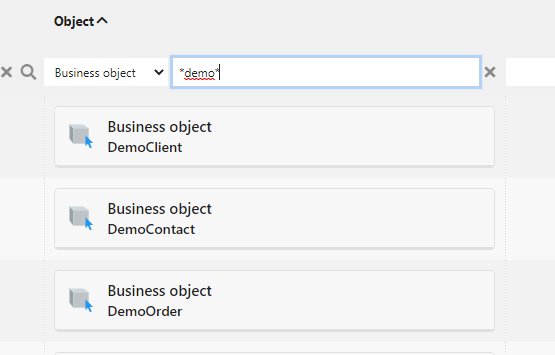

Search syntax
=============

Simple search syntax
--------------------

Simple search syntax for search filters is a plain character string including,
if required, search SQL-like wildcards:

- `*` (or `%`): any group of characters
- `?` (or `_`): any single character

Date fields search filter syntax is `YYYY-MM-DD`

Datetime fields search filter syntax is `YYYY-MM-DD hh:mm:ss`

An advanced syntax is also available for most field types to proceed with more complex
searches: its syntax uses SQL-like statements (see below).

Simple or advanced filters can be used in all search features:

- Search pages of the generic web UI (for non assisted search fields)
- Data access interfaces (that can be used as extrenal data source in office software like Microsoft Office&reg;)
- Web services (JSON/REST and legacy XML/SOAP)
- Raw data services

Advanced search syntax
----------------------

Advanced syntax is a combination of the following comparators that do requires
simple quotes to enclose all textual values (not required for number values)

- `=`: strict equals
- `<>` or `!=`: strict non equals
- `>` or `>=`: higher than
- `<` or `<=`: lower than
- `like`: partial equals
- `is null`: empty value
- `is not null`: any non empty value
- `in ('a','b','c')`: exists in a list of values
- `not in ('a','b','c')`: not exists in a list of values
- `not in`: does not exists in the ENUM field definition (since 6.2)


Comparators can be combined with logical operators:

- `or`: inclusive or operator
- `and`: and operator
- `not`: negation operator

Parenthesis can be used for complex combinations.

Examples: 
- `>50 and <=100`
- `='value1' or ='value2'`
- `not like 'value%'`
- `not in ('value1', 'value2') and like 'value%'`
- `='value1' or (like 'value2%' and is not null)`

### Interval searches on date and datetime fields

Date or datetime interval search syntax is `YYYY-MM-DD[ hh:mm:ss];YYYY-MM-DD[ hh:mm:ss]` each boundary date or datetime being optional.

Alternatively you can use search filters named `dmin__<field name>` or `dmax__<field name>`

### Floating date search

Syntax with today's date:

- `[DATE:offset]`
- `[DATETIME:offset]`

With offset = `<+|-><number><unit>`, the `+` sign is optional

Time units:
- `ms` for milliseconds
- `s`econds
- `mi`inutes
- `h`ours
- `d`ays 
- `dw` days without week-ends
- `w`eeks
- `m`onths
- `y`ears

Examples

```java
// last 3 months
getField("myDate").setFilter(">=[DATE:-3m]");
// in 6 weeks
getField("myDate").setFilter(">=[DATE:+6w]");
getField("myDate").setFilter(">=[DATE:+42d]");
// in next 15 days
getField("myDate").setFilter(">=[DATE] and <=[DATE:15d]");
// before next 12 hours
getField("myDatetime").setFilter("<[DATETIME:+12h]");
```

### Interval searches on number fields

Number interval search syntax is `(>12 and <=25) or >100`.
For simple interval (min/max) you can use search filters named `nmin__<field name>` or `nmax__<field name>`

### Geographical search

As of version 5.3, geographical **coordinates fields** allows proximity search using syntax: 

```
<latitude>;<longitude>~<distance with unit, e.g. 100mi, 10km, ...>
```

### Meta-object search

As of v6.0, meta-objects are indexed with their functional key and are searchable with the following syntax : `<object name>#<user key filter>`

```java
// All users with 'martin' in the name
getField("myObjectField").setFilter("User#%martin%");
// All indexed objects with user-key starting with '12345'
getField("myObjectField").setFilter("%#12345%");
// Explicit User with row_id = 12
getField("myObjectField").setFilter("User:12");
```



API Filters
-----------

JSON Filters are used in several contexts: API endpoint, link filters, widgets, etc.

```json
{
  // expression
  "field1" : ">=1000 and <=5000",
  // ordered field
  "order__field2" : -1,
  // date range
  "dmin___date1" : "2021-01-01",
  "dmax___date2" : "2023-12-31 15:35:00",
  // today offset
  "date1" : ">[DATE:15d] and <=[DATE:3m]",
  // number range
  "nmin___number1" : 123,
  "nmax___number2" : 456.78,
  // use a predefined group-by fields
  "group__childField3" : 1,
  // or force another group-by on fields (since 6.2)
  "groupby": true, "groupbyfields": ['myEnumField'],
  // meta-object
  "mofield": "User#%martin%"
}
```
