Version 5.0.x release note
==========================

:::danger
**Warning**: This legacy minor version is **not maintained anymore**. Make sure you upgrade to the current minor version.
:::

JVM
---

As of this minor version, due to third party dependencies, the platform is compiled with a **OpenJDK version 11**.

The platform is thus **not** compliant any longer with any JVM **prior** to version 11, the legacy JVM version 1.8 in particular is not supported.

This means the recommended JVM to run the platform is still an **up to date JVM**, but **at least** an JVM version 11.

> **Note**: A **fatal** exception is now thrown if you use a unsupported JVM, preventing the webapp to start.

Rhino
-----

Implementing server side logic (hooks) using the Rhino (server-side Javascript) is now considered **deprecated**,
this possibility will be removed in next major version (v6), then only Java server logic will be possible.

Converting your existing Rhino scripts to Java class is thus highly recommended.

Bootstrap
---------

- **Bootstrap v4** has been added to replace V3
- New system parameter `BOOTSTRAP_VERSION`:
	- is set to 4 by default to use the new disposition `responsive5` based on Bootstrap v4
	- can be set to 3 for backward compatibility (or during your migration)
- Bootstrap v3 has been upgraded from 3.3.7 to 3.4.1: this maintenance version is supposed to fix issues (XSS)

See documentation to migrate your specific V3 components to V4 (https://getbootstrap.com/4.0/migration).

It is strongly recommended to use the helpers `$ui.view.tools` to ignore the rendering implementation/version.
For example, `$ui.view.tools.panel` will use a `<panel/>` in V3 and a `<card/>` in V4.

FullCalendar
------------

Both versions V3 and V4 are included in the platform:
- Use the parameter `FULLCALENDAR_VERSION` to set the version to use (3 or 4),
- For backward compatibility the parameter is set to 3 by default,
- See https://fullcalendar.io/upgrading-from-v3 to upgrade your specific usage before migrating to FullCalendar v4.
- Set optionally the parameter `FULLCALENDAR_LIBS` for additional plugins

Compatibility breaking changes
------------------------------

- The methods of `RESTServiceExternalObject` and `RESTMappedObjectsExternalObject` are now **public**
  instead of **protected**, if you have overridden them as protected you must now set them as public (if you don't do so
  you will have compilation issues).
- The grant hooks' `parseAuth` method is now called also for LDAP, OAuth2 and SAML authentication provider and it has a new interface.
  And it now takes session info as second argument instead of auth string in the previous versions' hook.
	- If you have implemented some logic assuming this hook is only called for server managed or custom authentication
	  you **should** refactor your code by testing the authentication provider.
	- If you still have an implementation with a plain string as second argument you **must** refactor it before upgrading.
- The extended title of object does not support the old syntax [field] any more (the supported syntax is [VALUE:field] since V3.0)
- The `GrantHooks` is **deprecated** but will be supported for backward compatibility in this version
  however it **must** be refactored to the new shared script `PlatformHooks` to use non-static methods:

```java
/**
 * Platform Hooks
 */
public class PlatformHooks extends PlatformHooksInterface {
	public String parseAuth(Grant sys, SessionInfo info) {
		// same method but not static...
	}
	public boolean isMenuEnable(Grant g, String domain, String item) {
		// same method but not static...
	}
}
```

- The internal `GitTool` toolbox class is now a singleton, no backward compatibility is implemented with legacy static methods
  as a matter of fact this toolbox should not be used by many application code and refactoring is very easy
  (change `GitTool.(...)` to `GitTool.getInstance().(...)`)
- Legacy `WebZone` are not supported anymore:
  - Extra zone, sub-head, public zones... are not loaded by the responsive UI
  - designer has to move the legacy logon addons to the new resource `LOGON_ADDON` of responsive disposition
  - all other zones have to be migrated to other resources (MENU, HEADER, FOOTER...) of disposition
- Ends of SQL `inner join` on all required foreign-keys:
	- Replaced by a `left outer join` to display potential dead links on UI, users will have to delete or fix the relationships
	- Only batch instances (during data import/export) will still use `inner join` for integrity reasons
	- Allows hooks/constraints to change the required property on foreign-key without perturbing the search/count result

Core changes
------------

- Upgraded third party libs
- New action to rebuild all thumbnails of image field
- No more legacy classes to build the old UI based on iframe:
	- ObjectForm, ObjectList, ObjectSearch... have been removed
	- Legacy external objects have been deleted: `ChangePassword`, `ModuleDelete`, `FieldEditList`, `EditConstraints` and `HomeModels`
	- Some components are still alive: modeler based on Canvas, Gmap.js
- ALMTest has been removed because emulate legacy UI, and ALMPlan will be optional but not installed by default
- Legacy `Graph` has been removed from the platform and related behaviors (jFreeChart.jar, Graph item in View, CONTEXT_GRAPH...)
- Added debug setting for Simplicité service objects
- `DBAccess` and `DBDOCAccess` have been refactored to responsive UI
- Added new `preAuth/postAuth` grant hooks to implement custom rules before and on successful or failed local authentication attempts
  (these hooks are not used in case of external authentication: SAML, OAuth2, ...)
- Added unit test type shared code (exposed as tests in modules' Maven projects), runnable from the UI or API within the context of the platform
- Added a JMX MBean (management bean) to read system info and to apply a global clear cache.
- Improved URI mapping applying changes also at API session valve level by configuring a dedicated URI filtering pattern.
- Added salt on internal passwords
- Export to Excel/CSV optimizations to support huge data without memory overflow. `ExcelPOITool` is deprecated, now `ExcelTool` uses buffered export.
- Added a new system parameter `PUBLIC_SESSION_TIMEOUT` to adjust public session' timeout (defaults to 5 min)
- Validation of `Integer` and `Decimal` fields supports `Field type` for additional Regexp or Method, for example to check a positive value

- Object search with page callback to preserve memory usage during a huge search of records
	- in this case object current list is not set because the heap will be free on each page
	- calculated fields and `postSearch` are called on each page before calling the callback

```java
obj.resetFilters(); // a full scan of a big table
// New search with page callback
obj.search(true, 100, (rows) -> {
	// Called on each page of max 100 records
	for (String[] row : rows) {
		// do something with the record
	}
});
```

- New Websocket event `clearCache` used during a partial clear cache to clean the designer's UI, by removing client-side cache to force a full reload of object metadata.
- Added Redis&reg; cache toolbox `RedisTool`
- Added Trello&reg; API toolbox `TrelloTool`
- Added Slack&reg; API toolbox `SlackTool`
- If a module's URL is a GitHub or GitLab repo URL, the setting is interpreted as a Git setting
- Added `GrantHook.socialPost` triggered when a social post is created/updated

- **Multi-documents** on field related to a DocIndex to set quota (min/max) and accepted mime-types
- `getNextIdForColumn` supports sequence on Oracle and PostgreSQL
- Allows to filter date with `is null` / `is not null`

- New system parameter `USE_OBJECT_USAGE` = yes:
	- to notify user when object is currently opened with update rights (or deleted) by other people
	- with new object `ObjectUsage` (in Operation menu) to manage "who is updating what at the same time"
	- with blocking timestamp on object: only one user can access with update rights to a record on UI form

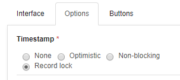

- New helper `BusinessObjectTool.selectValidateAndSave` in a thread-safe block:
	- to force access rights to business object
	- to select a record or copy
	- to set values from a Map or a JSONObject
	- to validate as usual
	- to save with or without the timestamp checking/update
	- to restore rights

- `postDelete` and `postDeleteAll` ability to return info/warning or redirect statement
- Min/max rows per object: new properties to override the default min/max of user's profile (when greater than 0, if not set the list will use the profile values)
- `obj.setValues(row)` has been revised to set the old values by default
- New parameter `COMPLETION_SIZE` for list size of field with auto-completion (default value 15)
- Limited REST API mapping for select objects and hidable objects/attributes from schemas

- `DocuSign`: client libs isolation to avoid dependency issues with more recent `javax.ws.rs` implementation
- Allows to load on-the-fly external **JDBC driver** to connect external database:
	- without adding it to your `tomcat/lib`
	- as a shared script (type lib/jar) loaded in the platform dynamic classloader
	- or thru an external jar loaded in one isolated classloader:
		- to avoid versions conflict between multi-datasources (i.e. many Oracle drivers)
		- new `jdbc` property to indicate the local JAR path to load, for example:

```json
{
    "driver": "org.postgresql.Driver",
    "username": "<user>",
    "password": "<pwd>",
    "url": "postgresql://<server>:<port>/<database>",
	"jdbc": "/usr/share/java/postgresql-42.2.9.jar"
}
```

- New **ClassLoaders** panel in monitoring to check loaded libs at different level:
	- Server: tomcat/lib content
	- Webapp:  WEB-INF/lib content
	- Simplicité core-cache with all dynamic modules (with compiled hooks) and shared libs (JAR shared script)
	- Extended classloaders: to isolate external datasource, docusign...

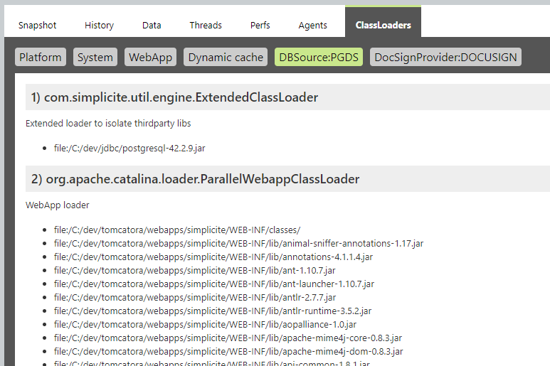

- List optimization to get less metadata on each row

- New hook `getExportFileName` to override the file name during data export, for example:

```java
@Override
public String getExportFileName(String type, String name, String row[]) {
	if (HTTPTool.MEDIA_XLSX.equals(type) && row!=null)
		return "EXPORT" + "-" + row[getfieldIndex("myfield")] + "-" + Tool.getCurrentDate();
	return getDisplay();
}
```

- New hook `isMergeEnable` to check if the selected ids are mergeable:

```java
@Override
public String isMergeEnable(List<String> ids) {
    if ( /* rule1... */ )
       return "ERR_NOT_ALLOWED_RULE1";
    return null; // OK
}
```

- It is now possible to retrieve logs using the I/O endpoint
- The duration (for session timeouts and user  token durations) can now be expressed with a duration syntax (e.g. `24h` or `1d`).
  Supported qualifiers are: `s` seconds, `m` minutes, `h` hours, `d`days. The default unit is still valid
  (minutes for session timeouts and hours for user token)

- New abstract business object `SimpleUser`
	- with internal business logic and implemented by `User`
	- to simplify UI overriding in a specific inheritance

- New precision on document field
	- to limit upload size per field (ex `max=10`)
	- System param `MAX_UPLOAD_SIZE` in always the global limit and each field (precision must be smaller)

- Predefined search with list preferences
	- supports preferences of visible fields on list
	- new hook `pre/postSavePredefinedSearch` when a private search is updated
	- new hook `getPredefinedSearches` to filter accessible searches
	- separate edit and usage by setting or calling `setPredefSearch(use, edit)`
	- direct access to predefined searches on list (dropdown control) `setPredefSearchOnList(boolean)`

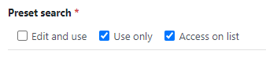

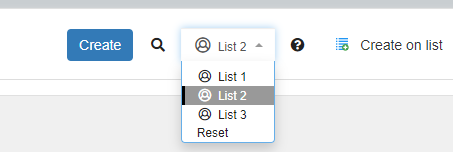

- Optimization: avoid double calls of `initRefSelect` and `initAssociate`
- New accessors `setPredefSearchOnList` and `isPredefSearchOnList` to enable fast access to predefined searches on list
- `public` session uses the URL parameter `_lang` or the `Accept-Language` if present in HTTP header to override the default language of this user
- Added SAML property to use a JKS or PKCS12 keystore file for the SP and/or IdP certificates and private keys
- Added filter to set custom HTTP headers configured in the `HTTP_HEADERS` system parameters,
  typical usage is to add security-related headers such as `Content-Security-Policy`, `X-Frame-Options`, `X-XSS-Protection`, ...
- Added action to generate the default typical resources of a UI component external object: HTML (`HTML`), JavaScript (`SCRIPT`) and CSS (`STYLES`)
- Supports Google Firebase JS 7.20.0
- Supports depth=0 on reflexive link to show the closed roots only
- Action with confirm fields supports documents
	- old syntax with `Map` is deprecated `public String myAction(Map<String,String> params)` but supported for simple fields (values as String)
	- and replaced by new syntax `public String myAction(Action action)` to access Action's fields directly:

```java
public String myAction(Action action) {
	String param = action.getConfirmField("myStringField").getValue();
	ObjectField myDocField = action.getConfirmField("myDocField");
	DocumentDB doc = myDocField.getDocument();
	AppLog.info(getClass(), "myAction", "DOCUMENT " + doc, getGrant());
	if (doc!=null) {
		// Uploaded tmp file
		java.io.File file = doc.getUploadFile();
		AppLog.info(getClass(), "myAction", "DOCUMENT FILE " + file, getGrant());
		// do something with the document...
		// Remove the file from /tmp directory
		file.delete();
	}
	return null;
}
```

- Fulltext search:
	- `preSearchIndex` and `postSearch` with new contextual parameters
	- call the hook `getTargetObjet` to return child objects in case of inheritance

- Optim fulltext search on PostgreSQL
- Backported core directories checksum verification at startup
- Backported new business object hooks: `preCount`, `preCrosstabSearch` and `postCrosstabSearch`,
  for backward compatibility these hooks calls `pre/postSearch` by default

UI changes
----------

- No more access to the legacy UI
- No backward compatibility on .jsp wrapper and old UI javascript
- New disposition resource `LOGON_ADDON` (to replace the legacy webzone)

- Optim: icon picker loads only the visible tabs
- `GOD_MODE_USER` new private parameter to allow developer or support team to log with any login
- `USE_CHANGE_USER` new parameter to allow the user to switch simply within his known logins (on a same browser)

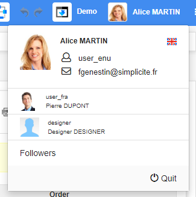

- Back-end monitoring has been refactored to the responsive UI

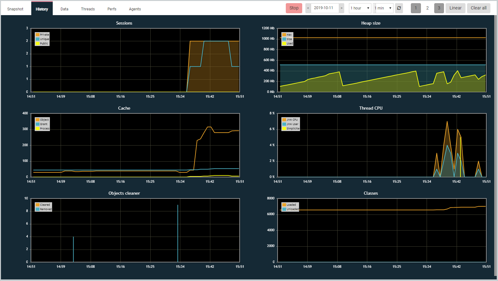

- Merge feature has been refactored

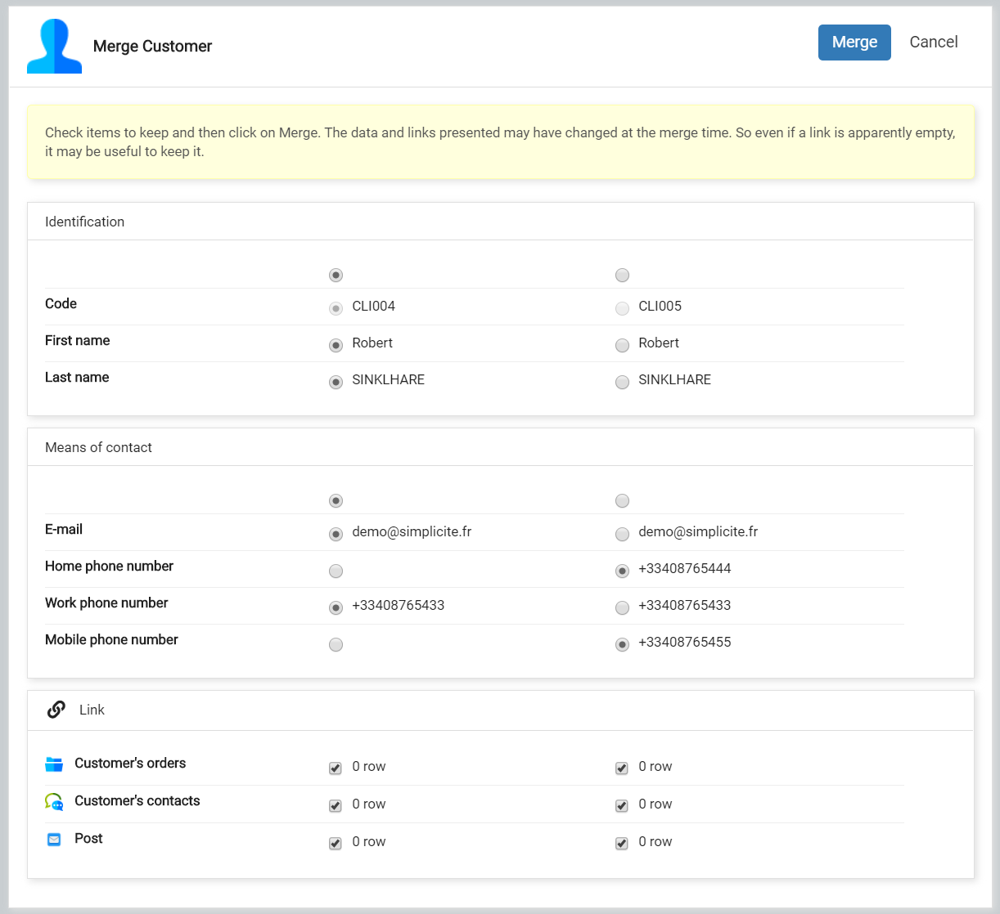

- Status counter on menu

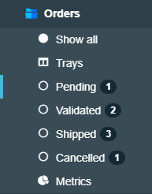

- New hook `form.noRowFound(ctn,obj,rowid)` to customize the UI when a record is not found (deleted, denied, user filters...)
- Export data (to CSV, Excel, PDF, XML..) opens a toast at screen bottom, the asynchronous download allows the user to continue working

- N,N Links rendered as **Pillbox** on list:
	- with positive order inserted into field positions
	- editable and searchable on list: search based on user-key index of child object

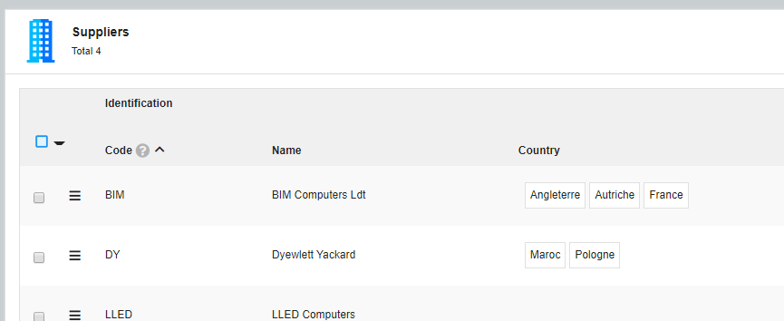
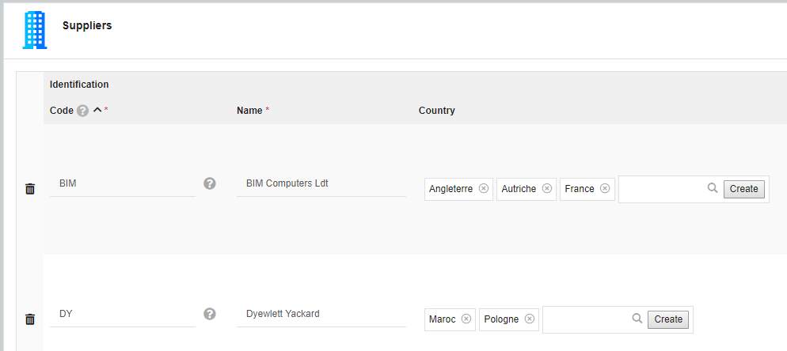

- The loading spinner of child list is enclosed to panel when the object form is loaded
- Clickable error message to show and focus the field

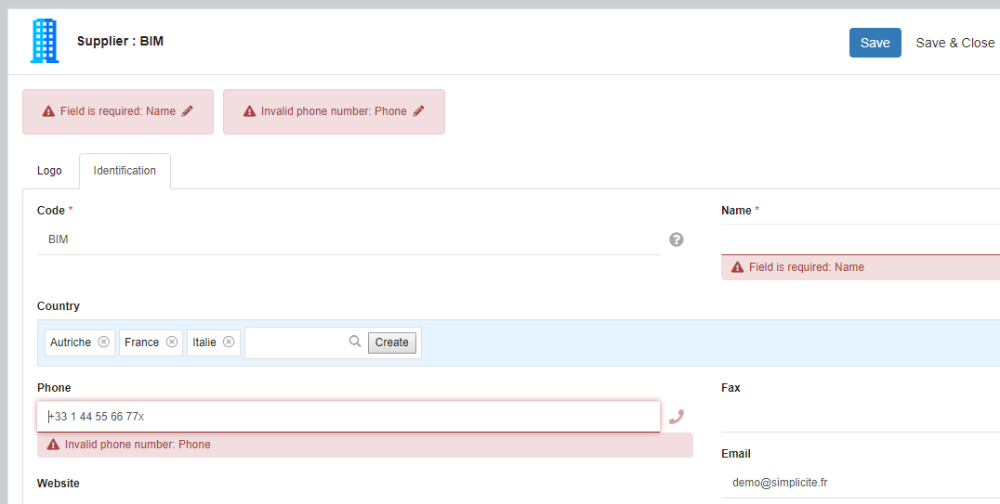

- `$ui.loadURL` can be called with a custom `reader` to wrap blob response into specific download

- XSS security: new jQuery selector `:safeAttr` to clean element attributes
	- remove all dom events `onload`, `onfocus`...
	- remove all attributes containing `javascript:`
	- example `$("img:safeAttr")` will prevent img loading with malicious `onload` callback

- New integer rendering:
	- slider: input range with the new precision parameters `min`, `max` and `step`
	- stars: rate bar where precision = nb of stars

List:

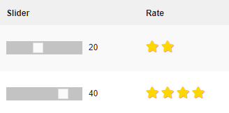

Form:

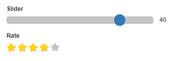

- New client hooks:
	- before rendering a list or a form when data are loaded
		- `list.preload(ctn, obj, params)`
		- `form.preload(ctn, obj, params)`
	- when a list row is displayed:
		- `list.onloadrow(ctn, obj, id, item, tr)`: to bind events on input fields, change the rendering...
		- `list.onunloadrow(ctn, obj, id, item, tr)`: to destroy specific field component before unloading the list
		- for example to apply field `change` on both form and edit list:

```javascript
(function(ui) {
	var app = ui.getAjax();
	Simplicite.UI.hooks.MyObject = function(o, cbk) {
		function bind(ctn,obj,id) {
			var myField = ui.getUIField(ctn, obj, "myField", id);
			myField && myField.ui.on("change", function() {
				var myField2 = ui.getUIField(ctn, obj, "myField2", id);
				myField2 && myField2.ui.val(myField.ui.val() > 1000 ? "big" : "small");
			});
		}
		try {
			var p = o.locals.ui;
			p.form.onload = function(ctn, obj) {
				bind(ctn,obj);
			};
			p.list.onloadrow = function(ctn, obj, id, item, tr) {
				bind(ctn,obj,id);
			};
		} catch(e) {
				app.error("Error in Simplicite.UI.hooks",e);
		} finally {
			cbk && cbk();
		}
	};
})(window.$ui);
```

- Crosstab:
	- Date axis: complete empty intervals with 0
	- hide low values on table cells

- Form: new follow links on sub-referenced objects
- Help access on ImportCSV and ImportXML

- **Multi-documents** rendering with new widget `docUploader`
	- to upload N documents into a single Document field
	- to display documents in a list or boxes viewer
	- to preview images: thumbnail size is defined in the field precision `w` or `h`
	- to drag&drop documents into the field container
	- to limit mime-types or file extensions in the accept files (pdf, image...)
	- to use quota on field: min and max uploaded documents

List column:

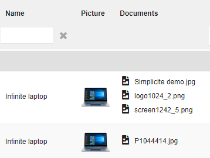

Form rendering of thumbnails:

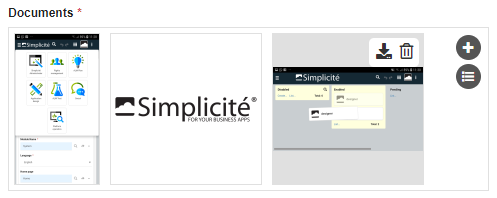

Drag&drop to upload N files:

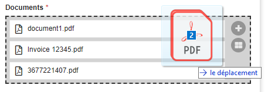

- Grouped list: title with the search count and the number of groups

- Object usage interface when `USE_OBJECT_USAGE` = yes
  - See people using the object with update rights:

  

  - And when object has a blocking timestamp:
    - If user has the lock, the form add a lock icon in header:

    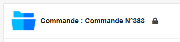

    - If user hasn't the lock, the form is in read-only with the lock owner in header:

    

- Linked lists on search (dialog and columns)
- New action to reset all datamap fields
- External object in form template:
	- insert easily an external object into the object form
	- new syntax `<div class="extern" data-extern="extobjname"/>` with options:
		- `data-embedded="true"` to insert the object without panel/card
		- `data-title="false"` to hide the object title (default is true)
		- `data-iframe="true"` to load the object in a embedded iframe

- New timesheet rendering with:
	- Input data grid with colored resources
	- Bottom chart to see the workload in time
	- Gantt view: coming soon

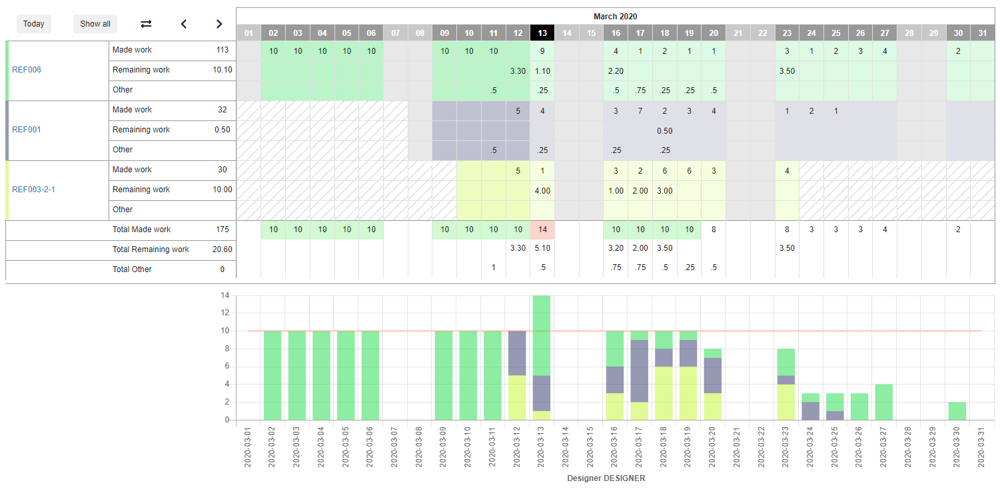

- Integrated **Swagger UI** libs + used in the API tester page and as publication for module
- Added static site external object helper `com.simplicite.webapp/web/StaticSiteExternalObject`
  to expose a whole static web site (HTML/CSS/JS/images) provided as a single file set (ZIP) resource

- New globals parameters:
	- `Simplicite.UI.Globals.compact`: compacted mode to gain height (default false)
	- `Simplicite.UI.Globals.fontSize`: specify the default font-size at top level (default = 100%)
	- accessible to user with parameters `USE_COMPACT = yes` and `USE_ZOOM = yes`

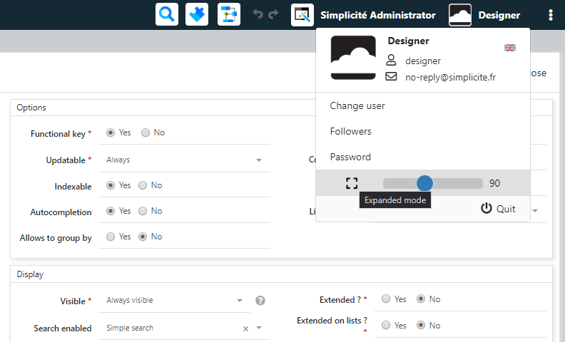

Example of compacted Order:

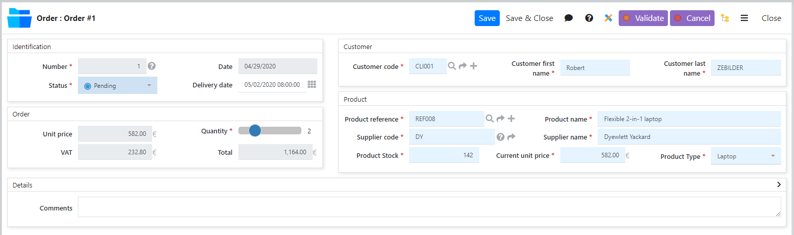

- CSS sizing:
	- this version uses flexbox instead of floating or inlined blocks
	- `px` sizing have been replaced by `rem` on responsive elements (menu width, font-size, margin, padding...)
	- designers have to migrate the specific `px` in less/css resources
	- the rule `1rem = 16px` is simple to apply using this tips without recalculation:

```less
@px: 16rem;
.myclass {
  /* font-size: 16px; */
  font-size: 16/@px; /* will generate 1rem */
  /* padding: 20px; */
  padding: 20/@px; /* will generate 1.25rem */
}
```

- New front APIs to change the page sizing:
	- `$ui.view.zoom(prct)` to change the global font-size and related rem elements (ex: "110%")
	- `$ui.view.compact(ctn, enable)` to apply a compact mode to a container (default = body)
		- reduce some margin/padding height
		- show label and input field horizontally
		- can be changed thru the top level class `.compact`

- The compact mode can be specified on `Theme` definition and `Field area` (template editor)

- `Simplicite.UI.Globals.onlogout()` new optional handler to override the Quit button which calls `$ui.logout({ confirm: true })` by default

For example:

```javascript
$(document).on("ui.ready", function() {
	$ui.options.onlogout = function() {
		var app = $ui.getAjax(),
			login = app.grant.login;
		// Save the session (navigation...)
		$ui.saveSession(function() {
			alert("Bye " + login + "!");
			// Call a SSO service
			$.ajax({
				url: app.sysparams.MY_SSO_LOGOUT_URL + "?user=" + encodeURIComponent(login)
			});
			$ui.quit(); // to invalidate session
		});
	};
});
```

- **Web news** have been updated to be displayed
	- as popup on user's logon
	- or articles in a new view item or thru a shortcut
	- or horizontal ticker in the footer (reloaded every 5 minutes)
	- or on demand by news administrator to push a popup to granted users (thru websocket only)

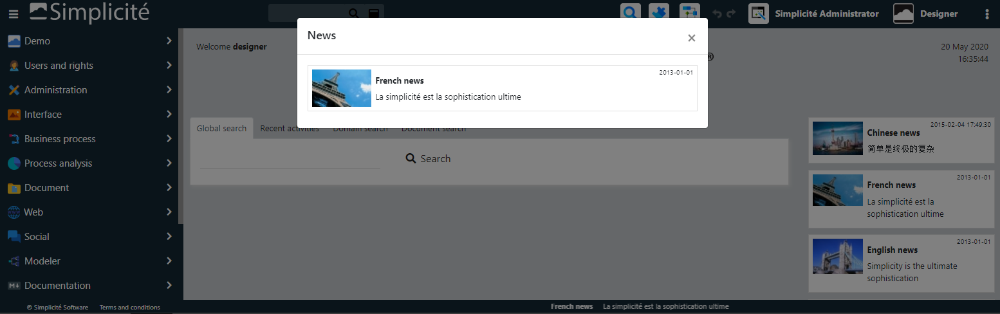

- Code editor with resources per object

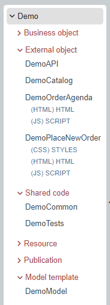

- JQuery `$('textarea').autosize()` has been added to grow the textarea size to fit its content
- Autosize long-text field (textarea) by default when height is unspecified or precision `h=0`

- **Notepad** with activities rendering with new features:
	- create editable checklists
	- post and update comments
	- supports markdown syntax
	- auto-split checklists and comments when container is large
	- no file attachment: this need is covered using a multi-doc field

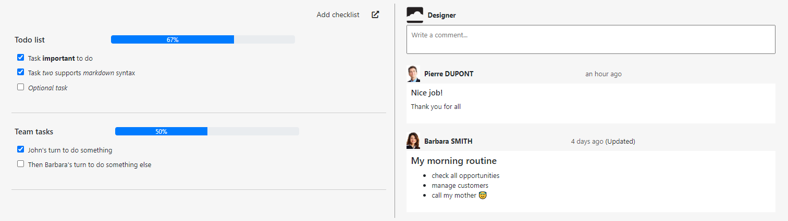

- Added method `setInitialDate` to **datetimepicker** to change initial date: `f.ui.input.parent().datetimepicker("setInitialDate", new Date());`
- Added a `hidden` mode to open a business model in a silent mode to edit the SVG thru front JavaScript
- Optimization: avoid double calls to `initRefSelect` when user is picking a reference
- Crosstab cell meta-data (http://community.simplicite.io/t/ajout-de-metadata-dans-un-tableau-croise/2459)
- New short-keys on object form to navigate between records:
	- `SHIFT-LEFT`: previous record
	- `SHIFT-RIGHT`: next record
	- `CTRL-SHIFT-LEFT`: first record
	- `CTRL-SHIFT-RIGHT`: last record
	- Supports also horizontal swipe on touch device

- Change user's language:
	- Switch easily the current language thru user's profile in header
	- By default all installed languages will be accessible to all users with `grant.getLanguages()`
	- Use the new method `grant.setLanguages(List<String> langs)` to override available languages for a user (on `postLoadGrant`)

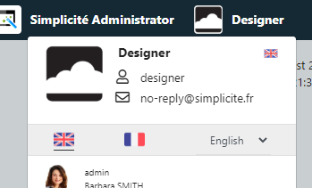

- New property `Preferred language` on user's profile
	- the current displayed language is still stored in usr_lang
	- the preferred language will be asked on logon if not already set
	- and used by default within available languages of business scopes

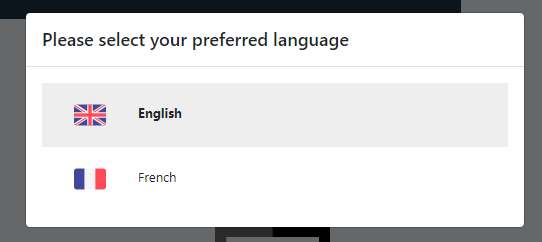

- Editable pivot table:
	- available when cells are identified by their user-key fields on rows/columns
	- and user is permitted to edit the data: see edit property on granted groups of crosstab
	- For example the `Translate` matrix is now editable by designers:

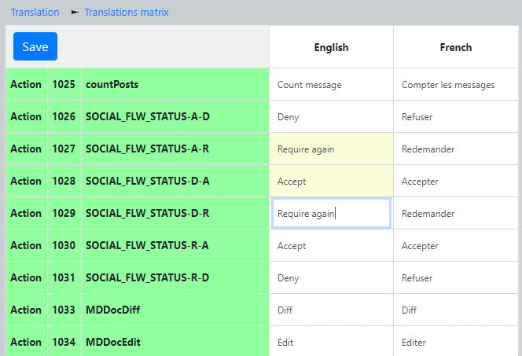

- Visible **Shortcuts**
	- support translated tooltips
	- can be inserted in views
	- `Plus` shortcuts are only accessible thru the head dropdown in header
	- `Visible` shortcuts are displayed in both menu and view item

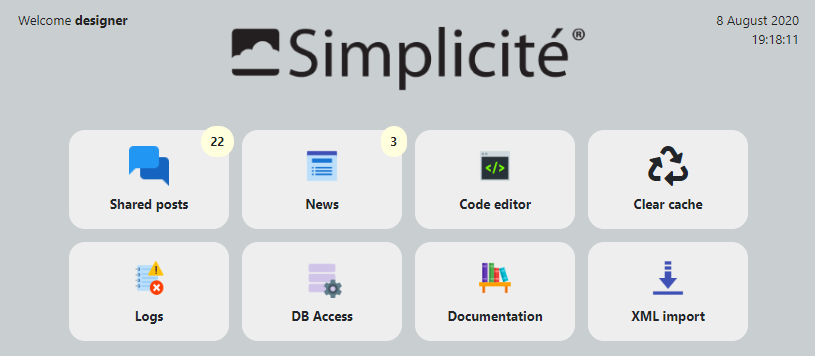

- **About** dialog has been refactored
	- to display current application title, version and scope
	- to give some legals links and the installed version of the platform
	- to display the health check for designer to get some technical data needed for the support
	- implemented into new resources `ABOUT` (french and english)
	- editable to add or hide specific informations if needed

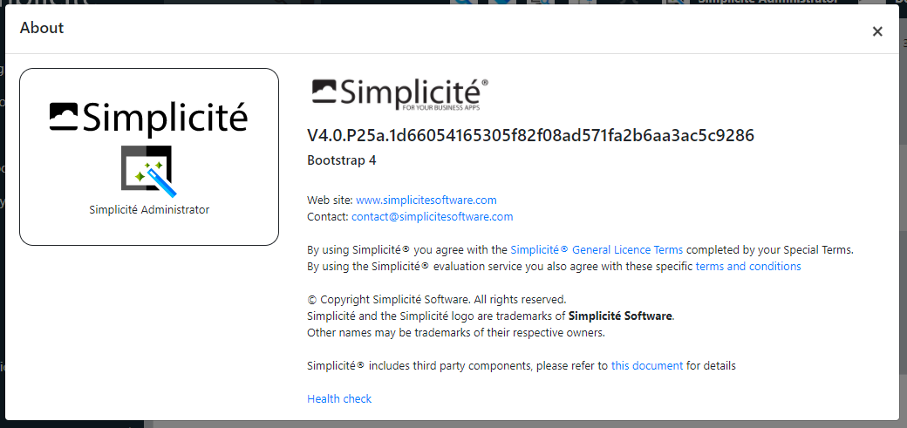

- Show errors on bulk update

- Experimental **Web Speech** on field
	- New field property `Conversation` implemented on simple or long text (without rendering)
	- Speech synthesis: use a supported voice on browser or native OS (not supported by IE)
	- Speech recognition: populate the field with words in user's language (supported by Chrome, Android and Edge only)
	- with new TEXT `SPEECH_CMD`: translated commands to substitute symbols and keywords (ex: point, new line, delete)

Speaking:

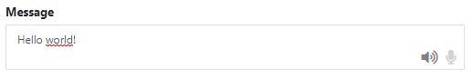

Listening:

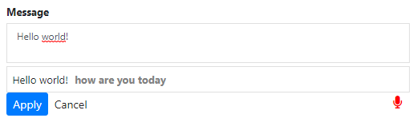

- Modules hierarchy
	- Access to `Required modules` and `Dependency` panels
	- New treeview to display the full hierarchy of module

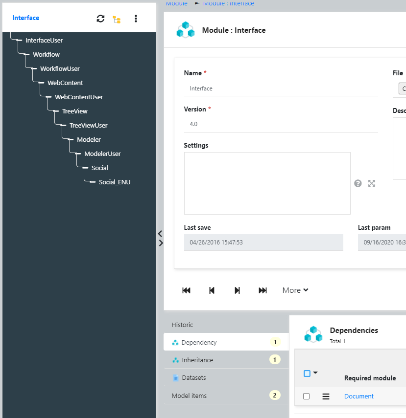

- `GRID` rendering supports read-only on list and form

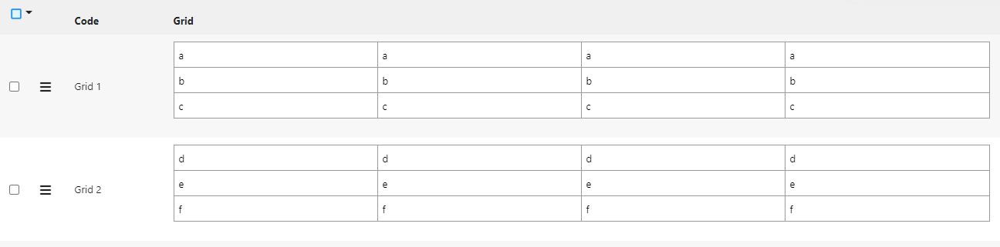

- Include all UI/API/IO/GIT running session on clear-cache info

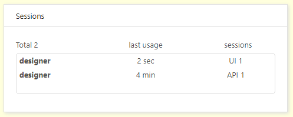

- Supports multiple `CONTENT` resources as `files set`. The resource code must start with `CONTENT` in each disposition:
 	- To add specific font with relative path into STYLES
 	- To add static HTML content to UI by code
 	- To load external component (js/css) on handler `ui.loaded` with `$ui.loadScript`

- supports 'Plus' property on action/transition: to move some state buttons in plus menu
- sticky header on list: `Simplicite.UI.Globals.list.sticky = true` by default

Backported from 5.x (x > 0)
---------------------------

- Datamap completion
- Completion spinner
- Rendering on long-text with characters counter
- Full redolog to store all changes from UI and cascading updates by code
- Long text with `Markdown` rendering and edit dialog
- Error messages on create thru a link pillbox
- `data-field` attribute on table `<td>` to simplify CSS customization per field
- Apply the linkmap rules with filters on FK completion and associate picker
- Supports svg + png + gif + jpg in ICONS set of Theme
- System parameter `EXPORT_MAX_ROWS` to limit export (to CSV, Excel and PDF), the parameter can be set at object level (postLoad)
- Search by date on list: date picker and reset button launch a new search
- `$ui.openURL` force now the `rel=opener` to set the window.opener (Chrome 88 has changed to `noopener` by default)

Fixes
-----

- Fixed duplicate branch on reflexive treeview
- Fixed completion with single item

Post-release
------------

### 5.0.0 (2021-01-11) - initial release

See above

### 5.0.1 (2021-01-15)

- Added `Grant.removeAllResponsibilities` methods
- Changed JWT token decoding

### 5.0.2 (2021-01-16)

- Fixed action container on rows

### 5.0.3 (2021-01-17)

- Robustness fix on PostgreSQL sequences

### 5.0.4 (2021-01-18)

- Additional robustness fix on PostgreSQL sequences
- Title & addon resources for auth pages:
	- `LOGON_PROVIDERS_TITLE` and `LOGON_PROVIDERS_ADDON` for the auth providers selection page
	- `LOGON_TITLE` (and still the existing `LOGON_ADDON`) for the internal auth provider's logon page

### 5.0.5 (2021-01-20)

- Fixed missing `canCloseContent` call
- Fixed ressource mismatch on providers' page addon
- Increased robustness on `PlatformHooks.parseAuth` calls
- Backported fetch on diagram container
- Limited associate on panel to current foreign keys
- Fix on providers' page addon ressource

### 5.0.6 (2021-01-21)

- Fix on `fld_tray`
- Backported `Tool.getWeekOfYear` with locale
- Styles fix

### 5.0.7 (2021-01-23)

- HTML escape on log viewer
- Backported Keycloak&reg; tools
- Backported new get methods on `BusinessObjectTool`
- Robustness fixes

### 5.0.8 (2021-01-25)

- Backported `Tool.getWeekOfYear` and `Tool.getDayOfWeek` with locale
- Fixed potential infinite loop in `setRootField`
- Keycloak&reg; tools improvements

### 5.0.9 (2021-01-26)

- Added object hook `boolean canPreview(field, doc)` and platform hook `boolean canPreviewDocument(grant, doc)`
- Create exception in logs
- Added `Tool.shiftTime` tool method to shift time fields (by seconds)
- Added a forward compatibility class `com.simplicite.util.engine.PlatformHooksInterface`

### 5.0.10 (2021-01-27)

- Backported support for calculated fields on pivot tables
- Added missing partial clear cache on print templates and pivot tables

### 5.0.11 (2021-01-28)

- Disabled constraints on template editor
- Removed UI popup in case of error on getting news
- Improved print styles

### 5.0.12 (2021-02-01)

- Status colors are used in metrics dashboard
- The template editor now uses the syntax convention for the foreign key naming proposals
- Fixed download issues for file names with unusual characters (e.g. `,`)

### 5.0.13  (2021-02-02)

- Fixed syntax convention proposals on template editor to fallback to previous naming strategy (for objects without syntax coventions prefixes)
- Improved download file name encoding to preserve spaces

### 5.0.14 (2021-02-03)

- Removed, for security reasons, commented stacktrace from the legacy low-level error pages
- Fixed a minor XSS vulnerability on the download/preview file popup's title
- Notepads auto-upgrade to JSON format when rendering becomes `Users activities`
- Backported status dashboard improvements
- Backported `Tool.join` methods

### 5.0.15 (2021-02-04)

- Removed insecure (and useless) `X-Simplicite-SessionID` HTTP header
- UI persistent user token cookies are now HTTP-only and secure
- Unauthorized search now returns an empty list instead of a `null`
- Backported `Tool.split` methods
- Refactored legacy user's prefs on edit-list
- Fixed upsert list on resize
- User min rows / max rows are now optional

### 5.0.16 (2021-02-09)

- Minor styles fixes
- Grant cache cleaning robustness

### 5.0.17 (2021-02-11)

- Minor styles fixes on alert popups
- Fixed module import from Git repository in "exploded" mode
- Fixed module diff in "exploded" mode or not
- Backported DocuSign&reg; improvements

### 5.0.18 (2021-02-12)

- Fixed websocket concurrent access
- Added new SVG icons
- Fixed generic OpenIDConnect logout management
- Docusign fixes

### 5.0.19 (2021-02-15)

- Fix on metrics dashboard
- Fixed `ObjectCore.toHTML()`
- Fixed standard JSON identation
- Added flexibility on `EncryptionTool`

### 5.0.20 (2021-02-16)

- Fix on module exports: the `package.json` file is not considered as a conditional artifact anymore
  and the `.gitignore` file is now generated only once at the repository creation

### 5.0.21 (2021-02-17)

- Added missing icons
- Fixed column size for `lov_code`
- Help on _Import XML_ page

### 5.0.22 (2021-02-23)

- Changed the name of the exported module info file from `package.json` to `module-info.json`
  (the old naming `package.json` is still taken into account as a backward compatibiliy fallback)
- The `version` parameter is not mandatory anymore for I/O module imports (and the `zip` parameter is automatically detected from file name extension when possible)
- Minor JS and CSS fixes (e.g. z-index issue on the selection menu on a scrolled lists)
- The resources are now excuded from the JAR built from the module's `pom.xml` in an IDE

### 5.0.23 (2021-02-24)

- Fixed title padding on diagrams
- Fixed module's Git repository deletion when deleting module

### 5.0.24 (2021-03-02)

- Added `Tool` methods for date manipulation
- Fixed filter on modeler for non string fields
- Added missing icons
- Added new `JARTool` methods
- KeyCloak improvements

### 5.0.25 (2021-03-04)

- Fixed KeyCloak logout
- Changed JWT token decoding (the previous claims parsing is now done as fallback in JWT token's payload decoding)
- Fixed issue on importing a module with `MDDocument` or `MDImage` items
- Added `if="null"` keyword on XML fields
- Fixed pagination in some cases (e.g; in REST-mapped APIs)

### 5.0.26 (2021-03-06)

- Backported the possiblity to pass a dedicated I/O and Git password for the privileged user (`designer`)
  using the `io.password` JVM argument or the `IO_PASSWORD` environment variable (the legacy `EAI designer` system parameter can also still be used).
- Updated `Markdown` optional module
- Aligned default working dir locations variables vs corresponding system parameters

### 5.0.27 (2021-03-11)

- Fixed some icons file names
- Backported `Tool` methods on dates
- Added `KeyCloakTool.setUser`

### 5.0.28 (2021-03-11)

- Robustness fix on `ExcelTool`
- Substituted dots in exports' filenames

### 5.0.29 (2021-03-15)

- Fixed pivot table charts' legend
- Changed: when cloning/creating modules' Git repositories the `core.autocrlf` is now forced to `true`
- Changed: Maven respository is now in "snapshot" mode for all the branches (the Maven version is now `x.y-SNAPSHOT`)
- Fixed a minor XSS vulnerability in the object export popup
- Fixed a minor SQL injection vulnerability on the document servlet

### 5.0.30 (2021-03-16)

- ESLint/StyleLint fixes
- Custom error pages for all HTTP codes
- Fixed KeyCloak language default

### 5.0.31 (2021-03-22)

- Fixed enum multiple filter
- Fixed take picture feature for BS4
- Fixed optional language patches application for secondary system patches

### 5.0.32 (2021-03-24)

- Fixed "group-by" list when select row is false
- Fixed image generation on hidden diagram

### 5.0.33 (2021-03-29)

- Backported module configuration capabilities for **custom** Maven settings and Sonar setting
- Fixed "group-by" list when select row is false

### 5.0.34 (2021-03-31)

- Delete jobs with running jobs interruption
- Keycloak setUserByLogon without API calls

### 5.0.35 (2021-04-02)

- Fixed class required on list
- Backported a new adapter helper using Apache commons CSV lib: `ApacheCommonsCSVAdapter`
- Fixed HTML/markdown module documentation type
- Changed JSR223 Rhino engine (for compliance with JVM 16)

### 5.0.36 (2021-04-07)

- Fixed Gson classes shaded duplicates by upgrading Jclouds libs
- Changed `.gitignore` file generation logic

### 5.0.37 (2021-04-08)

- Fixed front constraints pseudo-resource's MIME type
- Aligned "exploded" export paths for the `FieldStyle`, `LinkMap` and `FieldListLink` configuration objects vs next versions.
  Note: this will result in delete orl file + create new file at next commit

### 5.0.38 (2021-04-09)

- Robustness fix on JavaScript field's `val` function for better handling of `null` values.

### 5.0.39 (2021-04-11)

- Fixed disabled buttons on screen resize
- Removed numeric max input length
- Fixed navigation issue

### 5.0.40 (2021-04-14)

- Fixed compatibility with `obo_srh_predef` values in old module exports
- Fixed pivot table warning
- Added required `rel="opener"` for up-to-date Chrome browser

### 5.0.41 (2021-04-15)

- Oracle driver workaround: forced `TYPE_SCROLL_INSENSITIVE` in queries
- Fixed opened by default domain on menu

### 5.0.42 (2021-04-16)

- Fixed compatibility with `obo_historic` values in old module exports
- Fixed create state from diagram
- Fixed big number validation

### 5.0.43 (2021-04-21)

- Fixed dropdown position of grouped actions on list item (BS3 issue)
- Added redolog to API REST calls

### 5.0.44 (2021-04-23)

- Fixed list display when pagination=no
- Fixed pivot table quarter date axis
- Updated application store module

### 5.0.45 (2021-04-27)

- Changed `autocomplete` value
- Inhibited "class not found" warning during loading process
- Core cache loading optimization for HSQLDB
- Updated application store module

### 5.0.46 (2021-05-01)

- Fixed fallback to public grant for static contents, resources and documents
- Changed `Mail` SMTP authentication

### 5.0.47 (2021-05-05)

- Added `[URL]` substitution pattern for publication templates and alert contents
- Added cloud storage overrides properties configuration capabilities

### 5.0.48 (2021-05-11)

- Improved external object resources snippets
- Crosstab chart on TEXT columns

### 5.0.49 (2021-05-17)

- Simple XML file import not stopped upon error
- Class inheritance when child has no class

### 5.0.50 (2021-05-20)

- Group-by on list: final call to hook `list.onload`
- Fixed empty row actions in case of resize
- Fixed date picker position on editable lists

### 5.0.51 (2021-06-02)

- Added `CloudStorageTool` methods using file stream (`put` with a path and `openStream`)
- Fixed actions indentation on grouped lists

### 5.0.52 (2021-06-12)

- Added external object parameters when embedded in business object form
- Added `onloadrow` UI hook call when appending a row to a list
- Fixed link map with pillbox rendering
- Backported `CloudStorageTool.list`

### 5.0.53 (2021-06-15)

- Backported `CloudStorageTool.list` improvements + `CloudStorageTool.delete`

### 5.0.54 (2021-06-22)

- Backported local-only module's Git branch create/checkout
- Fixed modeler data-keys updates
- Backported `[RESOURCEURL:<code>[:<type>[...]]]` syntax in URL substitutions

### 5.0.55 (2021-07-01)

- Performance fix on date picker
- Fixed empty MIME types list = all MIME types allowed for multiple document fields
- Robustness fix on object locking action

### 5.0.56 (2021-07-14)

- Increased robustness for thumbnail generation for unhandled images types (e.g. TIFF)
- Added document icon per MIME-type
- Added reflexive links recycling for experimental "exploded mode" modules imports
- Preview document in meta-data
- Uniformized CR/LF to LF in XML/JSON exports + added `.gitattribute` in module's Git exports

### 5.0.57 (2021-07-19)

- Moved object parameters in `GrantData` to be kept during a garbage collection on objects
- Changed: when cloning/creating modules' Git repositories the `core.autocrlf` is now forced to `false` and `eol` to `lf`
- Fixed list add-row to show col-action

### 5.0.58 (2021-07-21)

- Fixed tray search

### 5.0.59 (2021-07-24)

- Fixed datetime picker with date min/max

### 5.0.60 (2021-07-29)

- Fixed Template editor on button color/size
- Fixed Module delete access for patch only
- New class `.filter-tab` for filtered panel badge
- Optimization on front hook `list.onloadrow`

### 5.0.61 (2021-08-12)

- Pivot table chart Y axis with suggested min value = `0`
- Pivot table chart Y axis with same precision
- Fixed full input substitution in SQL

### 5.0.62 (2021-08-20)

- Fixed checkbox on search on multiple enumeration field
- Added info on Docker image in `/health`
- Added configurable error message for sign in
- Robustness fix on search spec preprocessing

### 5.0.63 (2021-08-25)

- Fixed full input name on `ModelBusinessObject`
- Backported `BusinessObjectTool` methods with `redolog` parameter
- Fixed adding class to object not taken into account before a full clear cache
- Backported Luhn alogorithm check method in `Tool`

### 5.0.64 (2021-09-01)

- Revert back to W3C standard `autocomplete="off"` as Chrome now partially supports it
- Inhibited TinyMCE context menu to avoid _Ctrl + Right click_ to get the spell check completion proposals

### 5.0.65 (2021-09-29)

- Fixed multiple pillboxes context
- Improved robustness on remote Simplicité objects vs multiple leading slashes in URI
- Fixed token expiry for remote Simplicite objects
- Fixed search for export
- Fixed errors on edit list with group-by

### 5.0.66 (2022-09-24) - post-maintenance revision

- Backported security fixes

### 5.0.67 (2022-09-30) - post-maintenance revision

- Backported security fixes

### 5.0.68 (2023-07-28) - post-maintenance revision

- Backported robustness fixes

### 5.0.69 (2023-09-30) - post-maintenance revision

- Backported security fixes

### 5.0.70 (2023-10-14) - post-maintenance revision

- Backported security fixes
- Fixed `ALTER TABLE ` syntax in the SQLServer SQL system patches
- Backported fix on service objects' action hook fallback to standard action mechanism

### 5.0.71 (2023-10-31) - final post-maintenance revision

- Backported security fix on document servlet

> **Warning**: this is the **final** revision for this minor version 5.0, no further maintenance will be done on it.
> If you are still using it, please upgrade to the current minor version of major version 5.
