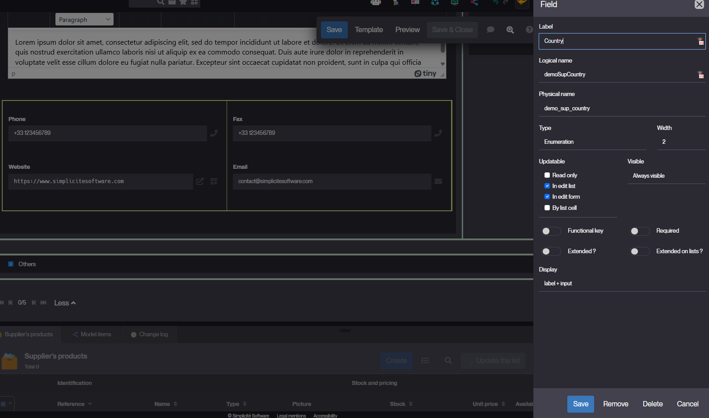
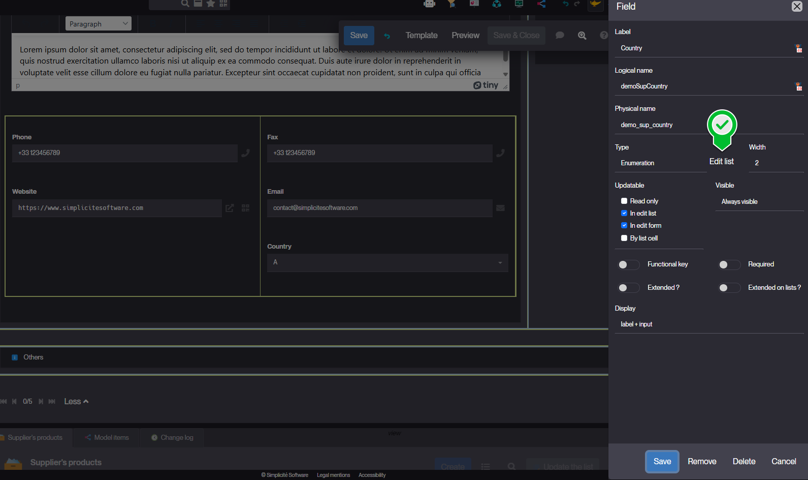
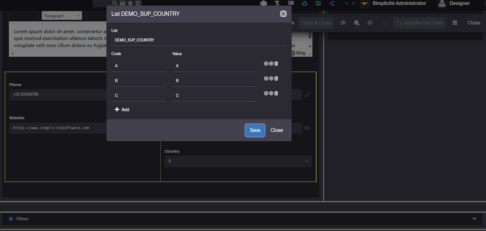
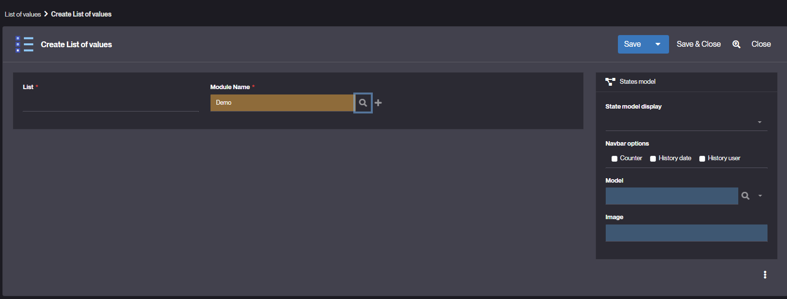
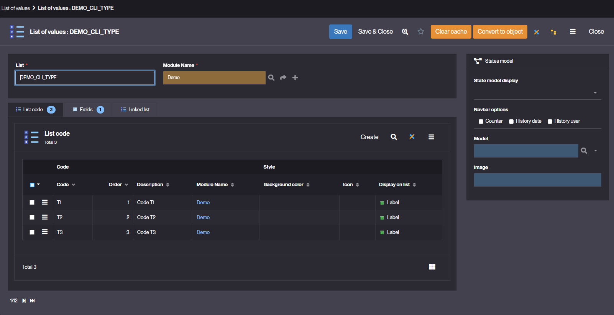

List Of Values
===============

What is a List of Values (LOV)?
-------------------------------

In **Simplicité**, a **List of Values (LOV)** defines the allowed values for an enumerated field.

Each LOV is linked to one or more fields and provides a controlled set of codes whose translated labels are displayed to users based on their language.

LOVs ensure data integrity and provide a standardized input mechanism across the application.

Only the code is stored in the object’s table, while the corresponding translation is displayed in the UI.

**Example**: A LOV can be used to define a dropdown list for selecting:

- A **country**
- A **status** (e.g., _Active / Inactive_)
- Any other predefined option set

How to create a List of Values?
-------------------------------

### Creating a List of Values via the UI

We recommend creating Lists of Values directly in **Simplicité’s template editor**:

1. Create the enumerated field and save it.
   
2. Re-edit the field configuration. An **Edit list** button appears.
   
3. Enter codes and values, then reorder the list as needed.
   

### Creating a List of Values via the "Business objects" menu

1. Navigate to **Business objects > List of values**.
2. Click on **Create** to add a new list of values.
   
3. Fill in the following fields:
   - **List** – Unique identifier of the list of values.
   - **Module** – Define the [module](/make/project/module) to which the LOV belongs.
   - **Fields specific to state diagram display (if applicable)**:
     - **State model display** – Choose how the state diagram bar will be displayed if the LOV is linked to a state model:
       - _Breadcrumb_
       - _Arrows_
       - _Metro line_
     - **Navbar options** – Select what is displayed on milestones:
       - _Counter_: step counter
       - _History Date_: Last transition date
       - _History User_: User who performed the last transition
     - **Optional Model** – (Optional) Link the LOV to an existing state diagram model.
4. Save your List of Values.

:::tip[Reminder]

For each LOV, define the **codes** and their **order**. The application will automatically display
the **translation of each code value** in the user's language.

:::

Read more
---------

- [Creating a Field](/tutorial/getting-started/attribute)
- [Create a state model](/tutorial/expanding/states)
- [State Model](/make/businessprocess/state)
