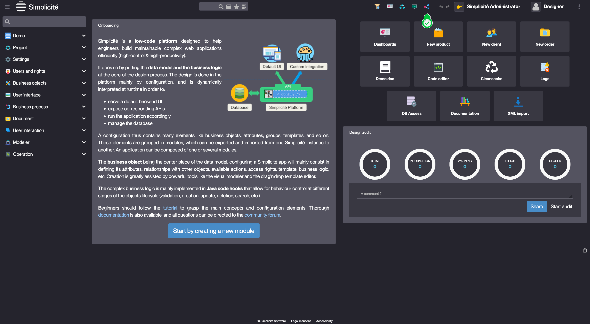
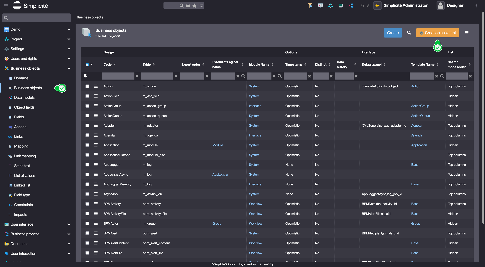

# Business object

## Introduction

Business objects represent real-world entities or concepts within an application, such as a **Client**, **Product**, **Invoice**, or **Employee**. They typically consist of multiple **attributes**, maintain relationships with other business objects, and follow specific **business logic**. For instance, once an invoice is sent to a client, its items may no longer be editable.  

As explained in the [object tutorial](/tutorial/getting-started/object), the **business object** concept is central to Simplicité's meta-model.  

Business objects are usually linked to a database table, enabling standard **Create, Read, Update, and Delete (CRUD)** operations. Additionally, they may include processing logic (code, constraints, etc.) to enforce behavior and data integrity. 

However, some objects are not tied to a table:  

- **[Select objects](/docs/core/objects/select-objects)** – based on SQL queries  
- **[Service objects](/docs/core/objects/service-objects)** – interact with external services

Since business objects form the foundation of the platform, most functionalities revolve around them, including:  

- Search  
- Lists  
- Forms
- Scripts
- Publications
- And more...

Additionally, business objects can include **business rules** to precisely control their behavior.

## How to create a Business object ?

It is **highly** recommended to use the business object **creation assistant** to create a Business object. The creation assistant will also create display labels for the object, grant the object to Groups and add it to a Menu. 

### Creation assistant via the modeler 

1. Open the modeler :  

2. Create or select a previously created *ModelBusinessObject* model :
    - For creation, fill in the header of the pop-up and click **Create** : 
        > Example values :   
        
3. Right click on the opened modeler window and select **Add > Create Business object**. This will start the creation assistant.

### Creation assistant via the Business object list

1. Access the list of Business objects :
    - Business objects > Business objects  
    
2. Click **Creation assistant**
3. Fill in the Object information and click **Create** :  
    > Example values :  
    
4. Fill in the Translation for your Object and click **Next**:
    - These are the labels that will be displayed in the user interface. *NB: using "|" allows the use of the plural form (label used for lists)*
5. If applicable, select a Function for each previously created Group(s) and click **Next**
6. If applicable, add the Object to the previously created Domain(s) and click **Next**

## Configuration 

| Field | Description | 
| ----- | ----------- |
| Code | Object's unique identifier |
| Table | Table name / *service* for a [Service object](/docs/core/objects/service-objects) / *select* for a [Select object](/docs/core/objects/select-objects) |
| Extend of Logical name | Used for inheritance (parent object) |
| Icon code | Object's logo |

## Read more   

- [Business objects hooks](/docs/core/objects/businessobject-code-hooks)
- [Select objects](/docs/core/objects/select-objects)
- [Service objects](/docs/core/objects/service-objects)
- [Custom service objects](/docs/integration/remote/custom)

<!--
## Business object Hooks

When an object is configured, it has a default behavior based on the different elements and properties configured.

For example, if an attribute is mandatory:
- when preparing the form, it will be taken into account by the platform to transmit the information to the front-end
- when saving the object, a validation step checks the presence of a value for this attribute, returns an error and cancels the saving if there is none

It is conceivable that a web service call is needed to find out whether the attribute is mandatory, in which case a constraint is no longer really appropriate as the code becomes too complex for an executed field.

It is for these cases that it is possible to extend the default behavior of business objects. The default behavior is coded in a Simplicité Java class called `ObjectDB`. All business objects inherit from this class, which provides a number of hooks that are executed at different points in the business object's lifecycle. By inheriting from this class and overriding the hooks, it becomes possible to modify the behavior of the business object. The exhaustive list of hooks can be found in the [JavaDoc](https://platform.simplicite.io/current/javadoc/), and here we present only the more common ones. *The possibilities are endless, and a thorough understanding of the hooks and the Java Simplicité API is an important part of success*.

Object scripts can be written in Java or JavaScript (which will be executed by Rhino, just like the executed fields), but **good practice is to use Java scripts** which include a compilation step and ensure that the syntax of the script is correct. *In advanced use cases that are not part of this tutorial, the use of Java gives access to all of the classic application development tools: step-by-step debugging, unit tests, development in a Java IDE, code quality analysis with Sonar etc.*.
[Learn more](/docs/code/businessobject-code-hooks)

## Business object instances & cache 

In order to manipulate business objects correctly via the Java API, it is necessary to understand the notion of object instance, and by extension to have a schematic idea of how the caching system works in Simplicité. It also helps to understand what the different cache flush actions are and when they are needed.

To determine the behavior of an object, unlike a traditional Java application where all the behavior is coded and compiled in bytecode, Simplicité interprets the configuration that is stored in a database. The construction of an object (object load) involves complex mechanisms: inheritance, recursion, attribute definitions, numerous SQL calls, templates, etc. Since objects are stable in production, Simplicité builds them only once and stores the result of this construction in the core cache (=server cache). **The core cache therefore stores in memory the definition part of the object (fields, template, table name), it is a snapshot version of the configuration.**

Each time a user manipulates an object, he will need to instantiate it, and load the necessary information into it, in the same way that a java class is loaded with specific data. To do this, a clone of the object loaded in the core cache is positioned in the user's session, this is called an instance of the object. The instance is persistent in the user's session, which is why, for example, if you do a search on an object, navigate elsewhere in the application and return to the list, the search is still active. **The session therefore stores instances of the object's definition, cloned, and the dynamic part of the object (data, search, current parameters, etc.).**

When the object, inheriting from `ObjectDB` is manipulated in the code as in the previous lesson, one of these instances is used. Beware, if only one instance of the object was used, this would mean that when searching for the object in the code (see below) to programmatically modify a set of objects, the user browsing the object would see this search positioned without having done it himself!

To avoid this problem, the session loads not one, but many instances of the object, each with a name relevant to its use:
- **the_ajax_ObjectName:** main instance, used for the main list
- **ref_ajax_ObjectName:** instance dedicated to the selection of objects on links (for example the selection of the product for the order)
- **panel_ajax_ObjectName:** instance dedicated to panels (for example the panel of orders under a product)
- **bpm_ajax_ObjectName:** process instance (e.g. during the module creation process)
- **tmp_ObjectName:** "temporary" instance dedicated to use in server side code
- etc.

There are many instance names used by the platform, we won't list them all, but let's remember:
- that each instance has a name (accessible via `ObjectDB.getInstanceName()`) which depends on the context of use
- that each instance keeps in memory the searches, loaded values, etc.

Therefore, when using an instance in scripts, it should be kept in mind:
- that it may be necessary to flush loaded filters and values (via `ObjectDB.resetFilters()` and `ObjectDB.resetValues()`)
- to avoid concurrent use of the same instance by several threads, it is essential to use a synchronization block (see commented example below) 
SYNC TEST 3
-->