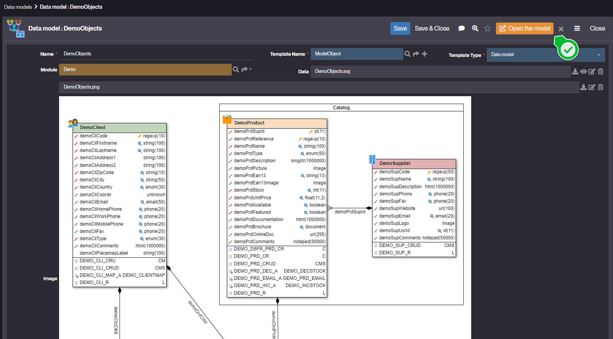

# Data Models

## What are Data Models ?

Data Models allow you to view a minified list of business and physical object templates configured in the modeler.    
They are based on **template models** of types `ModelBusinessObject` and `ModelPhysicalObject`.  
Each data model are used to structure data visually and logically within Simplicité.

This feature offers a global, high-level view of the main elements (objects and links) that define business models, without exposing all the underlying technical details.

## How to view a Data Model ?

To view a data model, follow the steps below:

1. Go to **Modeler > Data Models**.
2. The system will display the list of available models.
3. Click on a model to open its graphical representation.  

4. You can then:
    - Visualize the objects (business or physical) and their relationships.
    - Understand quickly the structure and interactions of the modeled entities.
    - Use the model as a support for analysis or discussions.

The Data Model display is **read-only**. To modify a model, you must **open the model** by clicking on the form button.  
This will open the modeler.  

## Notes
- Only templates of type `ModelBusinessObject` and `ModelPhysicalObject` are displayed in the Data Models menu.
- The behavior of custom Data Models can be customized via [modeler code hooks](/docs/core/modeler-code-hooks). 