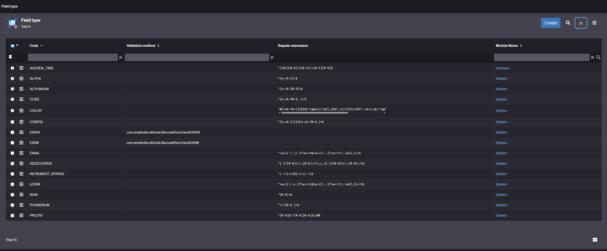

# Field Type

## What is a Field Type?
In **Simplicité**, a **Field Type** defines the format, validation rules, and behavior of a field within a business object. Field Types ensure that data entered in fields complies with specific formats or constraints, using predefined validation methods or regular expressions.

They are reusable definitions that can be associated with multiple fields across objects, standardizing input formats (e.g., alphanumeric codes, emails, dates).

## Structure of a Field Type

Each **Field Type** record is defined by:

- **Code**:  
  A unique identifier for the field type (e.g., `EMAIL`, `LOGIN`, `NUM`).  
  This code is referenced when assigning a field type to a field in the object model.

- **Validation method** *(optional)*:  
  The Java method called for validation (e.g., barcode validation methods like `BarcodeTool.checkEAN13`).

- **Regular expression** *(optional)*:  
  A regex pattern that enforces the format of field values (e.g., email format validation).

- **Module Name**:  
  The module to which the field type belongs (e.g. your application module).

## Examples of Built-in Field Types

Here are some standard field types available in Simplicité:

| **Code**          | **Validation method**                      | **Regular expression**               | **Module**     |
|--------------------|-------------------------------------------|--------------------------------------|----------------|
| `ALPHA`           | –                                         | `^[a-zA-Z]+$`                        | System         |
| `ALPHANUM`        | –                                         | `^[a-zA-Z0-9]+$`                     | System         |
| `EMAIL`           | –                                         | `^\w+([\.-]?\w+)*@\w+([\.-]?\w+)*$`  | System         |
| `EAN13`           | `com.simplicite.util.tools.BarcodeTool.checkEAN13` | –                     | System         |
| `COLOR`           | –                                         | `^#[da-fA-F]{6}$|^rgba\(...\)$`      | System         |
| `NUM`             | –                                         | `^[0-9]+$`                           | System         |
| `PHONENUM`        | –                                         | `^\+?[0-9 ]+$`                       | System         |

## Usage

1. When defining a field in a business object, select the **Type** that matches the expected input format.
2. The system automatically applies the associated validation (method or regex).
3. Custom Field Types can be created for specific validation needs.  
   Select the **Type=Validated text** and choose your custom field type in **Validation type** for the field.  

## Creating a Custom Field Type

To create a custom Field Type:
1. Navigate to **Configuration > Field Type**.
2. Click **Create**.
3. Provide:
   - A unique **Code**.
   - An optional **Validation method** (Java method to call).
   - An optional **Regular expression**.
   - The **Module Name**.
4. Save your Field Type.

:::note
- Validation occurs **when saving the record**, ensuring format consistency.
- Field Types are shared across objects: modifying a Field Type impacts all fields using it.
- Custom Field Types should be defined in your module, not in the `System` modules.

:::

## Read more   

- [Creating a Field](/tutorial/getting-started/attribute)
