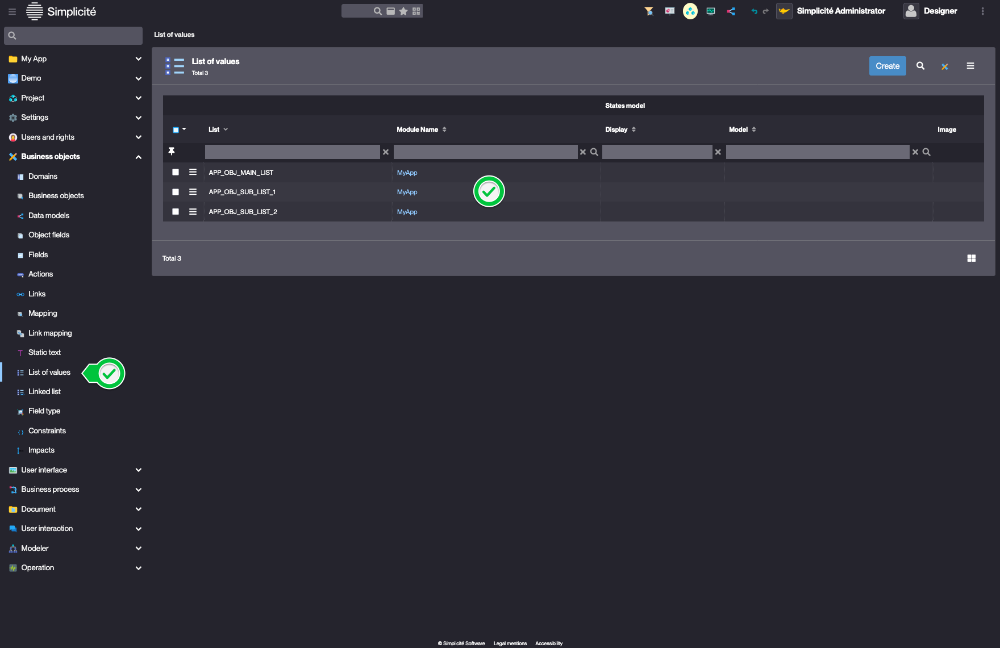

Linked list
===========

What is a Linked list?
----------------------

Linked lists allow you to create dynamic dropdown menus where the available options in one field change based on what's selected in another field.

For example:

- When you select "Country" in the first dropdown
- The second dropdown automatically updates to show only cities from that selected country

This creates a dependent or cascading relationship between two enumeration fields.

Key benefits:

- Helps users make valid selections
- Reduces errors by showing only relevant options
- Improves data integrity

### Example: Field Configuration

When configuring a Field, you'll notice this linked list behavior in action:

1. The Field object has two important properties:
   - A **Type** field
   - A **Rendering** configuration field

2. How it works:
   - When you change the value in the **Type** field
   - The available options in the **Rendering** field automatically update to show only relevant choices for that Type

How to create a Linked list?
----------------------------

    
Prerequisite

    You have previously created a main list of values and it's sub list of values
    

To create a linked list, click **Create** in the **Business objects > Linked list** menu :

1. In the **Object** reference field :
   - Choose the **Object Field** that will control (or trigger) the changes
2. In the **List of values** field :
   - Select which value from the controlling field will trigger the change
3. In the **Linked object** field :
   - Select the Field that will change based on the controlling field
4. In the **Linked list** field :
   - Choose which values should appear when the trigger condition is met

:::tip

With this configuration, when "Sub-list 1" is selected in the _appObjMainList_ field, _APP_OBJ_SUB_LIST_1_ items will be displayed in _appObjSubList_.

:::

Read more
---------

- [Linked list tutorial](/docs/tutorial/enhancing/linkedlists.md)
