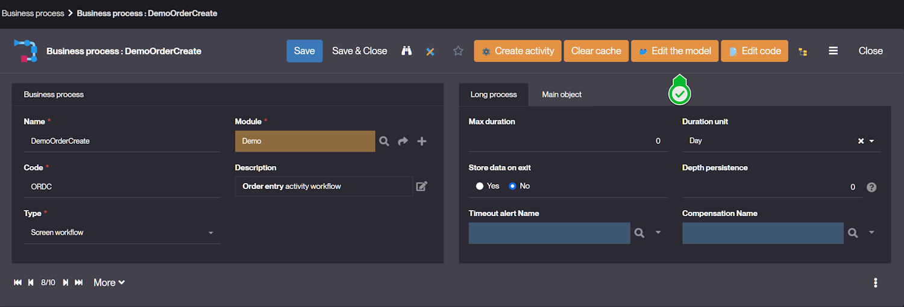
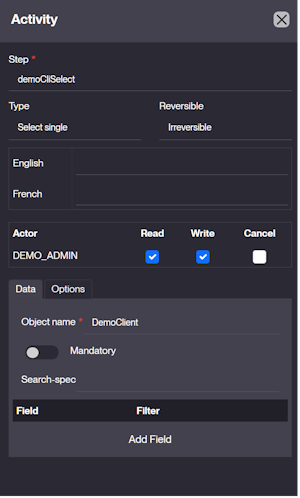

Business Process – Screen Workflow
==================================

Overview
--------

Since version 6.3, the configuration of a Screen Workflow has been redesigned to clearly separate:

- The workflow structure (Business Process): steps, logic, activities
- Workflow permissions: who can start, approve, or see each step during execution.

The configuration is now guided and significantly simplified compared to previous versions.

This document describes the recommended approach for version 6.3 and above.

Architecture in 6.3+
---------------------

A Screen Workflow is composed of two main elements.

### Business Process

Defines:

- Activities
- Transitions
- Activity data
- Routing logic

It defines what happens in the workflow.

### ModelWorkflow

Automatically created when clicking Edit Model.

Defines:

- Actors
- Activity permissions
- Transition permissions

It defines who can execute the workflow.

Creating a Business Process
----------------------------

Create a new process with:

| Field       | Description                              | Required |
| ----------- | ---------------------------------------- | -------- |
| Name        | Functional name                          | Yes      |
| Code        | Unique identifier                        | Yes      |
| Type        | Screen Workflow                          | Yes      |
| Source Code | Java class (optional advanced logic)     | No       |
| Module      | Application module                       | Yes      |

After saving, two activities are automatically created:

- Begin
- End

If removed, they must be recreated manually.

ModelWorkflow – Actors and Permissions
---------------------------------------

After creating the process:

Click **Edit the model**.

A ModelWorkflow model is created automatically.

### Actors

In version 6.3+, Actors represent Groups.

An Actor corresponds to a [group](/make/usersrights/groups)
that is authorized to participate in the workflow.

Once an Actor is assigned, it automatically receives
the necessary permissions for activities and transitions.

- Access activities
- Execute activities
- Trigger transitions

To configure Actors:

- Use Insert Actor or Create Actor
- Select the appropriate Group

At least one Actor must be defined, otherwise the workflow cannot be executed.

### Activity and Transition Permissions

With version 6.3+, permissions are automatically applied when an Actor is assigned to a workflow:

- Activities: the Actor can view (Read), execute/confirm (Write), and optionally skip (Cancel) activities.
- Transitions: the Actor can trigger transitions and access the allowed routing paths.

This means there is no need to manually assign permissions for each activity or transition

Creating Activities (6.3+ Guided Configuration)
-----------------------------------------------

In version 6.3+, activity creation is simplified through a guided screen.

The activity creation form includes:

- Step (mandatory)
- Type
- Reversibility
- Translations
- Actor permissions
- Data tab
- Options tab

### Step

The Step field is mandatory.

It uniquely identifies the activity inside the process.

Best practice: prefix it with the process code.

### Type

The Type determines:

- The behavior of the activity
- The data that must be configured

Available types include:

- Begin
- End
- Search
- New
- Update
- Delete
- Service Call
- Select Single
- Select Multiple
- Split parallel
- Join synchronise
- Condition
- External Page
- Message
- Sub process

The system automatically prepares the required data structure depending on the selected Type.

Previously, this had to be done manually.

Automatic Data Generation (Major Change in 6.3+)
------------------------------------------------

In previous versions:

- For a New or Update activity, you had to manually create:
  - `Object.Name`
  - `Field.<FieldName>`
  Activity data are accessible by code or syntax `[<MyStepName>.Field.<MyFieldName>]`

- For a Select activity, you had to manually configure:
  - `Object.Name`
  - `Filter.<FieldName>`: optional to force a field filter on list
  - `Constraint.Mandatory`: must be `true` to force the user to select at least one value
  - `Search.Spec`: optional to specify one SQL filter on list

In version 6.3+:

- When selecting the Type,
- The system automatically prepares the required data structure.
- The configuration becomes guided and contextual.

This significantly reduces configuration errors.

### Example: New Activity

When Type = New:

The system expects:

- Object definition
- Field configuration

You are guided to specify the business object directly in the interface instead of manually creating Object.Name in Activity Data.

### Example: Select Activity

When Type = Select Single or Select Multiple:

The interface provides structured configuration for:

- Mandatory selection
- Filters
- Search specification

Activity Data (Advanced Configuration)
--------------------------------------

Although the UI generates the required structure, Activity Data still follows the same logical model.

### Data Format

Activity data is defined using the following structure:
`<GroupName>.<DataName>`

Dynamic reference syntax:
`[StepName.GroupName.DataName]`

Each data element:

- Has a single value per activity
- Can reference previous steps
- Can be ordered if multiple values are needed

### Common Data

For CRUD Activities:

- `Object.Name`
- `Field.<FieldName>`

For Select Activities:

- `Constraint.Mandatory`: must be `true` to force the user to select at least one value
- `Filter.<FieldName>`: optional to force a field filter on list
- `Search.Spec`: optional to specify one SQL filter on list
- `[<MyStepName>.Field.row_id]`: at runtime will contain the list of `row_id` = rows selected by the user

For Service Activity:

- `Service.Mode`: `Sync` or `Async` call
- `Service.Name`: java method name to be called in the process implementation

Transitions
-----------

Transitions define navigation between activities.

They can be created:

- Via Activity Link menu
- Directly in the process diagram

### Transition Properties

| Property        | Description                                 |
| --------------- | ------------------------------------------- |
| From Step       | Source activity                             |
| To Step         | Target activity                             |
| Action          | Adds action button                          |
| Condition       | Required if multiple outgoing transitions   |
| Callback Method | Java method                                 |
| Alert Name      | Log or notification                         |
| Module          | Owning module                               |

### Conditional Routing

If multiple transitions leave the same activity:

- The Condition must match the Return.Code
- [DEFAULT] can be used as fallback

End Activity Options
--------------------

Optional parameters:

- `Forward.Page`: final URL to redirect the end of the process
- `PARAM.<index>`: URL parameter

Example:
Forward.Page = [EXPR:HTMLTool.getFormURL("MyBusinessObject", null, "[PARAM:1]", null)]
PARAM.1 = [MyStepNew.Field.row_id]

Execution Flow Summary (6.3+ Standard)
--------------------------------------

1. Create Business Process
2. Click Edit Model
3. Create Actors (Groups)
4. Create activities using guided interface
5. Configure transitions
6. Test execution per Actor

Key Improvements in 6.3+
------------------------

- Clear separation between structure and rights
- Actors based on Groups
- Guided activity creation
- Automatic data preparation
- Reduced manual configuration
- Lower risk of configuration errors
- Improved readability and maintainability

When to Use Java Hooks
----------------------

Implement Java logic when:

- Business rules are dynamic
- Routing depends on runtime computation
- Complex validations are required
- External system integration is needed

Conclusion
----------

Version 6.3 introduces a more structured and guided workflow configuration model.

The Business Process defines the structure.
Activity creation is now assisted by the UI, reducing manual data configuration and improving reliability.

Learn more
----------

- [Business workflow hooks](/docs/core/businessworkflow-code-hooks)
