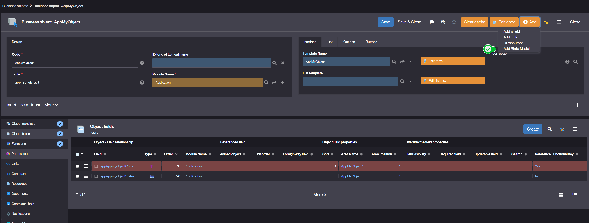
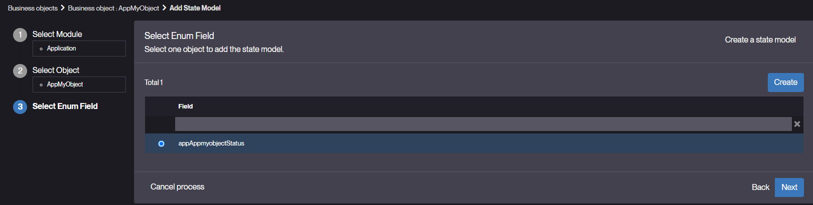
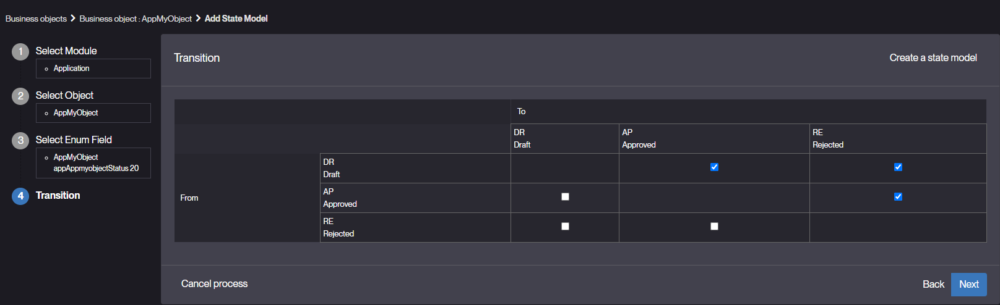
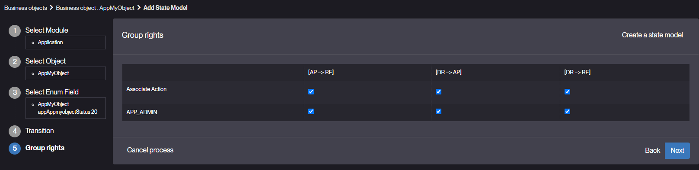
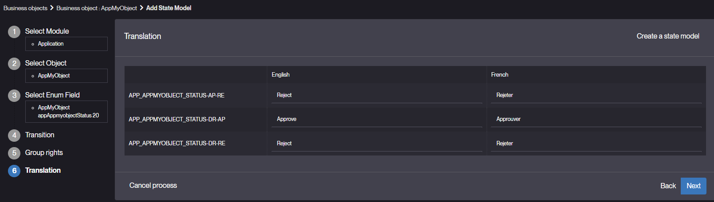

State
=====

What is a State?
----------------

A state represents a step in the lifecycle of a Business Object.

### Key features

A business object can have states that provide the following features:

- Direct access to lists filtered by state via the menu
- Grant-based state transitions (specific user groups (e.g., administrators) can be given rights to move an object to a previous or next state.)
- Actions on state transitions (e.g. send email when an order moves to validated...etc.)
- Execute business rules when an object enters a new state or during state transitions.

How to create a State?
----------------------

### Prerequisites

Before defining states, ensure the following conditions are met:

- the object must have **a simple enumerated field**(which will carry the state)
- this field must be **mandatory**
- the object **must not already have a state**

### Steps to create a State

1. Define the State Field
   - Select the Business Object whose going to follow a state model
   - Create an enumerated field to store the State ([see Creating a Field](/tutorial/getting-started/attribute))
   - Add possible values representing different states (e.g.: Draft, Approved, Rejected)
   - Mark the field as Required
2. State creation wizard
   Once the object has an enumerated field and no state, a state model creation wizard can be accessed via the Add button and then Add State Model.
   
   - Select the Enumerated field whose going to store the state.
   
   - Configure state transitions.
   
   - Set transition permissions.
   
   - Configure automated actions translations on transitions.
   **Note:** Once the state model has been created, it is no longer possible to access this wizard.
   
3. Define a _ModelState_ model
   - Open the modeler.
   - Choose the _ModelState_ template.
   - Add a state created in 2.
   - Right click on the state and choose _Fetch related_ to insert all the relative states or select all the states to insert.
   - The model presents the different states and their transitions, as well as the group(s) of rights authorized to make the transitions.
   - Double click on a state opens the state form.  Double click on a transition open the transition form.
   
