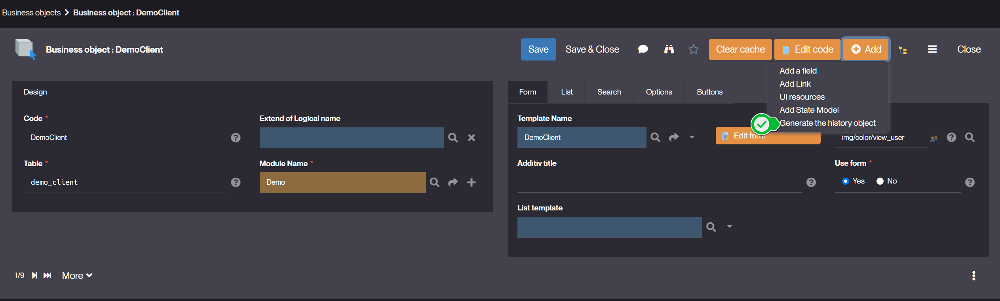
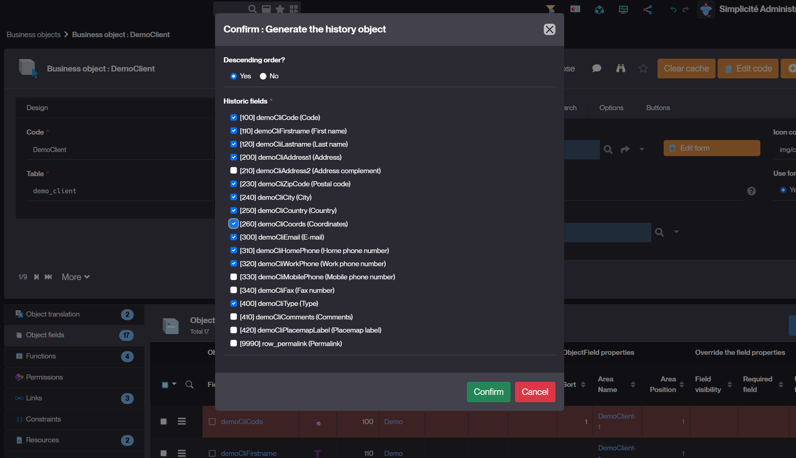
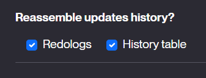

Historization
=============

It is possible to easily activate two types of historization on business objects: the change log and the history table.

Change log
----------

The change log allows you to log all activities done on the object (who, what changes, at what time). To enable it, you must:

- make sure that the system parameter `LOG_ACTIVITY` is enabled ("database": true), which is the default.
- check the "Data History: Change log" option in the business object settings.

:::warning

Currently, it is necessary to manually create a function on the "RedoLog" system object to give access to change-logs to end users.
Be sure to remove module filters to add this function.

:::

Child objects change logs
------------------------

You can retrieve redo logs of child objects into the parent **Change log panel**:

- Use the **Link option**: `Reassemble updates history?`

- Or by code:
  
```java
getLink("DemoProduct","demoPrdSupId").setMergeRedologs(true);
```

History table
-------------

The history table allows you to record all or part of an object in an _ad hoc_ table.

Activating the history will result in the creation of a "Historic" object  
(e.g. `TrnProductHistoric`) in the same module as the business object,  
with all the fields of the object to be historized, plus:

- a reference to the creating record
- the date of historization
- the user's login
- **[Since 6.3]** a **summary of updates** field `row_diff`

:::note
This calculated field `row_diff` generates, on search,  
the difference between a record and its previous version (`row_id` based).

It is currently used for History objects but can also be added to other objects.
:::

When `FeatureFlag.HISTORY_DIFF_MODE` is active, the History object automatically includes this field (for pre-6.3 objects).

It is activated by default, and overridable through the system parameter [FEATURE_FLAGS](/versions/release-notes/v6-3#new-featureflags):

```json
{
  "history_diff_mode": false
}
```

A read-only function is created on this historical object, which must be granted in order to view it.
The object is not automatically added to the model, but it is possible to add it manually.

It is the presence of a field in the history object that determines which changes cause historization.
For example, if we delete the object field "description" from the `TrnProductHistoric` object,
not only will the description not appear in the "snapshot" taken at any time, but the change in description will not create a new row in the history.

### **[Since 6.3]** New action to generate the Historic object

A new action on object definition is available to build the history object/table:

- Specify if the history is in descending order
- Select the fields to be historized





Then the action creates or updates the history object:

- with technical fields `row_idx`, `created_by_hist` and `created_dt_hist`
- and the foreign key `row_ref_id` to parent object with its referenced key fields
- and the selected fields to be historized on parent updates

This object can be updated manually by designers.

### Conditional historization

You can use the **`isHistoric` hook** to add business rules that conditionally trigger historization. This allows you to:

- Historize only when specific conditions are met
- Implement custom logic to determine when a snapshot should be created
- Add fine-grained control over what changes are recorded
- Restrict historization to specific user groups or responsibilities

Example:

```java
@Override
public boolean isHistoric() {
    // Only historize if status changes to "Validated"
    return this.getStatus() == "VALIDATED";
};
```

### **[Since 6.3]** Reassemble child updates history

You can now display the history of child objects within the parent object's history table:

- Check the **"Reassemble updates history"** option in the link setting
  
  

- This will include child object changes in the parent's history view, providing a consolidated view of all related changes

Change Log vs History Table: Key differences
--------------------------------------------

### **Change Log (RedoLogs)** - Technical auditing tool

The **Change Log** is a **technical tracking system** that records every single change made to an object.

**Purpose:**

- Track who did what and when at a granular level
- Provide complete audit trail for technical troubleshooting
- Debugging and system analysis

**Key characteristics:**

- Records **all** changes without filtering
- Cannot be customized with business rules
- **Security consideration:** Shows all field changes, even for fields the current user cannot normally access

:::danger Security Warning

If you expose the Change Log to end-users, they may see **data they don't have permission to view**.

:::

### **History Table** - Business-oriented historization

The **History Table** is designed for **end-users and business purposes**.

**Purpose:**

- Provide a safe, user-friendly view of object evolution
- Track business-relevant changes with custom rules
- Display change summaries without exposing restricted data

**Key characteristics:**

- Can be filtered using the `isHistoric` hook for business logic
- **[Since 6.3]** Includes an **Summary of updates** field showing a summary of changes
- **[Since 6.3]** Can reassemble child object updates for a consolidated view
- Respects field-level permissions and business rules
- Safe to expose to end-users

**Recommendation:** Use the History Table when you need to show change tracking to business users,
as it provides better control over what is recorded and displayed.
