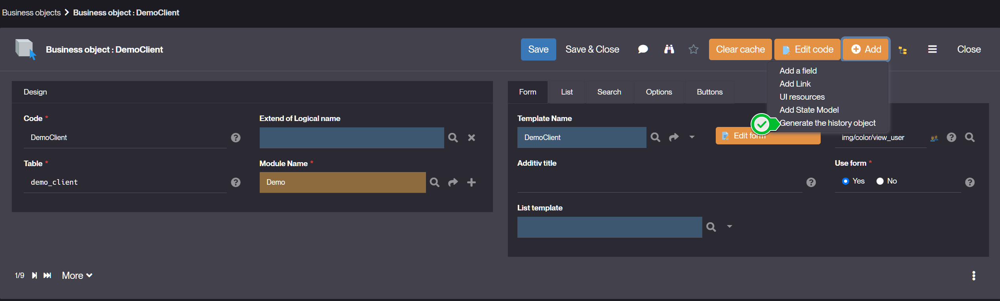
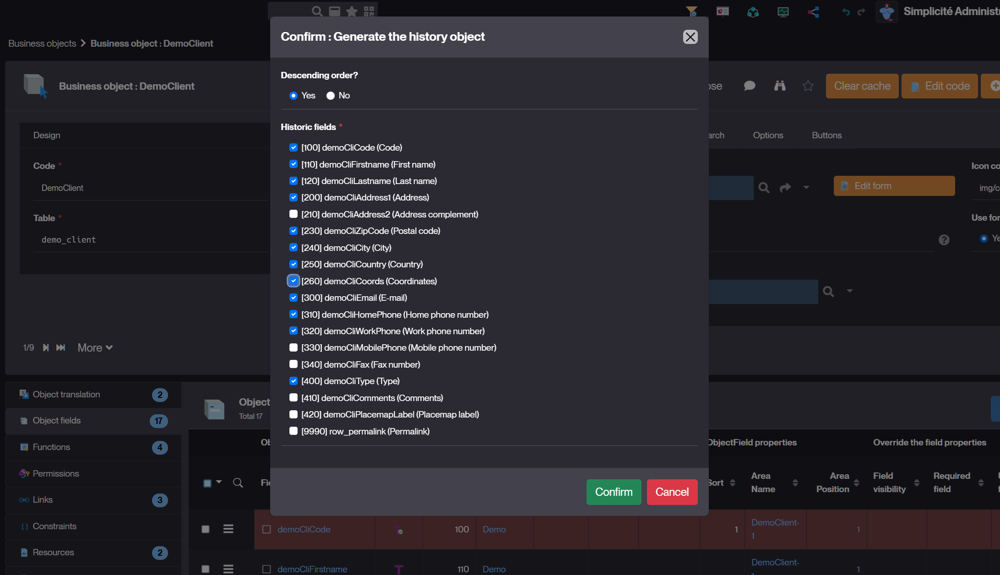
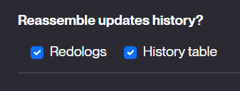

Historization
=============

It is possible to easily activate two types of historization on business objects: the history table and the change log.

| | History table | Change log |
| --- | --- | --- |
| **Role** | Business-oriented historization | Technical auditing tool |
| **Purpose** | Give end users a safe view of how a record evolved | Track who did what and when, for troubleshooting and system analysis |
| **What is recorded** | All or part of the object's data, in a dedicated table | Every change, with no filtering |
| **Business rules** | Conditional historization through the `isHistoric` hook; the maker chooses which fields are historized | Fixed: every change is recorded |
| **Permissions** | Respects field-level permissions and business rules | Shows every field change, including fields the current user cannot normally access |
| **Child updates** | **[Since 6.3]** Child updates can be reassembled into the parent history | Child redo logs can be reassembled into the parent change log panel |
| **Change summary** | **[Since 6.3]** `row_diff` field with a summary of updates | Each entry is the change itself (who, what, when) |
| **Audience** | Safe to expose to end users | Technical users. Exposing it to end users can reveal restricted data |

History table
-------------

The history table records all or part of an object's data in a dedicated table.

Enabling history creates a "Historic" object (e.g. `TrnProductHistoric`) in the same module as the business object.
It contains all the historized fields of the object, plus:

- a reference to the original record
- the historization date
- the user's login
- **[Since 6.3]** a **summary of updates** field, `row_diff`

:::note
The `row_diff` field is calculated on search:
it shows the differences between a record and its previous version (based on `row_id`).

It is currently used by the History panel, but it can also be added to other objects.
:::

When `FeatureFlag.HISTORY_DIFF_MODE` is enabled, this field is automatically added to the generated Historic object.
For Historic objects created before 6.3, add the field to the object fields manually if needed.

The flag is enabled by default and can be disabled through the [FEATURE_FLAGS](/versions/release-notes/v6-3#new-featureflags) system parameter:

```json
{
  "history_diff_mode": false
}
```

The `row_diff` feature can also compare sibling records of any object:

- add the `row_diff` field to the object
- call `setRowDiff(true)` to enable the calculation on search (e.g. in `postLoad`, for panel instances only)
- beware: the calculation runs many SQL queries and is slow, so never use it on large searches

A read-only function is created for the Historic object and must be granted for users to view it.
The object is not added to the model automatically, but the maker can add it manually.

The fields present in the Historic object determine which changes trigger historization.
For example, if the maker removes the "description" field from `TrnProductHistoric`,
the description no longer appears in the history snapshots, and changing the description no longer creates a new history row.

### Historic object generation

**[Since 6.3]**, an action on object definition is available to build the history object/table:

- Specify if the history is in descending order
- Select the fields to be historized





Then the action creates or updates the history object:

- with technical fields `row_idx`, `created_by_hist` and `created_dt_hist`
- and the foreign key `row_ref_id` to parent object with its referenced key fields
- and the selected fields to be historized on parent updates

This object can be updated manually by designers.

### Conditional historization

The maker can use the **`isHistoric` hook** to add business rules that conditionally trigger historization. This makes it possible to:

- Historize only when specific conditions are met
- Implement custom logic to determine when a snapshot should be created
- Add fine-grained control over what changes are recorded
- Restrict historization to specific user groups or responsibilities

Example:

```java
@Override
public boolean isHistoric() {
    // Only historize if status changes to "Validated"
    return this.getStatus() == "VALIDATED";
};
```

### Child updates history

**[Since v6.3]** the maker can now display the history of child objects within the parent object's history table:

- Check the **"Reassemble updates history"** option in the link setting
  
  

- This will include child object changes in the parent's history view, providing a consolidated view of all related changes

Change log
----------

:::danger Security Warning
If the maker exposes the Change Log to end-users, they may see **data they don't have permission to view**.
:::

The change log records all activities done on the object (who, what changes, at what time). To enable it, the maker must:

- make sure that the system parameter `LOG_ACTIVITY` is enabled ("database": true), which is the default.
- check the "Data History: Change log" option in the business object settings.

:::warning
Currently, it is necessary to manually create a function on the "RedoLog" system object to give access to change-logs to end users.
Be sure to remove module filters to add this function.
:::

### Child objects change logs

The maker can retrieve redo logs of child objects into the parent **Change log panel**:

- Use the **Link option**: `Reassemble updates history?`

- Or by code:
  
```java
getLink("DemoProduct","demoPrdSupId").setMergeRedologs(true);
```
