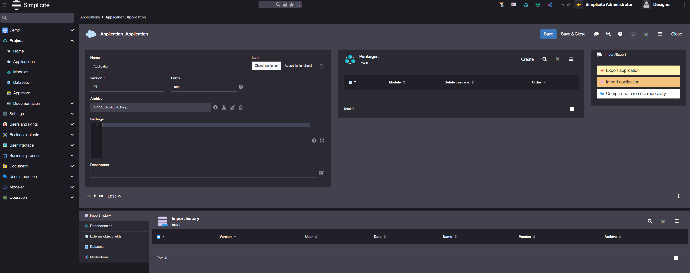

Application
===========

Introduction
------------

An **Application** in Simplicité is a structured entity composed of multiple **Modules**. It serves as the main container
for organizing business logic, configurations, and functionalities.

- It provides a structured way to group modules.
- It facilitates the export, import, and versioning of configurations.
- It creates a POM file

Configuring an Application
---------------------------

### Creating an Application

To create an Application, follow the steps below:

1. Navigate to **Project>Applications**.
2. Click **Create**.
3. Fill in the application details (e.g., name, version, prefix) and click **Save**.

> Example values:
> 

### Application Actions

| Action Name | Description |
| ----- | ----------- |
| Export Application | Generate and download an application package |
| Import Application | Import an application configuration from a file |
| Compare with Remote Repository | Compare local configuration with a remote repository |

### Application Structure

An application consists of:

- **Modules**: core components of an application. They contain business objects, actions, fields, and other configuration elements.
- **Packages**: A Package represents the relationship between the Modules and the Application.
- **Import History**: Logs of imported versions and configurations.
- **Archive**: The application archive contains the POM (Project Object Model) file and the modules that compose the application.

### Application-Module Relationship

When associating modules with an application, different relationship rules can be applied:

- Impossible if referenced: Prevents module deletion if it is referenced elsewhere.

- Delete cascade: Automatically deletes associated modules when the application is deleted.

- Set relation to empty: Removes the link between the application and modules without deleting the module itself.

Configuration Fields
--------------------

| Field | Description |
| ----- | ----------- |
| Name | Unique identifier of your application |
| Version | Application version number |
| Prefix | Short identifier used for naming conventions |
| Archive | File used for storing exported applications |
| Settings | JSON object for additional application configurations |

Read More
---------

- [Managing Git Repositories](/docs/integration/webservices/git-repositories)
