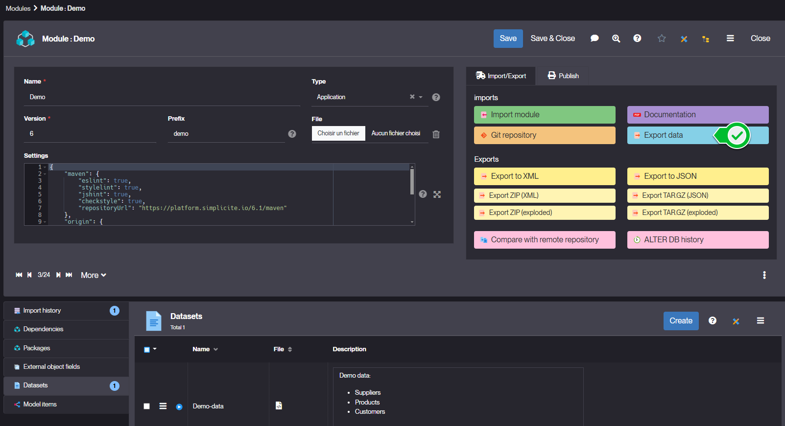

# Datasets

## What are Datasets ?

When installing a module, it is often useful to provide a test data set

To transfer data from one instance to another, the first method that comes to mind is to export the database or a sub-part of the database. This is **technical export**. The problem that can arise in **partial** technical exports is the following
- if an exported object A refers to a non-exported object B
- the SQL export of the table of object A will therefore contain the technical key of object B
- when importing on another instance, this technical key may not correspond at all to what object B was in the original instance.

This is why there is a **functional export**, which is an export that contains **only functional data**, not technical data such as IDs. When it is imported, Simplicité will *fetch the ID of the linked object from its functional key*, and make the link. For this to work, object A must of course contain all the fields of the functional key of object B to which it is linked, otherwise object B cannot be found to make the link.

An export per object is available on the lists as a designer (menu plus > export > export Simplicité), but to create a real dataset, the platform offers the possibility to generate them automatically. To do this, it is important to understand that the order of import is crucial. It is impossible to import products before suppliers. In cases of complex models (circular relationships), it is complicated for the platform to determine the import order. Some objects may not make sense in a dataset (for example, one may decide not to include historical data). It is for these reasons that it is necessary to configure this order manually.  

## How to create a Dataset ?

To create a dataset, follow the steps below: 

1. Add the order of export of each objects of your module.  
In case your application depends on different modules make sure that the global export order is consistent, as datasets relate to one module only.   
   
2. Once all the export orders have been completed, you can generate your dataset.   
Go to the Project menu and click on Modules (you can use the menu's search bar), open your module and click on Export data.   
   
