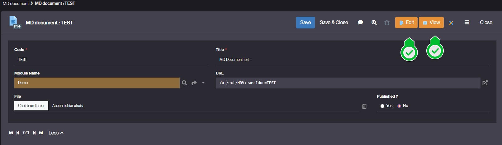
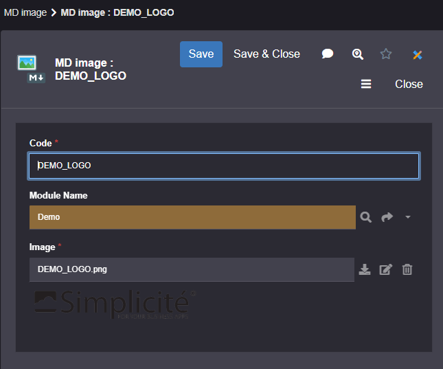

MD Document and MD Image
========================

Introduction
------------

MD document and MD image allow you to manage your documents in Markdown format and the images they may contain
for publication to all types of user (business, project teams, etc.).

A URL can be used to display them in the UI so that they can be presented to users in the menu via
an external object, in a list or form via an action, or in a shortcut.

Usage
-----

### MD Document Creation

To create a MD Document, follow the steps below:

1. Click **Create** in Project > Documentation > MD Document
2. Fill in the MD Document information and click **Save** :
   > Example values :
   
The URL for viewing the MD Document is automatically generated.
Once you have edited the MD document, the attached file will be automatically generated in Markdown format with the MD Document code as its name.

### MD Document actions

| Action name | Description                          |
| ----------- | ------------------------------------ |
| Edit        | To create or update your document    |
| View        | To view your document in HTML format |

### MD Document configuration

| Field       | Description                                |
| ----------- | ------------------------------------------ |
| Code        | Unique identifier of your MD Document      |
| Title       | UI title of your document                  |
| URL         | Module trigram used for naming conventions |
| File        | the attached file of the content           |
| Published   | Available or not to users                  |
| Module name | Membership module                          |

Shortcuts for integrating models, images and specifications
-----------------------------------------------------------

- `[IMAGE:<mdimage_code>]` : to embed an image
- `[MODEL:<model_name>]` : to embed the image of a data model
- `[OBJECTDOC:<object_name>]` : to embed configuration description of the object.

### MD Image Creation

To create a MD Image, follow the steps below:

1. Click **Create** in Project > Documentation > MD Image
2. Fill in the MD Image information and click **Save** :
   > Example values :
   
The Image field is where you upload your image file.
The image can be viewed from the MD Image form.
To put it in the MD document, use ```[IMAGE:<image code>]```.

### MD Image configuration

| Field       | Description                           |
| ----------- | ------------------------------------- |
| Code        | Unique identifier of your MD Document |
| Image       | UI title of your document             |
| Module name | Membership module                     |
