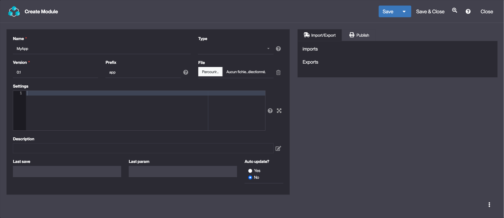
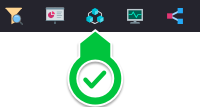
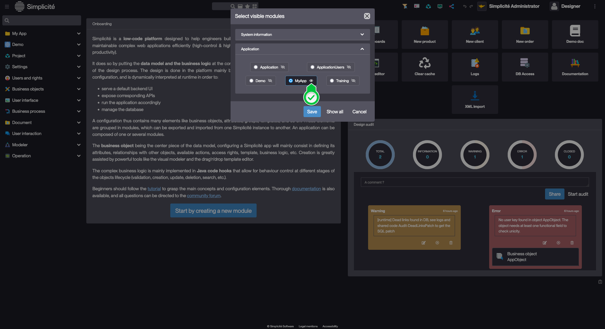

Module
======

Introduction
------------

Each configuration of an app starts with the creation of a module.

**All the configuration objects are part of a module, corresponding to the export unit of Simplicité**.

Simplicité is configured via **configuration objects** that provide the description of the application. These objects are business objects, fields, templates, actions, etc.

Usage
-----

### Creation

> If you are creating your first Module use the [Module creation assistant](/tutorial/getting-started/module)

To create a Module, follow the steps below:

1. Click **Create** in Project > Module
2. Fill in the Module information and click **Save**:
    > Example values :
    

### Module actions

| Action name                    | Description                                                                                  |
| ------------------------------ | -------------------------------------------------------------------------------------------- |
| Import module                  | Import module stored in the **File** field or defined in **Settings** field                  |
| Documentation                  | Generate PDF module documentation                                                            |
| Git repository                 | Open GIT view                                                                                |
| Export data                    | Generate Dataset                                                                             |
| Export to XML                  | Generate Module XML file and store in **File**                                               |
| Export to JSON                 | Generate Module JSON file and store in **File**                                              |
| Export ZIP (XML)               | Generate a ZIP archive containing Module XML file and store in **File**                      |
| Export TAR.GZ (JSON)           | Generate a TAR.GZ archive containing Module JSON file and store in **File**                  |
| Export ZIP (exploded)          | Generate ZIP archive containing a tree-like structure of the Module and store in **File**    |
| Export TAR.GZ (exploded)       | Generate TAR.GZ archive containing a tree-like structure of the Module and store in **File** |
| Compare with remote repository | Compare local configuration with a remote repository                                         |
| ALTER DB history               | Retain relevant configuration items' old values during export                                |

### Module filtering & default module {#module-filtering}

The **Visible Modules* button in the platform's header: 

- Filters the platform's configuration objects by module (eye icon next to the module name).
- Sets a default module for new configuration objects (selected item in the list).

> In this example, "MyApp" is the default module, and configuration objects (e.g., Business Objects, Groups, Fields) are filtered accordingly.

When a Module filter is set, the header button is *highlighted*.

Configuration
-------------

| Field    | Description                                                              |
| -------- | ------------------------------------------------------------------------ |
| Name     | Unique identifier of your module (generally the name of the application) |
| Type     | Used to describe the purpose of the module                               |
| Prefix   | Prefix (e.g. trigram) used for naming conventions                        |
| Settings | JSON object used to link to module to a remote URL, see in-app help      |

### Modules types

There are several module types:

- **Simplicité modules** : those are reserved for official Simplicité modules, you should not create nor edit modules of the following types :
    - System : core modules
    - Add-On : some are provided by default, others through the AppStore
- **Multi-module** apps. Modules of this kind offer specific functionality through the [Application object](/make/project/application).
    - Application 
- **Standard modules** : interchangeable types, provided for filtering purposes, with no associated functionality
    - App component
    - Common
    - Toolbox
    - Services
    - Data

## Read more

- [Managing Git repositories](/docs/integration/webservices/git-repositories)