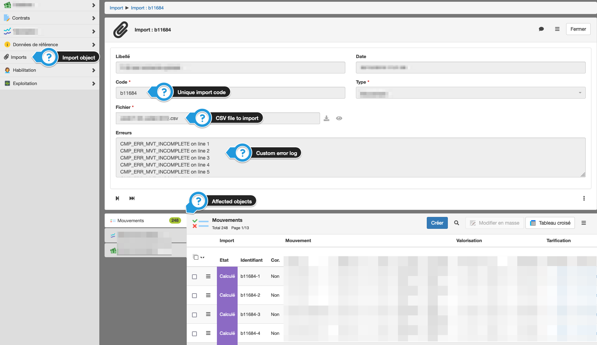

Adapters
====================

An adapter is a Simplicité tool which aims at processing incoming data, generally to import it in the database. Although it is always possible to import data by handling the task in custom code, using adapters offers some advantages:
- pre-built adapter classes to build upon and speed up development (see the [integration package JavaDoc](https://platform.simplicite.io/current/javadoc/com/simplicite/util/integration/package-summary.html))
- centralized "Imports supervisor"
- import logs handling
- imported file storing
- built-in import options :
    - atomic imports
    - stop at first error
    - parallel loading

> Using a dedicated business object and totally circumventing Simplicité's mechanisms can sometimes be a better approach, depending on your business needs.

There are many ways of importing data into a Simplicité App. Let's get en overview and settle the pro's and con's.

## XML Adapters

### Standard XML import
As we know, **the mother tongue of Simplicité is XML**. As a reminder, here is the simplified general XML structure:

<details>
<summary>Click to open</summary>

```xml
<simplicite>
    <object>
        <name>MyObjectName</name>
        <action>update</action>
        <data>
            <myObjectField>data_A1</myObjectField>
            <myObjectField2>data_A2</myObjectField2>
        </data>
        <data>
            <myObjectField>data_B1</myObjectField>
            <myObjectField2>data_B2</myObjectField2>
        </data>
    </object>
</simplicite>
```

</details>

In this most basic case the import looks like this:

> `XML_Simplicité`  --->  nativeXMLReader()  ---> DB

One good thing is that with this native reader this **data travels through all the normal validations pipes and Java hooks that you configured for your object**. It's just as if you copied it on the forms and hit "save", if the data is not valid, you'll get an error.

### Stock XML adapters

Adapters are called the way they are called because historically they were conceived as functions that would transform a specific kind of structured data (for example JSON) to the Simplicité-XML format:

> `JSON` ---> stockJsonAdapter() ---> `Simplicité-XML` ---> nativeXMLReader() ---> DB

Simplicité comes bundled with some "stock adapters". They are **structurally identical** to the native XML format:
- JSON adapter
- YAML adapter
- ZIP adapter (files are bundled with the XML instead of being inlined into it as base64)
- CSV adapter (deprecated)

### Custom XML Adapters

Most of the time, the standard XML/JSON structure is not the needed format, so you need to write your own adapter:

> `customStructuredData` ---> `customAdapter()` ---> `Simplicité-XML` ---> nativeXMLReader() ---> DB

Often, these custom adapters leverage Simplicité's parsing mechanisms by inheriting one of the internal classes, all in the `com.simplicite.util.integration` package :

```
- SimpleAdapter
    - LineBasedAdapter
        - CSVLineBasedAdapter
    - SAXParserAdapter
        - SimpleSAXParserAdapter
            - SAXImportXML
    - SimpleJSONAdapter
        - SimpleYAMLAdapter
    - SimpleXLSAdapter
        - CellBasedXLSAdapter
    - SimpleXLSXAdapter
        - CellBasedXLSXAdapter
    - SimpleSQLAdapter
        - SQLAdapter
```

To create a new adapter, go to Operation > Adapter > Create. Once created (and the Java code written):

* the adapter will be **automatically made available through the XML Import page** => you don't need to code any UI.
* in the **Imports Supervisor** object, your adapter will generate will automatically save:
  * the input file 
  * the XML generated by your adapter
  * a log file, concatenating:
     * our adapter logs
     * the native XML reader logs
  * an error file, if the XML import fails

The canonical example is available in: [basic CSV->XML Adapter](/docs/integration/adapters/csv-to-xml)

## Direct Adapters

There are cases where you don't want to generate the intermediate XML. Think about very large imports, that would clutter the import supervisor object with huge XML files, and might pose memory problems. In these cases, we can use direct adapters, for which the usage is the same, but the way of processing the data is different:

> `customStructuredData` ---> `customAdapter()` ---> DB

These adapters can leverage the same helper classes mentioned before.

The canonical example is available in: [direct CSV->DB Adapter](/docs/integration/adapters/csv)

## Stock CSV Adapter

A special case is the new Stock CSV Importer, that will offer an admin-friendly interface to import CSV files and apply some mappings and transformations to the data. It's still limited to one object per CSV but has two modes : direct (CSV=>DB) or indirect (CSV=>XML=>DB)


Custom Import Objects
====================

In cases where...
- you don't need/don't want to clutter the Import Supervisor, 
- OR need your non technical users to import the data (no access to "Operations")
- OR need custom logging / error messages **available to business**
- OR need a link between the import and the business object

...you might need to build a custom import object.

Below is a screenshot of such a case, where the imported objects **must** be systematically associated to a source file **and** follow a manual validation state model ("Imported" > "Validated"), done either by record or in bulk. *The import process is coded in the "import object" and is totally independent from the adapter mechanisms; let's note that it **could** leverage an adapter through code if we want to also use the import supervisor & parallelization features.*



## One last word...

Wether you use an adapter or a custom import object, it's always Java running under the hood that you'll have to code, please make sur you understand how parsers work and why you should one against another. These choices can have big memory and performance implications.