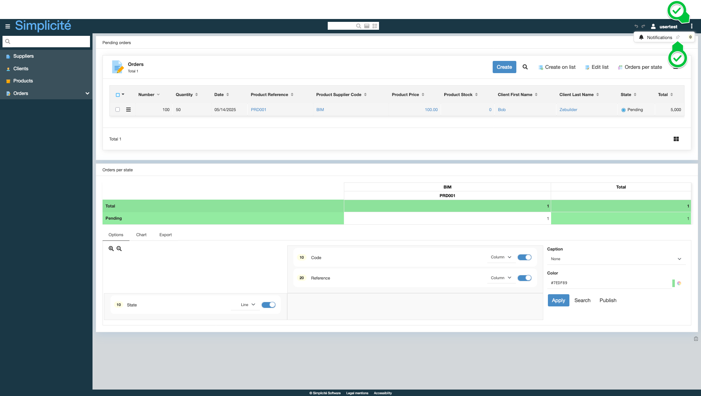
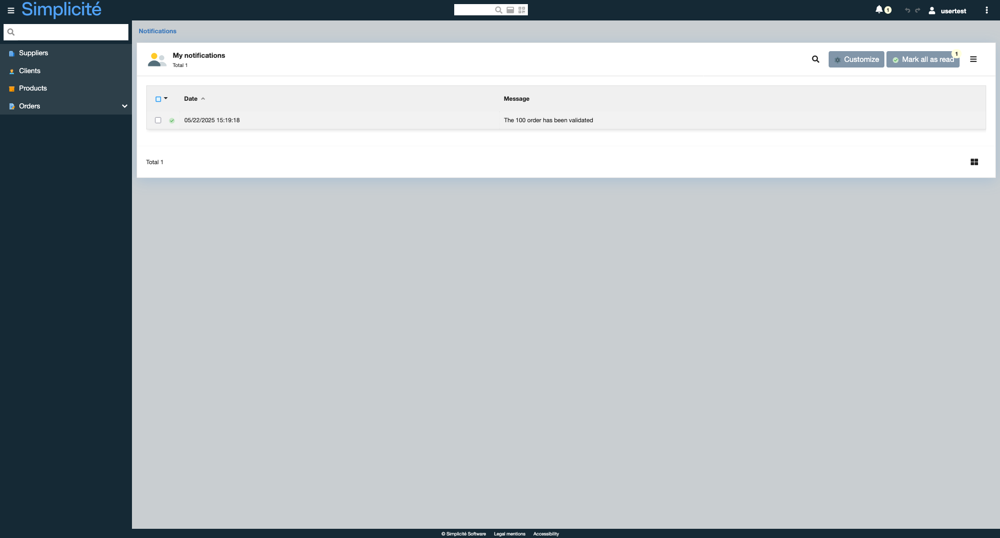

import Tabs from '@theme/Tabs';
import TabItem from '@theme/TabItem';

# Notifications

## What are Notifications ?

Notifications are used to notify users of events that occur in the platform. They are triggered by an action (create, update, delete) on a business object and can optionally have an execution condition in the form of an [expression](/docs/core/expressions). They can be sent through multiple broadcast channels to multiple recipients. It's content is defined per language and can be overridden for a particular channel and/or recipient.

Configured recipients are concerned by all of the notification's channels or be set up individually for a more precise configuration per recipient. 

## Configuration

| Field | Description |
| ----- | ----------- |
| Name | Unique identifier |
| Object | The business object linked to the notification |
| Action | The action that triggers the notification (create, update, delete) |
| Expression | The condition that must be met for the notification to be sent |

In order to receive internal notifications, users must be part of the `NOTI_USER` system group.

### Recipients

<Tabs>
<TabItem value="tab1" label="User">
A named user of the platform
</TabItem>
<TabItem value="tab2" label="Group">
A group of users
</TabItem>
<TabItem value="tab3" label="SQL">
The result of an SQL query : 

```sql
SELECT user_fk FROM my_object WHERE row_id = [ROWID]
```
</TabItem>
</Tabs>

If the notification is not mandatory, recipients have the option to **subscribe** or **unsubscribe** from the notifications they receive (via the *Subscriptions* button on their notification list).

### Channels

<Tabs>
<TabItem value="tab1" label="Internal">
The counter of a bell icon visible in the platform's header is updated with each new notification. Notifications are stored in a system table
</TabItem>
<TabItem value="tab2" label="Mail">
An email is sent to the recipients of the notification
</TabItem>
<TabItem value="tab3" label="Specific">
Invokes a method of the business object linked to the notification

```java title="MyObject.java"
public class MyObject extends ObjectDB {

    [...]

    public void myCustomMethod(Notification notification) {
        // TODO: implement
    }

    [...]
}
```
</TabItem>
<TabItem value="tab4" label="Web Push">
Sends a push notification to the user's browser. 

Read more about the Push API on [MDN](https://developer.mozilla.org/en-US/Web/API/Push_API) and the [VAPID RFC](https://datatracker.ietf.org/doc/rfc8292/)

Web push notification require a set of system parameters :
- `WEBPUSH` : `yes`
- `WEBPUSH_VAPID_KEY` : generated VAPID public key
- `WEBPUSH_VAPID_PRIVATE_KEY` : generated VAPID private key
- `WEBPUSH_VAPID_MAILTO` : `mailto:<contact-email>`

To generate VAPID keys, you can use the [web-push tool](https://www.npmjs.com/package/web-push) or an [online generator](https://www.attheminute.com/vapid-key-generator)

</TabItem>
</Tabs>

> *By default, notifications are sent through all configured channels to all configured recipients, but optionally, a channel can be limited to some of the configured recipients.*

## Using Notifications in code

### `preNotification` hook

The `preNotification` hook is called before the notification is sent. It can be used to modify the notification's content or cancel the notification when an error message is returned.

```java
public class MyObject extends ObjectDB {

    @Override
    public String preNotification(Notification notification) {
        notification.addContent("ENU", "A new notification has been created");
        return null;
    }
}
```

### `postNotification` hook

The `postNotification` hook is called after the notification is sent. It can be used to perform actions after the notification is sent.

```java
public class MyObject extends ObjectDB {

    @Override
    public void postNotification(Notification notification) {
        // TODO: implement
    }
}
```

### Manually triggering a notification

Notifications can be triggered manually by invoking the `push` method of the `NotificationTool` class.

```java
public class MyObject extends ObjectDB {

    public void customTriggerMethod() {
        Notification n = this.getNotification("MyNotification");
        NotificationTool nTool = new NotificationTool(n);
        nTool.push(this);
    }
}
```

## End-user features

- Users granted to the `NOTI_USER` group have access to a **Notification** shortcut that can be pinned to the platform's header.


- When clicking on the bell icon, the list of notifications is displayed.


- Notifications can be discarded by clicking on the **Check** button on a line or by clicking the **Mark all as read** button.
- When clicking on a notification, the linked record is opened.

- The **Customize** button allows to subscribe or unsubscribe from notifications : 
    - Users can only unsubscribe from *non-mandatory* notifications (configured at the broadcast channel level)

## Read more

- [Notifications tutorial](/tutorial/enhancing/notifications)

