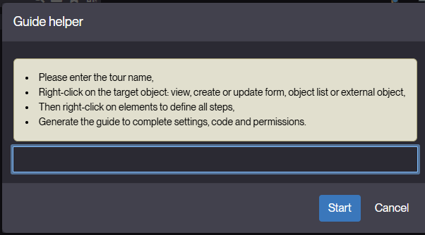
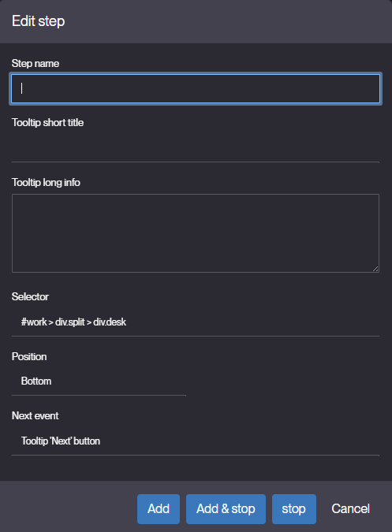

Guide Recorder
==============

What is Guide recorder?
-----------------------

In Simplicité [version 6.3](/versions/release-notes/v6-3), **Guide Recorder** is a helper tool to build a guide tour directly while navigating the UI.

It allows guide creators to **capture each step of a guide**, define instructions, and configure actions interactively.

How to Access Guide Recorder?
-----------------------------

Access to **Guide Recorder** is restricted:

- Users must have the `GUIDE_MAKER` responsibility.
- Users must have read access to the **DomainSocialUser** domain.

Without domain access, Guide Recorder will not be visible, even if the user has the `GUIDE_MAKER` responsibility.

The menu can be found under **User Interaction > User Onboarding** in the application.

Guide Recorder Usage
--------------------

To create a guide using Guide Recorder:

1. **Navigate to the target screen** where you want to start the guide.
2. **Activate Guide Recorder** from the menu.
3. For each step in the guide:
   - **Right-click** on the UI element you want to highlight.
   - **Enter the step details** in the dialog that appears:
     - **Step name** – The internal name of the step, used to identify it within the guide. Keep it short and descriptive (e.g., "Login Button").
     - **Tooltip short title** – A brief title shown in the tooltip to summarize the step for the user. Usually one line (e.g., "Click to log in").
     - **Tooltip long info** – Detailed instructions or explanations displayed in the tooltip. Provide context, guidance, or warnings
       (e.g., "Click this button to access your dashboard after entering your credentials.").
     - **Selector** – The CSS or UI element selector that identifies the target element for the step.
       This is usually captured automatically but can be adjusted if needed.
     - **Position** – The placement of the tooltip relative to the target element. Options:
       `top`, `bottom`, `left`, `right`. Choose a position that is clearly visible.
     - **Next event** – Defines what happens after the step is completed. Options include "Click", "Input Text",
       "Navigate to page", or "Wait for user interaction". Controls the flow to the next step.
      
4. **Repeat the process** for every step of the guide.
5. **Save the guide** once all steps are captured.

### Tips for Effective Guides

- Keep instructions **concise and clear**.
- Highlight only **necessary elements** to avoid confusion.
- Test the guide to ensure steps execute correctly.

Managing Guides
---------------

After recording steps:

- **Edit Steps** – modify titles, descriptions, or actions if needed.
- **Reorder Steps** – change the sequence of the guide if necessary.
- **Test the Guide** – simulate the guide as an end-user to verify clarity.
- **Publish** – make the guide available to end-users.
