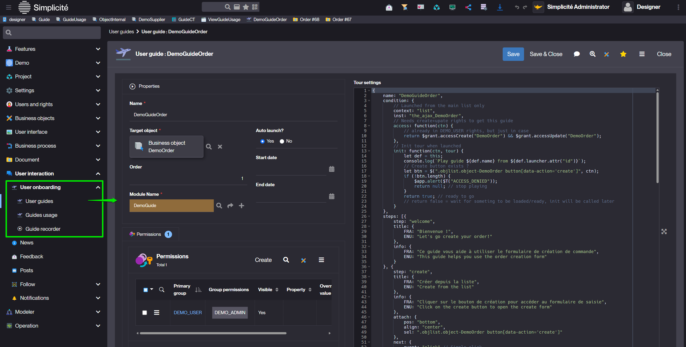

User Guides
===========

What is a User Guide?
---------------------

In Simplicité [version 6.3](/versions/release-notes/v6-3), a **User Guide** is an interactive tour designed to onboard users
and help them understand how to use the application.

A guide can walk the user through various parts of the UI, highlighting steps, actions, and interactions.

User Guides can be:

- Launched from any **view**, **home page**, **business object**, **dashboard**, **Domain home** or **external object**.
- Restricted to a **limited period of availability**.
- Made visible only to **specific user groups**.
- Composed of multiple **steps**:
  - On a single page.
  - Across several asynchronous pages or dialogs.
  - With required user interactions (clicking a button, completing a field, etc.).

With User Guides, Simplicité provides a structured, interactive way to onboard users and support application adoption.

How to Create a User Guide?
---------------------------

### Accessing Guides

Users with the `GUIDE_MAKER` responsibility gain access to the **Guides** menu, which includes:

1. **User guides** – full definitions of guides with step settings and permissions.
2. **Guides usage** – tracking information (who used a guide and when).
3. **Guide recorder** – a helper tool to build a guide skeleton directly while navigating the UI.

### Creating a Guide

1. Go to **User Interaction > User guides**.
2. Click **Create** a new Guide.
3. Define the following properties:
   - **Name** – unique key for the guide.
   - **Module name** – the [module](/make/project/module) to which the guide belongs.
   - **Target object** – Simple view, home page, business object, dashboard, domain home or external object.
   - **Availability period** – optional start/end dates.
   - **Order** - defines the order of display when multiple guides are available.
   - **Auto launch** – automatically launches the guide when the user first accesses the target object.
   - **Tour settings** – advanced options such as display style, navigation controls, or steps.

4. Define **steps** for the guide:
   - Page or dialog context.
   - Target element in the UI.
   - Step description/instruction.
   - Expected user interaction (click, input, validate, etc.).

5. Save the guide and test it in the UI.



### Creating a Tour

A **Tour** is a structured JSON object that defines a guide with **steps**, **conditions**, and **exit behavior**.

#### Structure of a Tour

```js
{
    name: "GuideName",
    condition: { ... },       // Launch conditions and access rules
    steps: [ { ... }, { ... } ],  // List of guide steps
    exitToast: { ... }        // Optional message at the end of the tour
}
```

#### Launch Conditions

The condition defines when and how the tour can be launched:

- `context` - location in which the tour is launched. (`view`, `list`, `external`, `create`, `update`)
- `inst` - instance name of the target object/view.
- `access` - function to check user permissions.
- `init` - optional logic to verify the page or elements are ready.

```js
condition: {
    context: "list",            // Launch context: "list", "form", etc.
    inst: "the_ajax_Object",    // Technical instance name of the target object
    access: function(ctn) {     // Optional access control function
        return $grant.accessCreate("ObjectName") && $grant.accessUpdate("ObjectName");
    },
    init: function(ctn, tour) { // Optional initialization logic
        // Example: check if a button exists before starting
        let btn = $(".objlist.object-MyObject button[data-action='create']", ctn);
        if (!btn.length) return null; // stop playing
        return true; // ready to go
    }
}
```

#### Defining Steps

Each step guides the user through an action or element:

- `step` - identifier for the step.
- `title` - multilingual step title.
- `info` - optional description text.
- `attach` - tooltip positioning and target element.
  - `sel` : CSS selector
  - `pos` : `"bottom" | "top" | "left" | "right"`
  - `align` : `"left" | "center" | "right" | "top" | "middle" | "bottom"`
- `next` - how to proceed to the next step
  - `event` : `"click" | "onload" | "toggle" | "change"`
  - `condition` : `(ctn,obj,tour)->true`

```js
{
    step: "step-id",
    title: { FRA: "Titre", ENU: "Title" },
    info: { FRA: "Description", ENU: "Description" },
    attach: { pos: "bottom", align: "center", sel: "CSS selector" },
    next: { event: "click", condition: function(ctn, obj, tour){ return true; } }
}
```

#### Exit Message

At the end of a tour, you can display an optional message:

```js
{
    exitToast: { FRA: "Merci et à bientôt !", ENU: "Thank you and see you soon!" }
}
```

### Using the Guide Recorder

The **Guide Recorder** (experimental feature) helps create a guide quickly:

1. Run through the desired journey in the UI.
2. Right-click on elements you want to include as guide steps.
3. Simplicité generates a **guide skeleton** with generic DOM selectors.
4. Refine the guide:
   - Adjust selectors for stability.
   - Add missing steps.
   - Define permissions.

The recorder provides a starting point; the guide designer must complete the setup for a functional onboarding tour.

How Users Access Guides
-----------------------

### GUIDE_USER Responsibility

End-users need the `GUIDE_USER` responsibility to access guides.

Guides can be:

- **Automatically launched** (once per user).
- **Replayed** at any time with a button in the UI.


