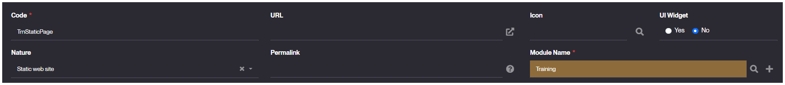
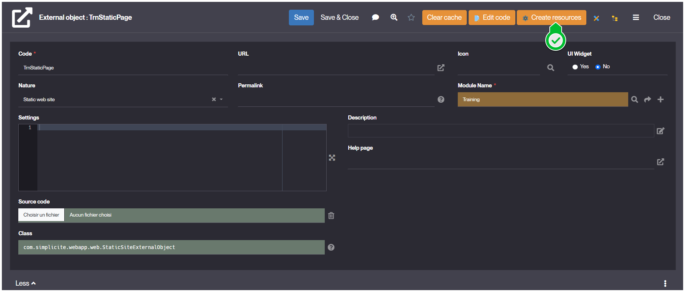
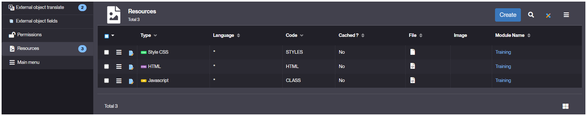

Static Web Site
===============

What is a Static Web Site?
--------------------------

Simplicité's [External Objects](/make/userinterface/externalobjects/basic) allow you to create **Static Web Site** objects;
standalone web pages used to display elements without necessarily being logged nor necessarily interacting with any feature from Simplicité's backend.

In other terms it is a static site that you create using either the native web stack (HTML, CSS, JavaScript)
or any popular web frameworks (Vue.js, React Angular, etc.).

:::tip

If the static site interacts with Simplicité's backend it is **highly** recommended
to use [our simplified JavaScript client lib](https://www.npmjs.com/package/simplicite) especially if it is based on a web framework.

:::

How to create
-------------

The creation process is similar to the one for any _External Object_:

1. Go to _User Interface > External Objects > Show all_, and then click **Create**

2. During the form's filling, ensure you select _Static Web Site_ as **Nature**.
   - **UI Widget** should be set as **No**
   - Ensure you assign the right **Module Name** for your object.
   > Example values:
   > 

3. Click **Save**.

   

4. From the updated object's form, click **Create Resources** to create the web [Resources](/make/userinterface/resources).
   - Ensure **CLASS** **HTML** and **STYLES** well appear in the _Resources_ tab.
   > Created Resources:
   > 

Usage
-----

As a _Static Web Page_ isn't necessarily interacting with Simplicité's API or backend, you only have the 3 resources to worry about.
For the development specific to Simplicité refer to the [JSdoc](https://platform.simplicite.io/current/jsdoc/global.html).

:::tip

Specific use case and code examples can be found in the following pages:

- [WebPage](/make/userinterface/externalobjects/webpage),
- [UI Component](/make/userinterface/externalobjects/uicomponent),
- [External Objects](/make/userinterface/externalobjects/basic).

:::

**HTML**:

- Content of your page, declared in a `.html` file
- Embedded (DOM context) in a `<div id="bs-main" class="container">...</div>`.
- Use dynamic instantiation for your DOM content (within `CLASS` resource) and only declare the "anchors" and layout placeholders here.
  > This ensure that all the interactions and method are referenced and avoids adding more complexity or logic to the workflow.

```html
<div id="trnstaticpage">
    <!-- Your elements here -->
</div>
```

**STYLES**:

- Stylesheet of your page, declaring all styles for your component.
- Using CSS or LESS.

```css
#trnstaticpage {
	/* Custom styles */
}
```

**CLASS**:

- JavaScript where you declare all of your component's behavior and interactions.
- Most happens in the `async render(){ ... }` method.
- Access your HTML using `const $content = this.ctn;` and then `$content.html(...)`.
  > You can also use more classic ways to access your elements like `document.getElementById()` or `$(<element-identifier>)`.
  Ensure your HTML content matches the logic you are using !
- Access public elements of Simplicité (in case of specific needs) using `getApp()` or `$app`.
  > From this entry point you can use few features and access limited objects from your instance's DB & models.

```javascript
Simplicite.UI.ExternalObjects.TrnStaticPage = class extends Simplicite.UI.ExternalObject {
	async render(params, data = {}) {
		// $('#trnstaticpage').append('Hello world!');
        const $content = this.ctn;
        $content.html("Hello World !");
	}
};
```

Read More
---------

- [JSDoc](https://platform.simplicite.io/current/jsdoc/global.html)
- [StaticSiteExternalObject](https://platform.simplicite.io/current/javadoc/com/simplicite/webapp/web/StaticSiteExternalObject.html) (javadoc)
