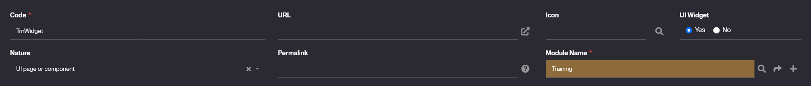
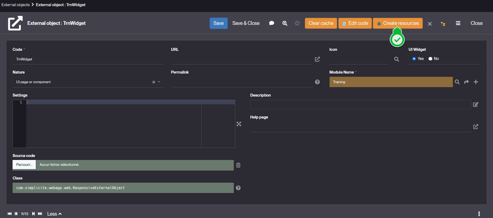
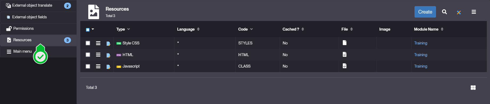
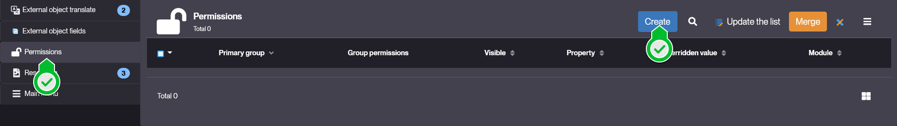
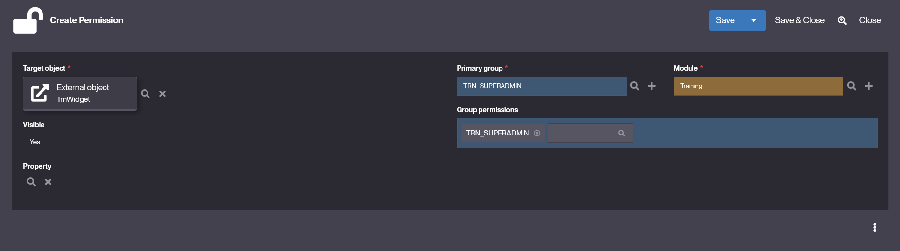
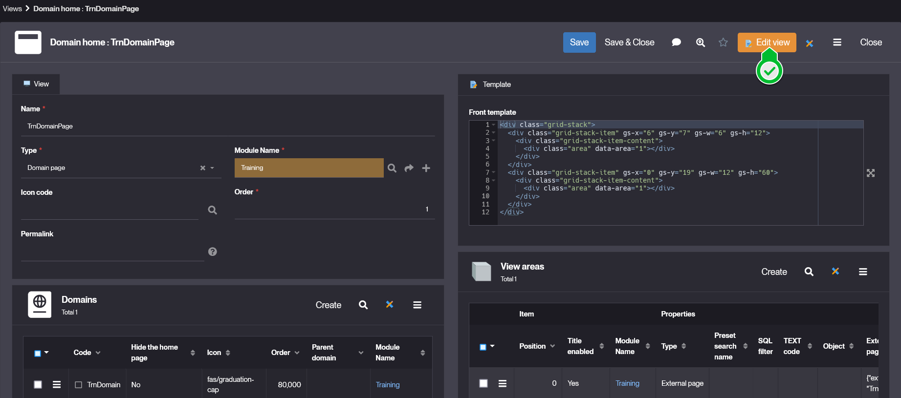
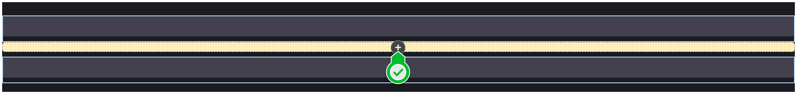
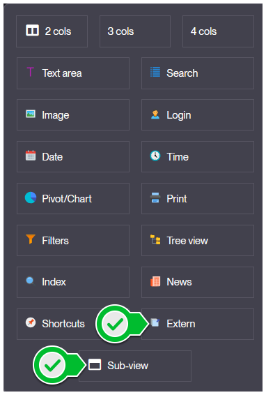
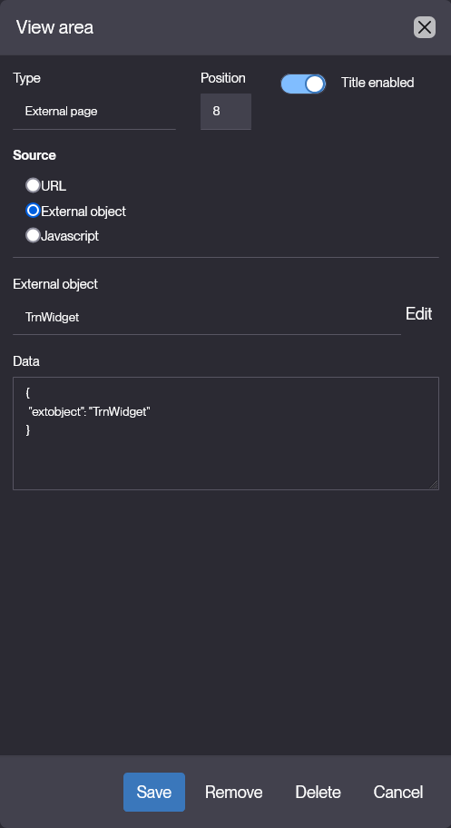
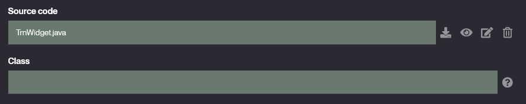

# UI page or component

## Introduction

"UI page or component" is a type of [External Object](/make/userinterface/externalobjects/basic) that is used to implement **specific front components** within your Simplicité instance. Thus creating **custom interactive components** to embed to your interfaces.

Thanks to such objects you can create dynamic elements that have custom behaviors and can seamlessly interact with Simplicité's API.

## How to create

Similarly to creating any type of *External Object*, go to *User Interface > External Object > Show all* and click **Create**:

1. Create your object by filling at least teh mandatory fields:
    - **Code** that is the name of your object.
    > While naming your objects, we **highly** recommend to follow the suggested nomenclature *ModulePrefix + ObjectName*.
    - **Nature** set to **UI page or component**.
    - **UI Widget** tells if your external object shall be considered as a *widget* or not, declaring wether or not it can be used in [dashboard](/make/userinterface/views/dashboard).
    > In **both** case, the component is usable in **any editable view**, the only difference is its possible including in dashboards.

    > Example values:
    > 

2. **Save** your object and click **Create resources**:
    
    - This creates the default [resources](/make/userinterface/resources) for your external object:
        - **HTML** in which you'll define your object's content structure.
        - **STYLES** that is your object's stylesheet.
        - **CLASS** where the component's behavior will happen.
        
    - See the [implementation](#how-to-implement) section below for how to use these resources.

3. **Save** your object, and now ensure that it has the correct rights & permissions.
    - At the bottom of your *object's form*, click the tab-item **Permissions**, and click **Create**.
    
    - In the *Create Permission* form, select the **Primary group** you want your object to be associated to, and select the **Group permissions** to select the specific rights for your object.
    > Example values:
    > 

    > ***Note:*** By default, trying to put your object in any interface will result in a `External Object __ not granted` text message.

4. Finally, add your object to an existing **View** of any type.
    - Go to *User Interface > Views > Show all*, and select the view you'd like to include your component in.
    
    - Click **Edit View** in the header of the form.
    - You are now in the **Template Editor**, move your mouse around and click on the **+** button at any position.
    
    - In the popup menu, select **Sub-View** or **Extern**.
    
    - On the **Type** field, select **External Page**.
    - Set the **Source** to **External Object** and the **External Page** to your component's name.
    > Example values:
    > 
    - JSON **Data** contains:
    	- the external object name
		- optionally your contextual URL parameters (needed by the external object in this view)
		- and fields values (only when External object definition has fields)

```json
{
 "extobject": "UIObjectCounter",
 "params": { "myparam1": "xxx", "myparam2": "yyy" }
 "fields": {
  "uiCounterTextColor": "",
  "uiCounterFieldId__fld_name": "demoOrdTotal",
  "uiCounterObjId__obo_name": "DemoOrder",
  "uiCounterIcon": "fas/euro-sign",
  "uiCounterColor": "red",
  "uiCounterBgColor": ""
 }
}
```

5. Click **Save** in the modal's footer, **Save** in the template editor, and **Save** in the view's form. Then **Clear your cache** and by visiting your view, you should see your component.

## How to implement

To actually implement *custom behaviors* and specific *interactions* for your component, you will have to dive into some web-development through the **Resources** of your external object.

There are 2 different categories for your external object's implementation:

1. The *setup* & *instantiation* that is done using a *Java Script*
    - `com.simplicite.webapp.web.ResponsiveExternalObject` by default
    - Can be overridden by a java code extending `ResponsiveExternalObject` or at least `ExternalObject` (the main parent class).

2. The *workflow* and *behavior* that is done using the *Javascript Resource*.
    - JS class extending `Simplicite.UI.ExternalObject`
    - Implementing the `render()` method to handle the DOM-related instantiations.
    - Declaring any other custom behaviors or features.

> In this part the taken code examples and features will be from an unreleased widget *DemoWelcomeCard* (source codes are provided in the sections below).

### Java instantiation

By default your component is just of Java class `com.simplicite.webapp.web.ResponsiveExternalObject`, but in case you need additional methods, you can create your own *Java class* for your component, that will extend the mentioned one.

1. In your external object's form, click **Edit Code**, then **Confirm**.

2. You will be redirected to the code editor with the basic java setup for your component's own class.
    - Yet you can click **Save** and **Close** to come back to the component's form.

3. Now instead of `com.simplicite.webapp.web.ResponsiveExternalObject` in the **Class** field, you have `<your-object-code>.java` in the **Source code** field.


### HTML content

Here, in the **HTML** you will write the html content of your component, the good practice is to define only the anchors for later implementation of the content through the **CLASS** dynamically.

At creation the script looks like:

```html
<div id="demowelcomecard">
</div>
```

With the `id` tag being the raw **Code** of your external object.

> **NB:** you can remove the div if you prefer, but then you have to reference your object's html using `const $content = this.ctn` in the **CLASS** resource file, and then add elements using methods like `$content.html()`.
> Such workflow will refer directly to the default container div your external object is created within.

There are several keypoints to understand and keep in mind while developing in this file:
- Those elements are displayed within the ```<div class="view-item item-extern"></div>``` element. Thus they can be targeted by existing styles and DOM constraints.
- The *html* is **not** linked to its script with the ```<script>``` tag, meaning you can't instantiate or call functions from the static content (the one written in the **HTML**).

<details>
<summary><b>DemoWelcomeCard</b> code example</summary>

```html
<div id="demowelcomecard">
    <div id="demowelcomecard-header"></div>
    <div id="demowelcomecard-actions"></div>
    <div id="demowelcomecard-productlist"></div>
</div>
```
</details>

### CSS styles

In the **STYLES** resource, you will write the *CSS* code that defines your component's styles. Thus ensure you target the correct element from your **HTML** and refer to them as precisely as possible. You can implement interactive styles and use all of CSS's regular features.

At creation the stylesheet looks like:

```css
#demowelcomecard {
	/* Custom styles */
}
```

There are several keypoints to understand and keep in mind while developing in this file:
- The written styles are gonna be merged to the overall stylesheet, so ensure you either don't use too common names for your *class* and *id*.
- You can use existing styles by simply adding specific *class* to your elements, but make sure you don't embed some unwanted features with it.

<details>
<summary><b>DemoWelcomeCard</b> code example</summary>

```css
#demowelcomecard {
    display: flex;
    flex-direction: column;
}

#demowelcomecard-header {
    display: flex;
    flex-direction: column;
    text-align: left;
    gap: 4px;
    width: 100%;

    & h1 {
        font-size: 32px;
        font-weight: 600;
    }
    & h3 {
        font-size: 24px;
    }
}

#demowelcomecard-actions {
    display: flex;
    flex-direction: row;
    justify-content: start;
    align-items: center;

    box-sizing: border-box;
    margin-top: 32px;
    gap: 32px;

    & .demowelcomecard-btn {
        position: relative;
        font-size: 24px;
        font-weight: 600;
        padding: 16px 32px;
        border: none;

        &::before {
            content: '';
            position: absolute;
            top: 0;
            left: 0;
            width: 4px;
            height: 100%;
            border-left: solid 4px transparent;
            transition: all 0.33s ease-in;
        }

        &:hover {
            &::before {
                border-left-width: 16px;
            }
        }
        &:active {
            &::before {
                border-left-width: 64px;
            }
        }
    }

    & #tutorial {
        background-color: rgba(84, 81, 255, 0.1);
        color: #5451FF;

        &::before {
            border-color: #5451FF;
        }
    }
    & #products {
        background-color: rgba(255, 209, 102, 0.1);
        color: #FFD166;

        &::before {
            border-color: #FFD166;
        }
    }
    & #user-infos {
        background-color: rgba(88, 236, 155, 0.1);
        color: #58EC9B;

        &::before {
            border-color: #58EC9B;
        }
    }
}

#demowelcomecard-productlist {
    display: flex;
    flex-direction: row;
    flex-wrap: wrap;
    justify-content: start;
    align-items: center;

    box-sizing: border-box;
    margin-top: 16px;
    padding: 32px;
    gap: 16px;

    & .demowelcomecard-product-card {
        position: relative;
        display: flex;
        flex-direction: row;
        box-sizing: border-box;
        padding: 16px;
        width: 40vw; /* fix this later on */
        border: solid 1px #C6C6C6;
        background: rgba(198, 198, 198, 0.25);

        & .dwc-product-card-left {
            display: flex;
            flex-direction: column;
            justify-content: space-between;
            width: 50%;
            text-align: left;

            & .dwc-product-card-left-header {
                display: flex;
                flex-direction: column;

                & .dwc-product-card-left-header-title {
                    font-size: 32px;
                    font-weight: 600;
                }
                & .dwc-product-card-left-header-subtitle {
                    font-size: 24px;
                }
            }

            & .dwc-product-card-left-footer {
                display: flex;
                flex-direction: column;

                & .dwc-product-card-left-footer-stock {
                    font-size: 16px;
                    font-style: italic;
                }
                & .dwc-product-card-left-footer-price {
                    font-size: 32px;
                    font-style: italic;
                }
            }
        }

        & .demowelcomecard-product-card-right {
            display: flex;
            flex-direction: column;
            justify-content: center;
            align-items: center;
            padding-left: 16px;
            width: 75%;
            text-align: center;
            border-left: solid 1px #C6C6C6;
            transition: all 0.33s ease;

            & .dwc-product-card-right-image {
                display: flex;
                justify-content: center;
                align-items: center;
                width: 50%;
                height: auto;
            }
            & .dwc-product-card-right-description {
                border-top: solid 1px #C6C6C6;
                display: flex;
                justify-content: center;
                align-items: center;
                padding: 16px;
                font-size: 16px;
            }
        }

        &::before {
            content: '';
            position: absolute;
            top: 0;
            left: 0;
            width: 2px;
            height: 100%;
            border-left: solid 2px #777777;
            transition: all 0.33s ease-in;
        }

        &:hover {
            background: rgba(198, 198, 198, 0.5);
            &::before {
                border-left-width: 6px;
            }
        }
        &:active {
            background: rgba(251,54,64, 0.25);
            &::before {
                border-left-width: 6px;
                border-left-color: #FB3640;
            }
        }
    }
}
```
</details>

### JS behavior

In the **CLASS** resource, you will write the JS script for your component's behavior. Here you will have the possibility to use both the [JSDoc](https://platform.simplicite.io/current/jsdoc/) for frontend operations directly in the **CLASS** resource's script, and to make few calls to the *Java* code of your component to add custom server-side operations.

> By default the only call from **CLASS** to **Java** is through `render()` that allows for your component's correct display and instantiation. But later on we'll see another method that allow for more custom calls: `service()`.

At creation the script is:
```javascript
Simplicite.UI.ExternalObjects.TestWebPage = class extends Simplicite.UI.ExternalObject {
	async render(params, data = {}) {
		$('#testwebpage').append('Hello world!');
	}
};
```

The key concepts and understanding that you need are:
- Every instantiation has to be within the ```async render(){ ... }```
- You can work with Simplicité's API and core library using several entry points such as `$ui`, `$app` or `$grant` (documented in the [Ajax library](https://platform.simplicite.io/current/jsdoc/global.html)).
- You can manipulate most of the *BusinessObjects* and elements through the `BusinessObject.search( function() {...} )` method.

You may need to implement some behaviors and features specifically on the *server-side* (though in the java code). Such workflow is required when you don't want to share information with the front (public) or you just want the calculations to be done by the backend.

1. **Javascript:** make a call to the [service](https://platform.simplicite.io/current/jsdoc/Simplicite.UI.ExternalObject.html#service) hook, and pass the  and data needed as arguments.
```javascript
const res = await this.service(data, 'json');
console.log(res.result);
```

2. **Java:** declare the logic for the object's [service](https://platform.simplicite.io/current/javadoc/com/simplicite/webapp/web/ResponsiveExternalObject.html#service(com.simplicite.util.tools.Parameters)) hook:
```java
public class _ extends com.simplicite.webapp.web.ResponsiveExternalObject {
    // ...
	@Override
	public Object service(Parameters params) {
        // parse params here
		JSONObject body = params.getJSONObject();

        // implemented custom logic
        String text = /* ... */ ;

		return new JSONObject().put("result", text);
	}
}
```

<details>
<summary><b>service()</b> code example (js)</summary>

```javascript
Simplicite.UI.ExternalObjects._ = class extends Simplicite.UI.ExternalObject {
	async render(params, data = {}) {
		// Send as parameter
		$('#apptestbackendservice-param').on('click', async _ => {
			const data = { text: $('#apptestbackendservice-text').val() };
			const res = await this.service(data);
			console.log(`Result: ${JSON.stringify(res)}`);
			$('#apptestbackendservice-result').append(`${res.result}\n`);
		});

		// Send as JSON body
		$('#apptestbackendservice-body').on('click', async _ => {
			const data = { text: $('#apptestbackendservice-text').val() };
			const res = await this.service(JSON.stringify(data), { contentType: 'application/json' });
			console.log(`Result: ${JSON.stringify(res)}`);
			$('#apptestbackendservice-result').append(`${res.result}\n`);
		});
	}
};
```
</details>

<details>
<summary><b>service()</b> code example (java)</summary>

```java
package com.simplicite.extobjects.Application;

import org.json.JSONObject;

import com.simplicite.util.AppLog;
import com.simplicite.util.tools.Parameters;

public class _ extends com.simplicite.webapp.web.ResponsiveExternalObject {
	private static final long serialVersionUID = 1L;

	@Override
	public Object service(Parameters params) {
		JSONObject body = params.getJSONObject();

		String txt = "[" + (body != null
			? body.optString("text") + "] from JSON body"
			: params.getParameter("text") + "] from parameter");

		return new JSONObject().put("result", txt);
	}
}
```
</details>

<details>
<summary><b>DemoWelcomeCard</b> code example</summary>

```javascript
Simplicite.UI.ExternalObjects.DemoWelcomeCard = class extends Simplicite.UI.ExternalObject {
    async render(params, data = {})
    {
        let app = $ui.getApp();
        let product = app.getBusinessObject("DemoProduct");
        let user = app.getBusinessObject("User");
        let login = $ui.getGrant().login;


        $("#demowelcomecard-header")
            .append($('<h1>').text("Welcome to Simplicité's Demo !"))
            .append($('<h3>').text("We're excited to have you onboard. Explore, interact, and enjoy your experience with us !"));

        $("#demowelcomecard-actions")
            .append($('<button/>').text("Check the Tutorial").attr("id", "tutorial").addClass("demowelcomecard-btn").on("click", () => { window.open("https://docs.simplicite.io/", "_blank"); } ))
            .append($('<button/>').text("Display Products").attr("id","products").addClass("demowelcomecard-btn").on("click", () => {
            	let b = document.getElementById("demowelcomecard-productlist").hidden;
            	document.getElementById("demowelcomecard-productlist").hidden = !b;
            } ))
            .append($('<button/>').text("See my Infos").attr("id","user-infos").addClass("demowelcomecard-btn").on("click", () => {
            	user.search( function(){
					const usr = user.list.find(u => u.usr_login === login);

					if (usr && usr.row_id) {
						$ui.displayForm(null, "User", usr.row_id, {
							nav: "add",
							target: "work"
						});
					} else {
						console.error("User not found.");
					}
		        }, null, {});
            } ));

        product.search(function() {
            for (let i=0; i<product.count; i++)
            {
                const prd = product.list[i];
                const imageSource = `data:${prd.demoPrdPicture.mime};base64,${prd.demoPrdPicture.content}`;

                let productDiv = $('<div>').addClass("demowelcomecard-product-card").on("click", () => {
                	// triggers an error but still saves & runs ...
                	$ui.displayForm(null, "DemoProduct", prd.row_id, {
						nav: "add",
						target: "work"
					});
                });

                let cardLeft = $('<div>').addClass("dwc-product-card-left");

                let cardLeftHeader = $('<div>').addClass("dwc-product-card-left-header");
                let cardLeftHeaderTitle = $('<span>').addClass("dwc-product-card-left-header-title").text(prd.demoPrdName);
                let cardLeftHeaderSubtitle = $('<span>').addClass("dwc-product-card-left-header-subtitle").text(prd.demoPrdSupId__demoSupName+" - "+prd.demoPrdType);

                cardLeftHeader
                	.append(cardLeftHeaderTitle)
                	.append(cardLeftHeaderSubtitle);

                let cardLeftFooter = $('<div>').addClass("dwc-product-card-left-footer");
                let cardLeftFooterStock = $('<span>').addClass("dwc-product-card-left-footer-stock").text(prd.demoPrdStock+" left in stock.");
                let cardLeftFooterPrice = $('<span>').addClass("dwc-product-card-left-footer-price").text(prd.demoPrdUnitPrice+"€");

                cardLeftFooter
                	.append(cardLeftFooterStock)
                	.append(cardLeftFooterPrice);

                cardLeft
                	.append(cardLeftHeader)
                	.append(cardLeftFooter);

                let cardRight = $('<div>').addClass("demowelcomecard-product-card-right");

                let cardRightImage = $('').addClass("dwc-product-card-right-image").attr("src", imageSource).attr("alt", prd.demoPrdName);
                let cardRightText = $('<span>').addClass("dwc-product-card-right-description").text('"'+prd.demoPrdDescription+'"');


                cardRight
                	.append(cardRightImage)
                	.append(cardRightText);

                productDiv
                	.append(cardLeft)
                	.append(cardRight);

                $("#demowelcomecard-productlist").append(productDiv);
            }

            $("#demowelcomecard-productlist").attr("hidden", "true"); // hiding by default

        }, null, { inlineDocs: true });
	}
};
```
</details>

## Configuration

| Field | Description |
| ----- | ----------- |
| Code | External Object's unique identifier |
| Nature | Type of the External Object, here **UI page or component** |
| Source Code | Java code for customized server-side behaviors |
| Class | Extended class for the Java code, here `com.simplicite.webapp.web.ResponsiveExternalObject` |
| Icon | External Object's logo |
| UI Widget | Indicates if this element shall be considered as a *Widget* or not. |

## Read More

- [Widgets](/docs/misc/widgets) already implemented within Simplicité's **Demo** module.
- [Code Examples](/docs/core/externalobject-code-examples)
- [JSDoc](https://platform.simplicite.io/current/jsdoc/)
- [Javadoc](https://platform.simplicite.io/current/javadoc/)

**JS Dev**
- [Javascript Development](/docs/front/javascript-dev).
- [Ajax Library](/docs/front/lib-ajax).