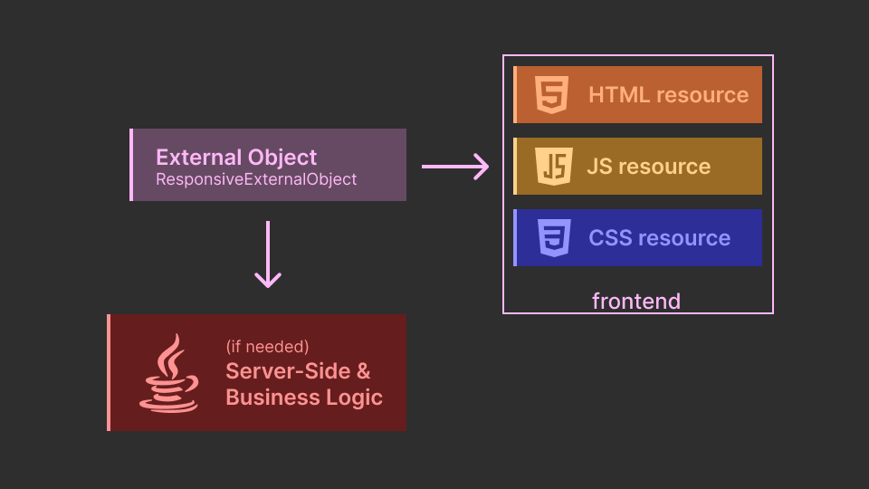
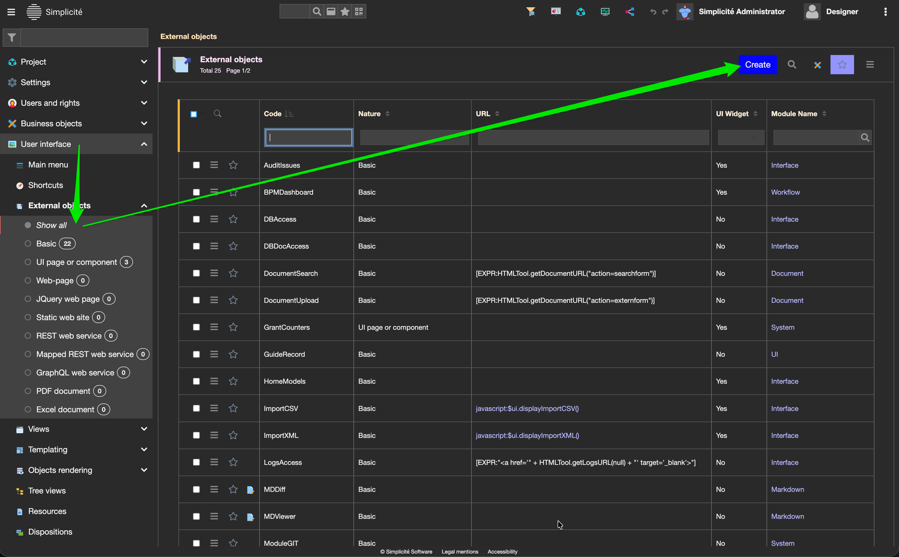
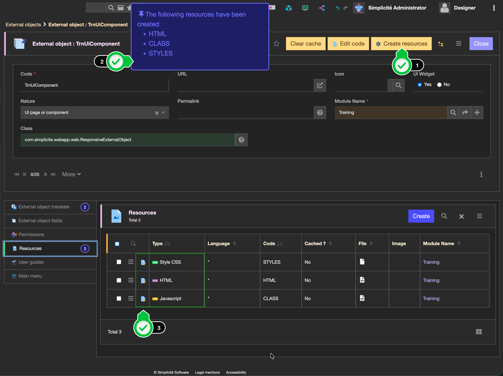
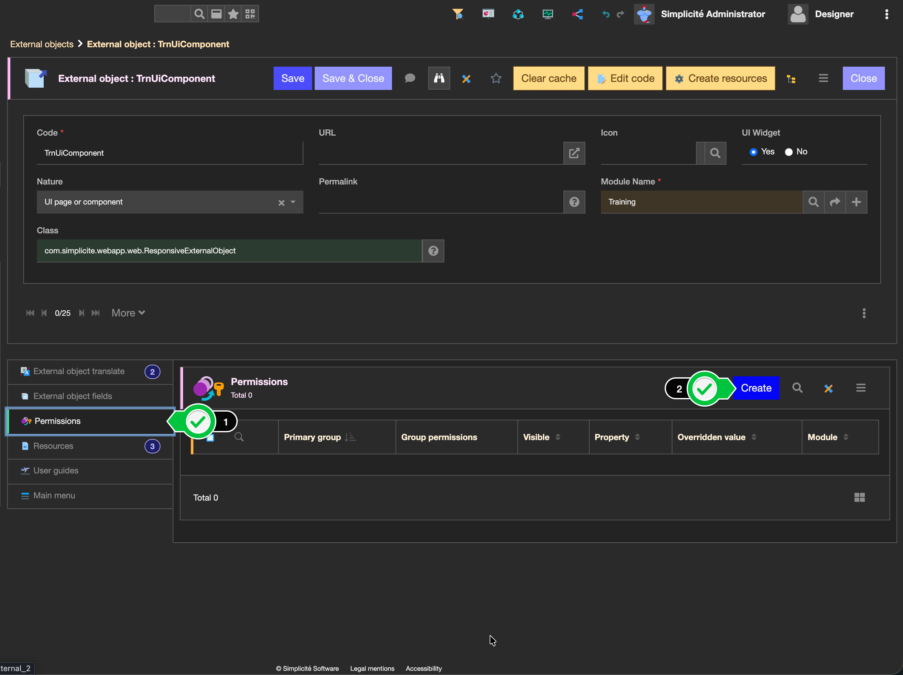
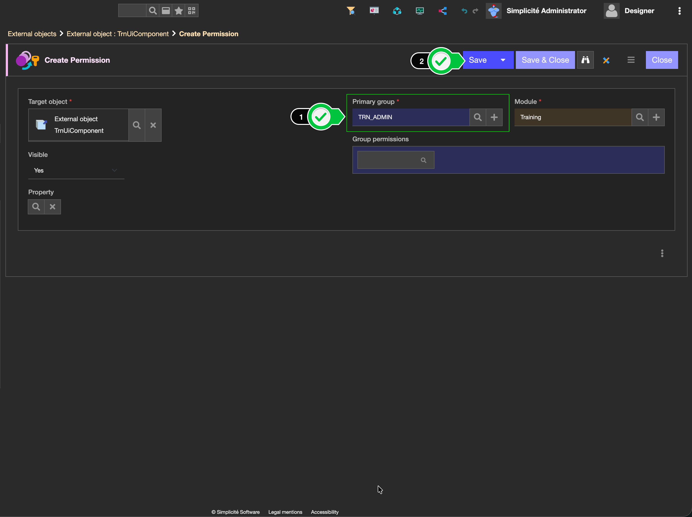
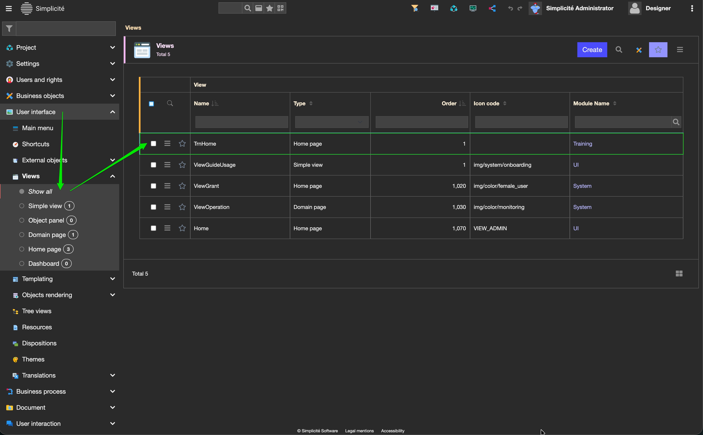
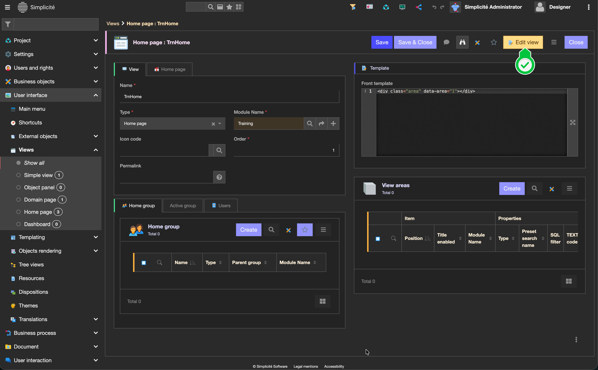
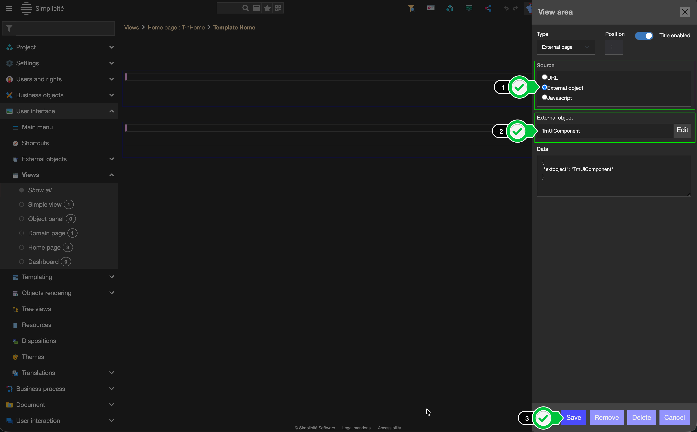

UI page or component
====================

Introduction
------------

External objects are the main brick to create custom components within Simplicité, both for a standard UI and for custom/alternative ones.
They're kinda like swiss-army knifes, it's where we get out of the simple settings to extend Simplicité's capacities.
Mostly for the creation of custom components & interfaces though, but also the integration of custom APIs, etc.

Keep in mind that those are the entry-point to intermediate & advanced customizations for your applications.
Thus are categorized for each usage they might have :

| Nature | Usage | Java class |
| ------ | ----- | ---------- |
| UI page or component | Create custom components for the standard UI | ResponsiveExternalObject |
| [Static site](/make/userinterface/externalobjects/staticsite.md) | Create custom standalone pages that can display elements without requiring a logged access to a Simplicité backend | StaticSiteExternalObject |
| [Web page](/make/userinterface/externalobjects/webpage.md) | Create custom standalone pages, that can interact with a Simplicité application's backend | WebPageExternalObject |

External objects are based on a simple front/back architecture, with 3 [resources](/make/userinterface/resources) **HTML/JS/CSS** for the "frontend".
Similarly to [Business objects](/make/businessobjects/business-objects) a java class in which you can implement the backend logic.

:::info

Most of the time it can be left empty, only extending the desired class

:::

How to create
-------------

1. Navigate to the **Creation Form** through menus _User Interface > External objects > Show all_
    
2. Fill-in the following informations, and then Save your object
   - **Code -** your object's name (we highly recommend to follow the suggested nomenclature _ModulePrefix + ObjectName_)
   - **Nature -** UI page or component
   - **UI Widget -** Yes/No (in both case, the component is usable in any editable view, the only difference is its possible including in dashboards)
    
3. Back on the external object's form, create the resources by clicking the **Create resources** (a) button
    - then you'll see the confirmation popup (b).
    - Now you are able to modify the frontend codes for your external object in the _Resources_ section (c)
    
4. Create the permission for your external object to be granted on the views you'll integrate it to.
    - Go to _Permissions > Create_ and select the groups you want to grant access to your object to, and save it.
    
    
5. Finally, you can add your external object to any editable view (and dashboard if _UI Widget - Yes_).
   - Navigate to your view through menus _User Interface > Views > Show All_, and select the desired view, then click the **Edit view** button
    
    
6. Inside the editor, click on any **"+"** bar and select **Extern**
    
7. In the modal, select **Source - Exernal object**, and then fill-in **External object** with your object's code, then press **Save**
    

:::info

If you see the message `External object __ not granted`, ensure you properly set the Permissions from step 4.

:::

Configuration
-------------

| Field | Description |
| ----- | ----------- |
| Code | Object's unique identifier |
| Nature | Object's usage and standard behavior, what is it used for |
| Class | Object's extended class, defining either it's standard behavior, or if using [standard widget](/docs/misc/widgets.md) specifying which one |
| Configuration | (optional) either if using standard widget or because applying a custom config through the `param` argument in java code |
| UI Widget | Can object be integrated to any [dashboard](/make/userinterface/views/dashboard) |

Read More
---------

- [Standard Widgets](/docs/misc/widgets.md)
- [JS development](/docs/front/javascript-dev.md)
- [Code examples for custom components](/docs/front/ui-component.md)
