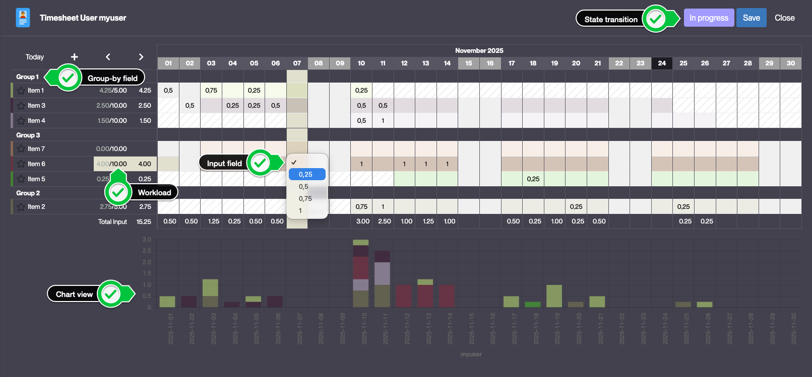
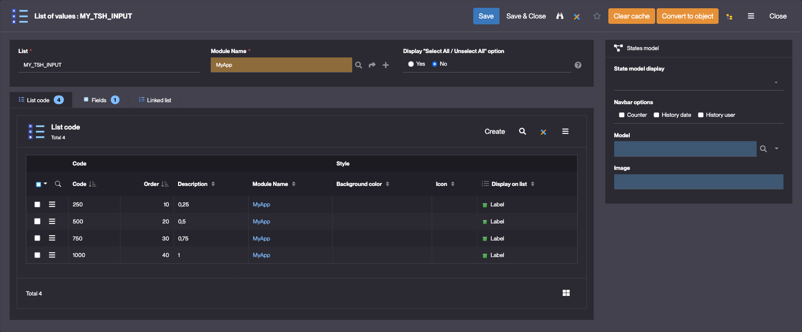
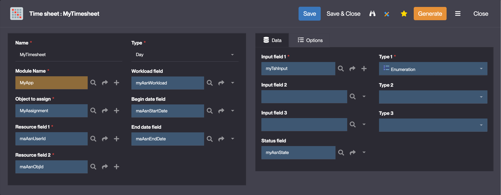
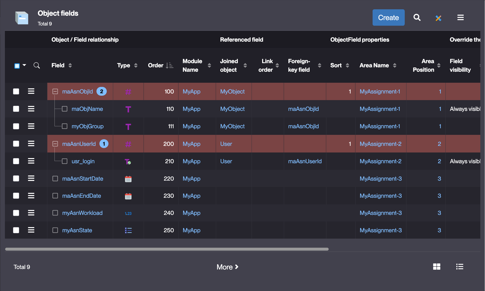
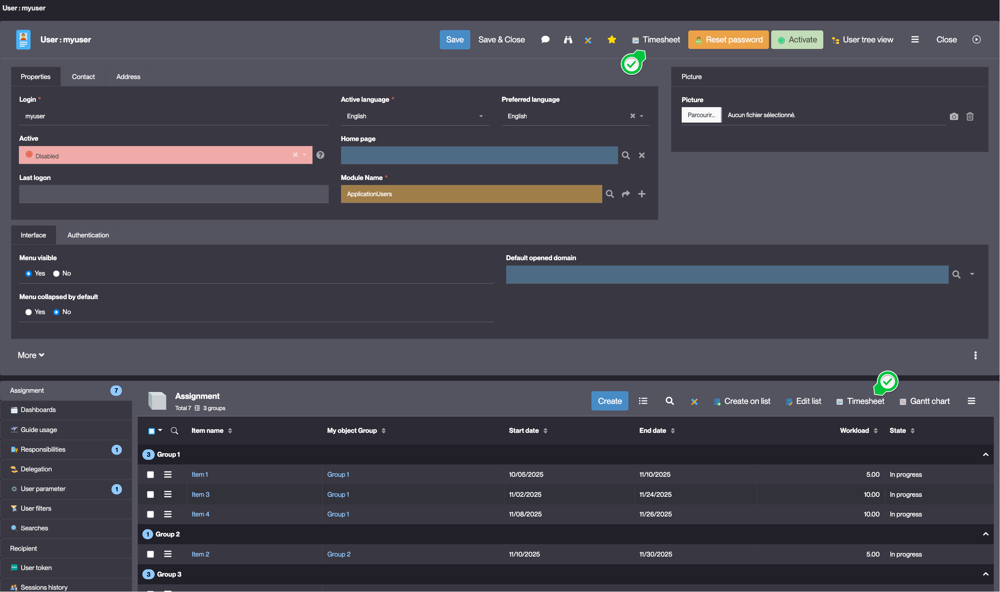

# Timesheet

## What is a Timesheet ?

A Timesheet is a view that allows users to enter workload data for a given period. Timesheets can also be used to display Gantt charts.

### Timesheet view example

### Gantt view example

## How to create a Timesheet ?

In order to create a Timesheet, several prerequisites must be met: 
- **Two "resources"** objects must be created:
    - One object representing the resource (e.g. a user)
    - One object representing the assignment of the resource to a period (e.g. a project)
- **An N,N object** between the two resources objects must be created. This object will be used to store the workload data.
- An "input" field for the timesheet - preferably an enumeration field with values like "0,25" / "0,5" / "0,75" / "1" - must be created. This field will be used to input data within the timesheet.

List of values configuration

- The N,N object must meet the following requirements:
    - It must have **start** and **end** date fields

Once the timesheet is created, the **Generate** button is used to create the timesheet object which will store the data entered.
To allow users to access / update the timesheet, they must be granted to a READ / CREATE / UPDATE function linked to the generated timesheet object.

### Timesheet configuration 

In the User Interface > Objects rendering > Timesheet menu, click **Create**

| Field | Description |
| ----- | ----------- |
| Name | The name of the timesheet |
| Type | The type of the timesheet (granularity of the timesheet : Day, Week, Month)|
| Object to assign | The N,N object between the two ressource objects |
| Resource field 1 | One of the foreign key fields of the N,N object |
| Resource field 2 | One of the foreign key fields of the N,N object |
| Workload field | The value is used to display the workload available for a given assignment |
| Begin date field | The field used to store the begin date of the assignment |
| End date field | The field used to store the end date of the assignment |
| Input field | The input field of the timesheet (e.g. 0,25 / 0,5 / 0,75 / 1) |
| Status field | The status field of the assignment object |
| Use Gantt diagram | Display a Gantt diagram linked to the timesheet |
| Use Resource Chart | Display a chart under the timesheet |

### Timesheet configuration example :

#### Timesheet :

#### Assignment (N,N) object fields :

## Usage 

Configured timesheets are accessible via the **Timesheet** button :
- on the form of both resource objects
- on the N,N panel of both resource objects

