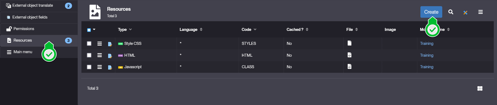
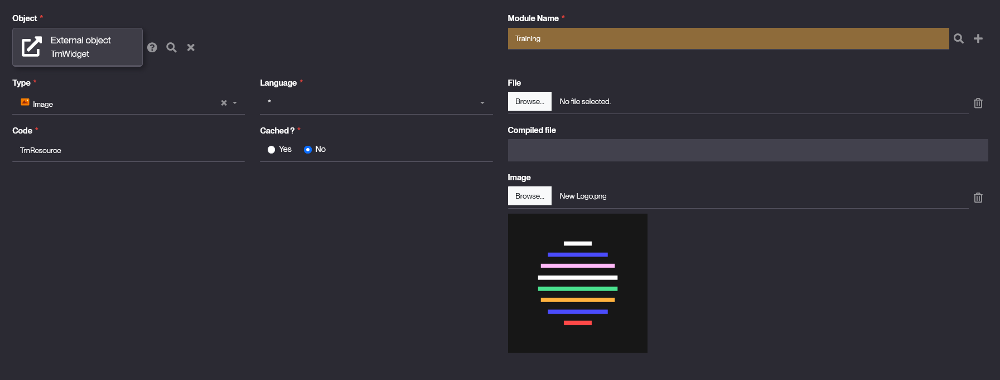
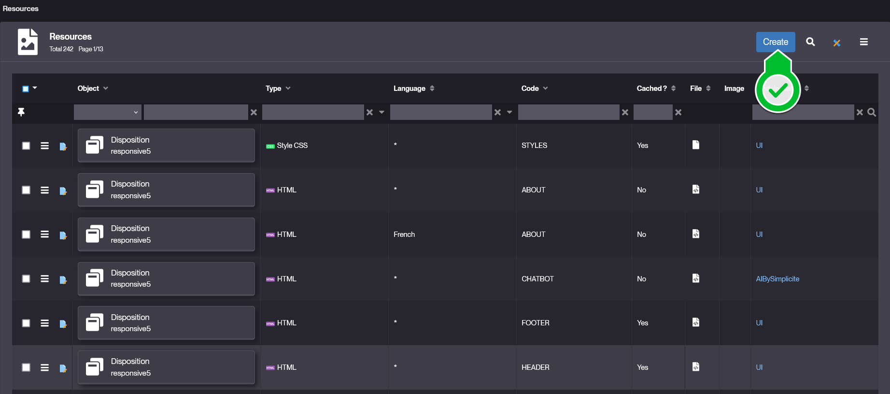

# Resources

## Introduction

When creating any [business object](/make/businessobjects/business-objects) or [external object](/make/userinterface/externalobjects/basic) of any type, you have the possibility to give it resources to pass it specific kinds of items. Resources are also used by the [disposition](/) and [business process](/) objects.

Resources has to be associated to an unique object which they'll be only available for. 

> Meaning each resource is available for its given object, and not others.

## What is a resource ?

A resource is an object that holds a specific item and allows other objects to access it without additional setup.

Resources can be of many types:

1. Files of certain extensions
    *Scripts*
    - HTML
    - Javascript
    - CSS
    - Markdown
    *Configurations*
    - JSON
    - XML
    *Others*
    - PDF

2. Directories
    - File set (`.zip` preferred)

3. Visual Elements
    - Object Icon
    - Image (banners, gifs, illustrations, ...)

4. Others

## Usage

Resources are created & defined at the creation of an object (Business Object, External Object, Disposition), it is done through the *Resources* part of any object's form panel (bottom tab).

1. Click **Create**

2. In the form, specify the informations and values for your new resource:
    - **Object** is automatically filled with the context object.
    - Select the type from the **Type** dropdown.
    - Enter the name of your resource in **Code**.
    - **Cached?** tells if your object shall be included in the cache or not.
    - **Module Name** should be automatically filled with the context object's module.
    - Select the content of your resource through the fields:
        - **Image** if your resource is of type *Image* or *Object Icon*
        - **File** otherwise.
    > Example values:  
    > 

3. Click **Save**.

But you can also want to create one from the *User Interface > Resources* list:

And from here the process is the same but ensure to properly set the **Object** and **Module Name** accordingly to avoid further issues.

> We highly recommend to stick to the first process to create resources, as it ensures the correct association of *Resource* with *Object* and *Module*.

## Configuration

| Field | Description |
| ----- | ----------- |
| Object | Which object is using this resource. |
| Type | Type of the resource from ([types](#what-is-a-resource-)) |
| Language | Written language of the resource (_'*'_ by default, otherwise `English` or `French`) |
| Code | Name of the resource |
| Cached? | Tells if the resource is included in the cache or not (**No** by default) |