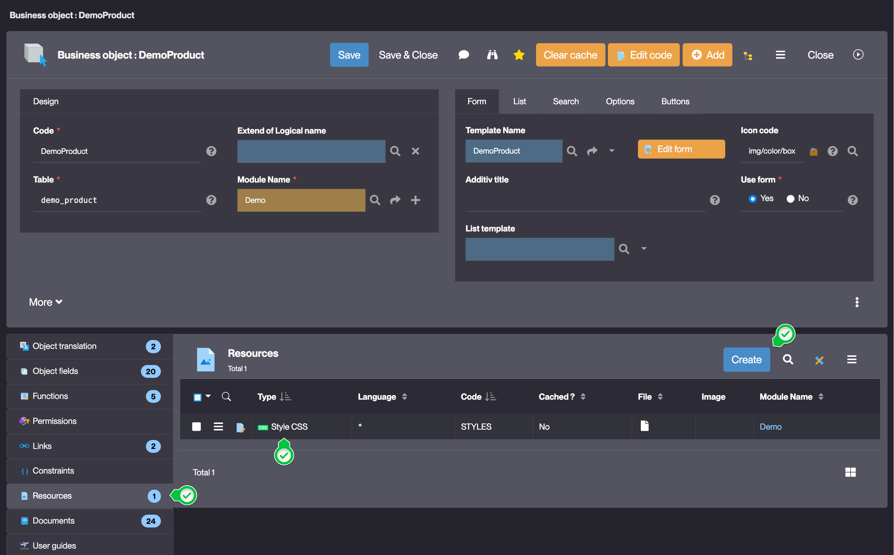
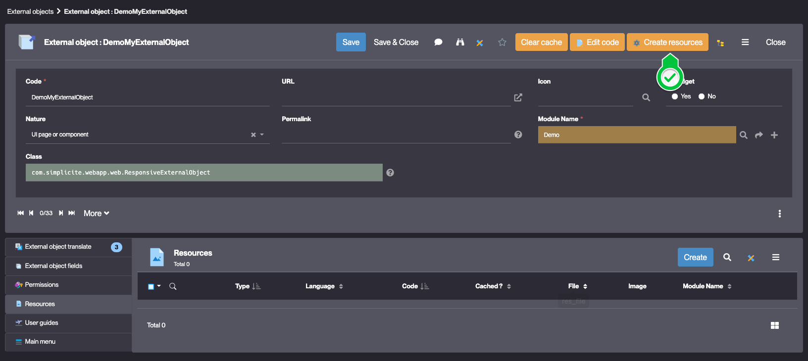

Resources
=========

What's a Resource?
------------------

A Resource is a file linked to a Business object, an External object, a Disposition or a Business Process.

They are a versatile component of the platform and have many use-cases.

Resource types
--------------

| Type        | Example use-case                                                  |
| ----------- | ----------------------------------------------------------------- |
| Image       | Image file that can be used in a publication                      |
| Style CSS   | CSS stylesheet for customizing the UI                             |
| Object icon | Icon set                                                          |
| JavaScript  | JavaScript file for front-end customization                       |
| HTML        | Used for the content of a publication                             |
| Markdown    | Store a Markdown file                                             |
| PDF         | Store a PDF file in the application for use in business process   |
| File set    | For an external object, it can be used to store a static web site |
| Font        | Font file for customizing the UI                                  |
| XML         | Store an XML file                                                 |
| JSON        | Store a JSON file                                                 |
| Other       | Any other file type                                               |

How to create Resources?
------------------------

### For a Business Object, Disposition or Business Process

Go to the object's form and click **Create** in the **Resources** tab :

### For an External Object

Use the **Create Resources** action button in the external object's form :

### Configuration

| Field    | Description                                                                                  |
| -------- | -------------------------------------------------------------------------------------------- |
| Object   | The Business Object, External Object, Disposition or Business Process that uses the resource |
| Type     | Type of the resource from ([types](#resource-types))                                         |
| Language | Language of the resource (_'*'_ by default, otherwise `English` or `French`)                 |
| Code     | Name of the resource                                                                         |
| Cached?  | Tells if the resource is included in the cache or not (**No** by default)                    |

Using the Java API
------------------

The main methods used to access a Resource are:

- `HTMLTool.getResourceHTMLContent(Grant g, String code)`
- `HTMLTool.getResourceCSSContent(Grant g, String code)`
- `HTMLTool.getResourceJSContent(Grant g, String code)`
- See the Javadoc for more details

Read more
---------

- [Using resources in an External object](/docs/core/externalobject-code-examples)
- [Custom disposition using resources](/docs/core/disposition-code-examples)
- [Using a resource in a publication](/docs/integration/publications/pdf)
- [Custom icons](/docs/front/icons)
