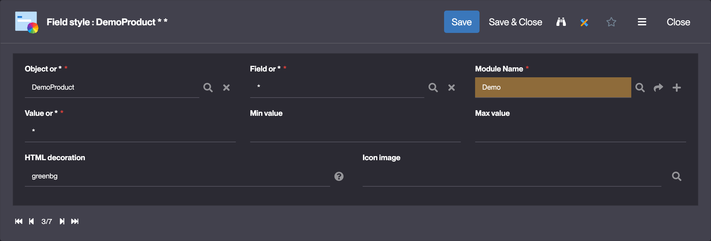
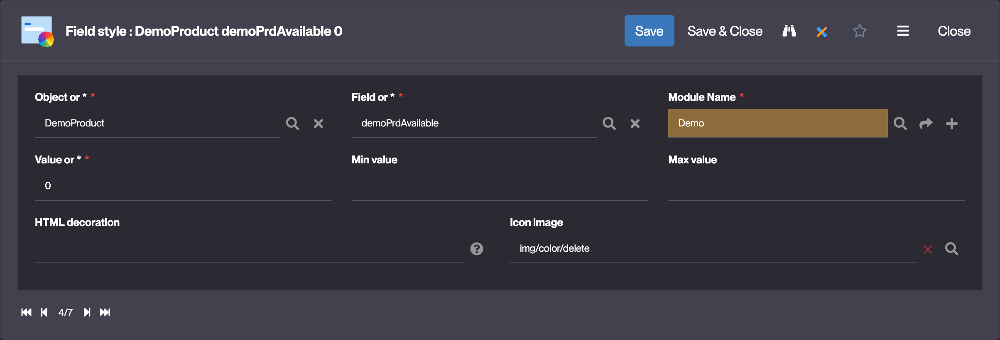
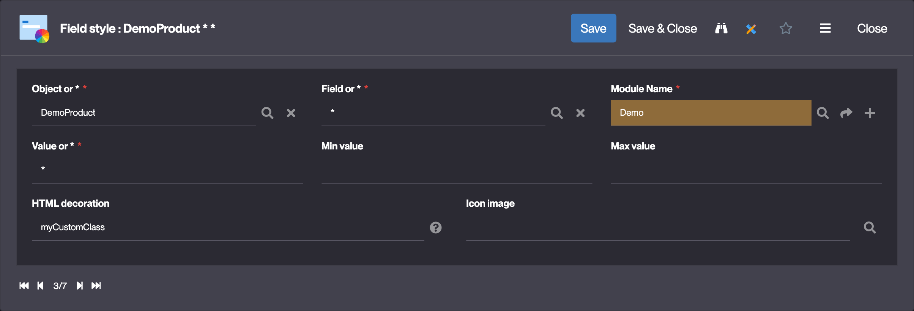

Field styles
============

What are Field styles?
----------------------

Field styles allow to customize a fields presentation via a CSS class or an image.
This is useful to apply a specific style to a field based on its value, on another field's value, etc.

How to create Field styles?
---------------------------

To create a Field style, go to the **User interface > Templating > Field styles** menu and click on **Create**.

### Configuration

| Field | Description |
| ----- | ----------- |
| Object or * | The business object linked to the Field you wish to customize. Use * to style all the Object Fields linked to the Field |
| Field or * | The Field you wish to customize. Use * to style all the previously selected Object's fields |
| Module Name | The module linked to the Field style |
| Value or * | The Field's value for which the style will be applied. Use * to apply a style independently of the Field's value |
| Min value | The minimum value for which the style will be applied |
| Max value | The maximum value for which the style will be applied |
| HTML decoration | The custom (or predefined*) CSS class name to apply to the field |
| Icon image | The icon to apply to the field (only relevant for boolean or enumeration fields) |

:::note Predefined CSS classes
The predefined CSS classes are:
`redbg`,`orangebg`,`greenbg`,`bluebg`,`purplebg`,`pinkbg`,`brownbg`,`blackbg`,`whitebg`,`yellowbg`,`greybg`
:::

### Configuration examples

#### Color all the fields of an Object in green



#### Display a cross (❌) icon when the value of a boolean is false



### Using a custom CSS class

- In the `HTML decoration` field, enter the CSS class name you want to apply to the field:

  - HTML decoration : **myCustomClass**
  

- Then, create or amend the **STYLES** CSS Resource linked to the Object to apply the CSS class to the field:

    <details>
    <summary>Access Resources in the Object's form</summary>

    
    </details>

    ```css
    .myCustomClass {
        background-color: red;
    }
    ```

- Clear the cache to apply the changes

### Using the Java API

The `getStyle` hook can be used to apply a custom CSS class to a field based on the Field's value.

The `getStyle` hook is called for each Field of the Object, in List and Form views.

```java
public String getStyle(ObjectField field, String[] row) {
    // set a red background if the "myField" Field's value is "123"
    if ("myField".equals(field.getName()) && "123".equals(getFieldValue("myField", row))) {
        return "redbg";
    }
    // default style
    return super.getStyle(field, row);
}
```

Read more
---------

- [Style hook in Business object hooks](/docs/core/objects/businessobject-code-hooks#style-hook)
- [Resources](/make/userinterface/resources)
