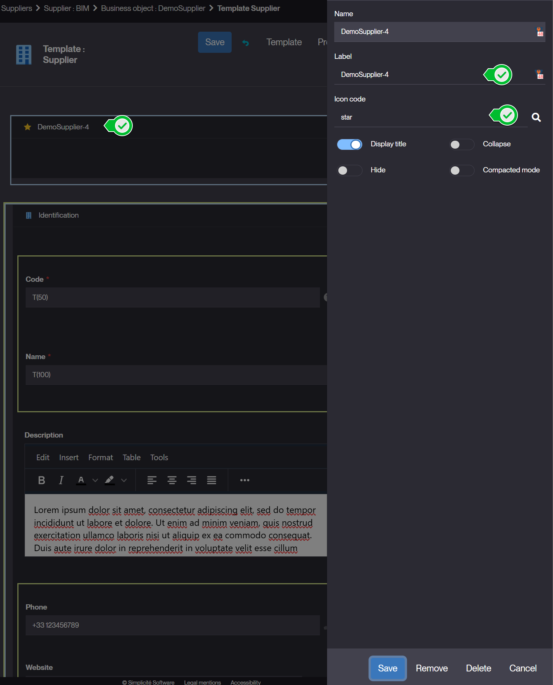
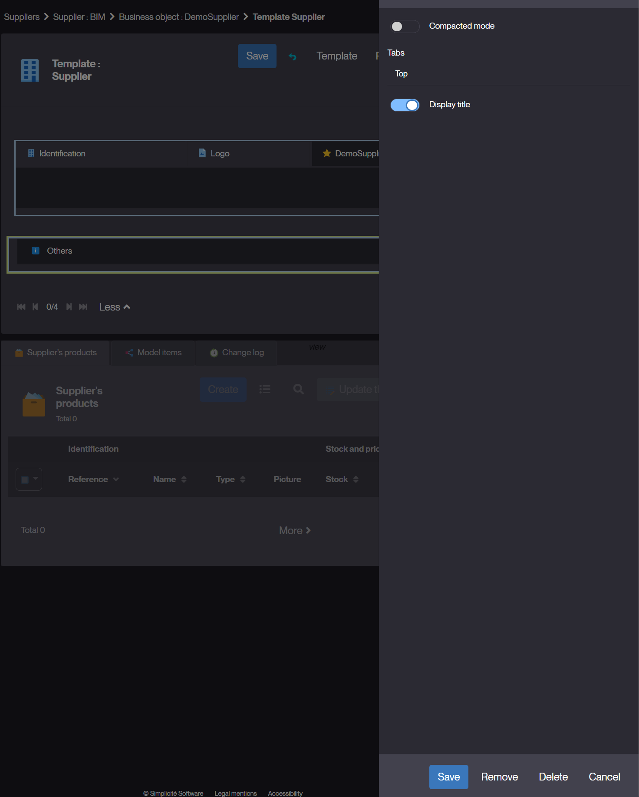
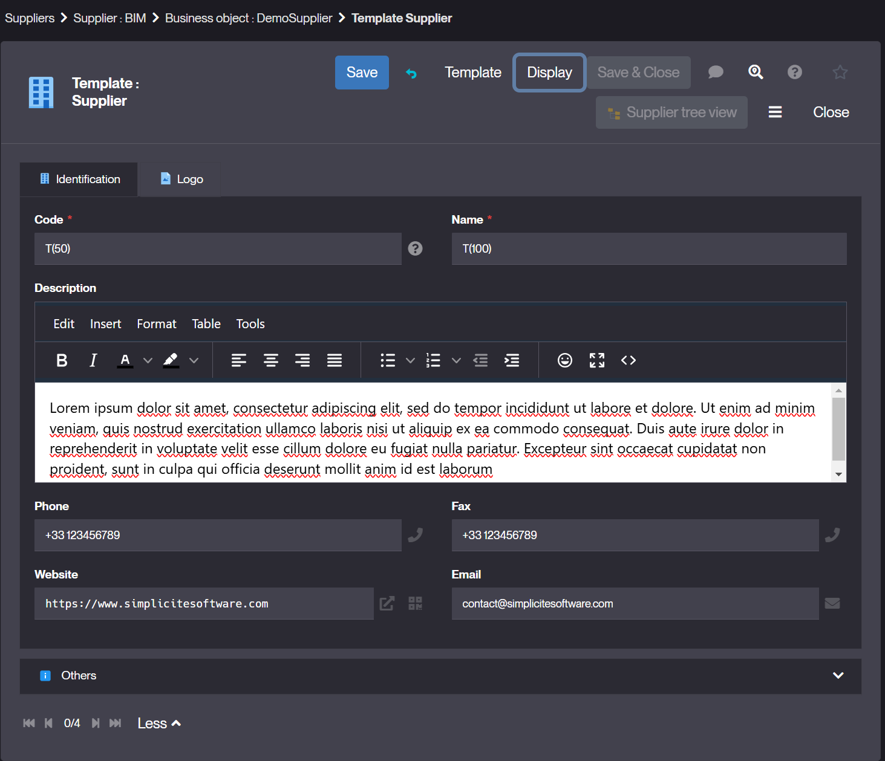
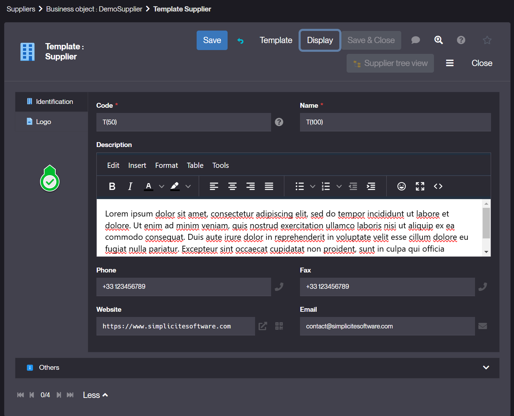
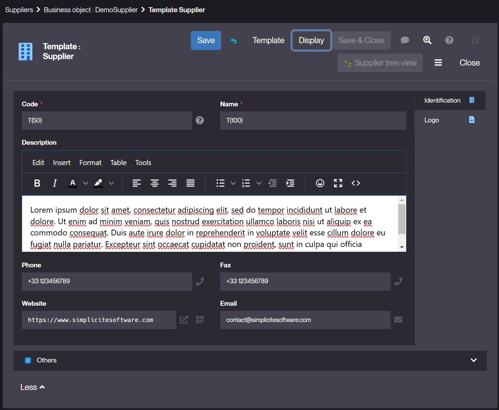
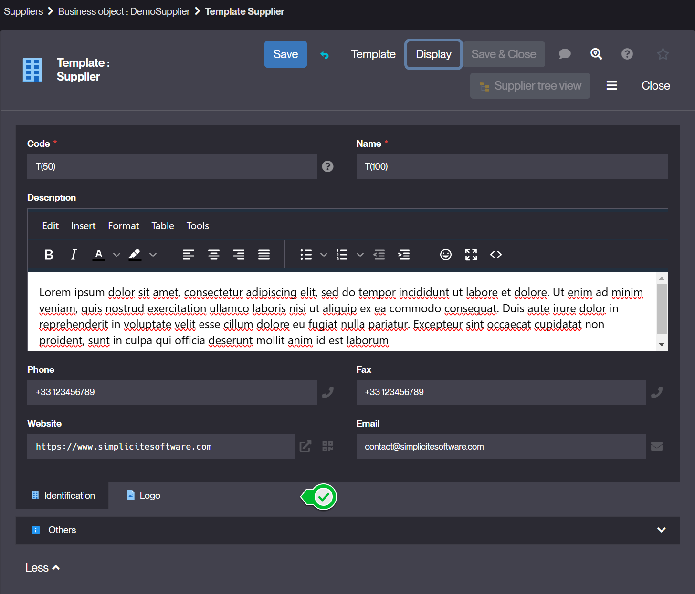

# Fields Areas

## What is a Fields Area ?

Fields areas are used to group fields, both in forms and in lists. They help organize the UI by structuring data into logical sections, making forms more readable and easier to navigate.  

### Key Features
- Groups related fields to improve clarity.
- Can be collapsed/expanded to optimize space.
- Supports conditional display (e.g., shown only under certain conditions).
- Affects both form layout and list headers.

## How to create Fields Areas ?

### Create a Fields Area via the template editor
- Select the object where you want to add field area and go to its configuration.  
- Click on the **Edit form** button of your business object. If the object doesn't yet have a template, you'll be asked to choose one. The template editor will open on a 1st attribute zone named `<Objectname>-1` 
If the object already has a template, click on the + in the zone of your choice and select **Fields Area**.  
- Define the properties    
    
    - Label : Name displayed in the UI.  
    - Display Title : choose if the label is displayed.  
    - Collapse : Choose if the area can be expanded/collapsed.  
    - Hide : visibility conditions (optional)- Define when the area is displayed.  
  
### Assigning Fields to a Fields Area   
Once the field area is created:

- Use drag & drop to place your fields in the fields area.  
- Use + to add fields or place attributes not yet used in your form.  
 

### Managing Fields Areas in Forms & Lists    

- In forms, fields areas appear as section headers, organizing input fields.
- In lists, they can be used to create grouped column headers.
- Custom styling can be applied via UI properties for a customized arrangement.
  In version v6, it is possible to change the display of tabbed fields areas by choosing whether tabs are displayed horizontally or vertically, top or bottom.  
   
   
Example:  
    - Top  
   
    - Left   
  
    - Right  
    
    - Bottom   
   

