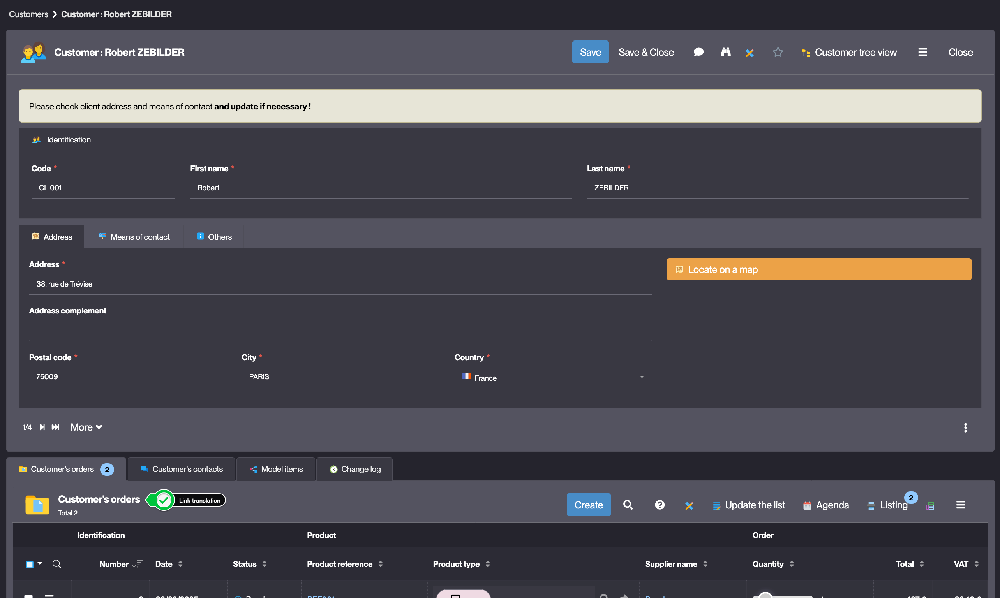
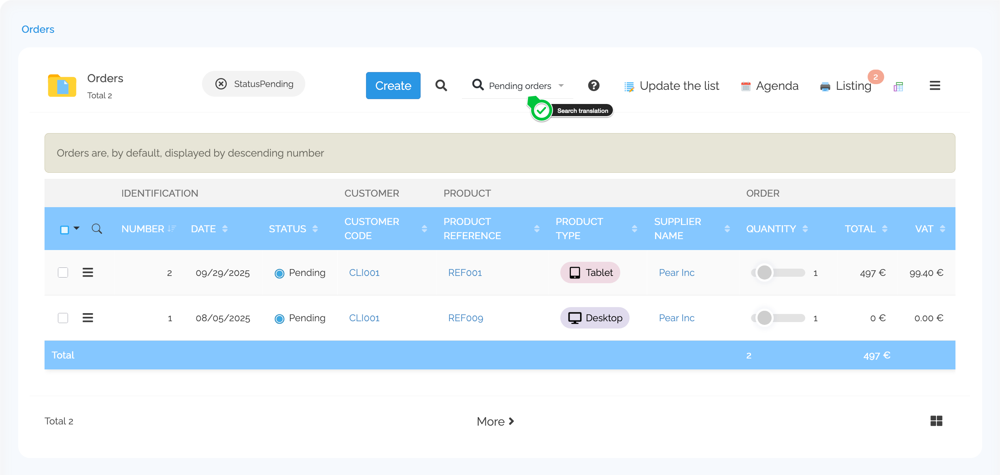

Translations
============

What is a translation?
----------------------

Simplicité is a multi-language application. The Translations object is used to configure the different labels per language displayed in the application.

Translations configuration
--------------------------

Most of the configuration objects that are displayed in the application have multiple
translations linked to it e.g. Objects, Object Fields, Domains, Actions, Links, View, Searches, etc.

Depending on the object, the Translations have different configuration fields.

### Object

| Field       | Description                                                                              |
| ----------- | ---------------------------------------------------------------------------------------- |
| Language    | User language                                                                            |
| Translation | The object's label (singular) - used in forms                                            |
| Plural      | The object's label (plural) - used in lists                                              |
| User help   | The object's help text - displayed in under the help icon in the list's or form's header |

### Field / Object Field

| Field                | Description                                                           |
| -------------------- | --------------------------------------------------------------------- |
| Language             | The language of the translation.                                      |
| Translation          | The field's label                                                     |
| Plural               | _unused for fields_                                                   |
| Simple help          | Content added to a help button next to the field on the object's form |
| Short label on lists | Overrides the label for the field in lists                            |
| Placeholder          | The field's placeholder - used in forms                               |
| Column help          | Content added to a help button next to the column in the list         |
| Tooltip              | Content displayed when the field label is hovered                     |

### Link

Link translations are used to override an object's translation when displayed in a linked list context.

| Field       | Description                      |
| ----------- | -------------------------------- |
| Language    | The language of the translation. |
| Translation | The link's label                 |

<details>
    <summary>Example</summary>

    
</details>

### Action

| Field       | Description                                         |
| ----------- | --------------------------------------------------- |
| Language    | The language of the translation.                    |
| Translation | The action's label                                  |
| Tooltip     | Content displayed when the action button is hovered |

### Search

Search translations are used in the context of preset searches.
They are also the default label given to a View Area when the preset search is used in a View.

| Field       | Description                      |
| ----------- | -------------------------------- |
| Language    | The language of the translation. |
| Translation | The search's label               |

<details>
    <summary>Example</summary>

    
</details>

Using the Java API
------------------

The `setLabel` method of the Java API can be used to set the translations for an Object, Link, Field, Action, etc.

Example: Customizing an object's label for a specific user group

```java
public void postLoad() {
	if (getGrant().hasResponsibility("USER_GROUP"))
		setLabel("My Custom Object Label");
}
```
