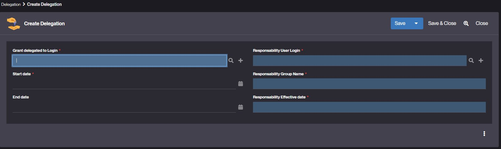

Delegation
==========

What is Delegation?
-------------------

It often happens that when a person is absent or on leave, they need to delegate their rights to
a third party for a given period. This is known as delegating rights.

This delegation can be configured in Simplicité and, like all system functions,
can be assigned to a [business profile](/make/usersrights/groups).

How to create a Delegation?
---------------------------

To create a delegation, follow the steps below:

1. Go to Users and rights > Delegation.
2. Click **Create** a new Delegation.
   
3. Fill in the required fields:
   - Grant delegated to Login : The login of the user to whom you wish to delegate rights.
   - Start date - Beginning date of the delegation.
   - End date (optional) – End date of the delegation.
   - Responsibility User Login - One of the responsibilities of the connected user.

A user can have several rights delegations.
