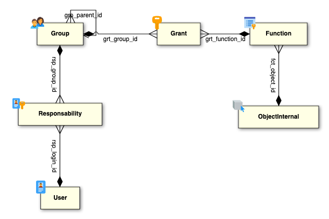

Function
========

Introduction
------------

In Simplicité, a Function represents the access rights assigned to Groups, defining what users can do within the application.
Functions determine access rights on objects (CRUD operations), views, and actions.

They are associated with Groups via Grants, which centralize access control.

A User belongs to one or more Groups through Responsibilities, which define their membership during a specific period.
These Groups, in turn, have Functions assigned via Grants, determining the User's effective access rights.

Configuration
-------------

| Field                        | Description                                                                 |
|------------------------------|-----------------------------------------------------------------------------|
| **Function Name (fct_name)** | Functional key, unique identifier for the Function.                         |
| **Function**                 | Type of access rights.                                                      |
| **Target**                   | Object code for CRUD Function, Action or View name.                         |
| **Module Name**              | Defines the module to which the Function belongs.                           |

Features
--------

### Access Control via Groups and Grants

Functions provide structured permission management by:

- Controlling access to CRUD operations on objects.
- Restricting or allowing access to specific views.
- Granting access for executing certain actions.
- Being assigned to Groups via Grants, ensuring users inherit access rights and permissions through their Group memberships.

### User-Group-Function Relationship

- A User belongs to Groups via Responsibilities (valid for a defined period or since a start date).
- A Group is assigned Functions via Grants, forming a many-to-many (N-N) relationship between Groups and Functions.

This ensures that a User’s access is determined by their Group memberships, not directly by the Function.

Example Use Case
----------------

Suppose there is a Function named **DEMO_ORD_CRUD**, which grants access rights to read, create, update and delete an order.

- This Function is assigned to the **DEMO_ADMIN** via a Grant.
- **Barbara Smith** is a member of the **DEMO_ADMIN** through a Responsibility.
- Barbara inherits the access rights of **DemoOrder** object without requiring direct access assignment.

Meta-model
----------

The structure of functions in Simplicité follows this pattern:

- A User is linked to a Group via Responsibilities (`rsp_login_id`, `rsp_group_id`).
- A Group is linked to Functions via Grants (`grt_group_id`, `grt_function_id`), forming an N-N relationship.
- A Function defines access rights on objects, views, or actions (`fct_object_id`, `fct_view_id`, `fct_action_id`).
- The Effective date of a Responsibility is defined by `rsp_start_date`.
- The Functional key of a Function is `fct_name`.

This structure ensures that access rights are managed centrally via Groups, making access control more maintainable and scalable.

The diagram below illustrates the relationships between Users, Responsibilities, Groups, Grants, and Functions in Simplicité:

