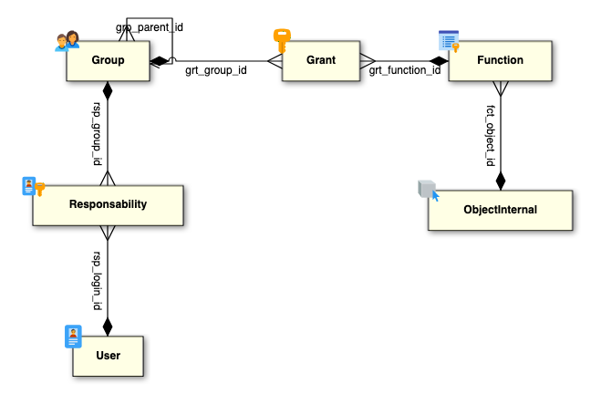

# Group

## Introduction 

A Group in Simplicité is a fundamental access control mechanism that defines grants and roles for users within the platform. Instead of assigning rights directly to individual users, grants are managed at the Group level.

## Configuration

| Field | Description |
| ----- | ----------- |
| Name | Group's identifier |
| Type | Type of Group <!--Needs detailed documentation-->|
| Parent group | Used in cas of Group inheritance |
| Home page | Define Home page for users linked to Group |

## Features 

### Group profiles and inheritance

#### Profiles

The **Profile members** tab enables the addition of sub-groups within a Group, which is particularly useful for profile management. 
Example use case :
- The ADMIN Group contains several Profiles like "GRANT_ADMIN", "USER_ADMIN" and "DASHBOARD_MAKER"
- When a User is assigned the ADMIN Responsibility, they inherit all profile grants and permissions without needing separate assignments.

#### Inheritance

The **Inheritors** tab in Simplicité is used to manage group inheritance. It allows a Group to inherit grants and permissions from another Group. 

Example use case :
- Suppose Group "Managers" has specific permissions for approving requests.
- Group "Senior Managers" is set as an inheritor of "Managers."
- Users in "Senior Managers" will have both their own permissions and all permissions from "Managers", without needing manual duplication. 

#### When to use what ?

- Use Inheritors when you want to extend permissions from one Group to another in a hierarchical way.
- Use Profiles when you want to group multiple roles under a single System Group for easier user management.

## Meta-model

