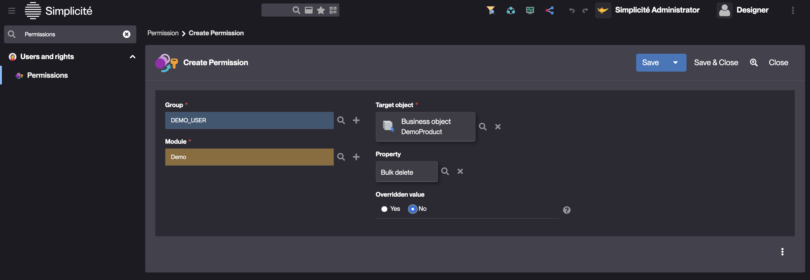

Permissions
===========

Introduction
------------

Since version 6.0, Permissions have replaced Functions for several Objects of the metamodel.

The Function Configuration Object is now dedicated to Business Objects, Actions and Views.

A **Permission** is a Configuration Object in the metamodel that allows controlling access rights and visibility for various system objects.
It provides more flexibility than Functions by allowing finer control over attributes such as visibility, update properties,
and other constraints that can be overridden for specific Groups.

Features
--------

1. **Permissions Control**
   - Permissions can be used to define access rights for a wide range of Configuration Objects.
   - They provide control over the visibility and properties of objects, overriding default settings for specific Groups.
   - Permissions can be applied to objects like Agenda, Domain, and Business Objects, among others.

2. **Object Types**
   - Permissions can be created for both:
     - **Business objects**, **Fields**, and **ObjectFields** where properties can be overridden.
     - **Other Configuration Objects** like Agenda, Search, Timesheet, and more.

3. **Group-Based Permissions**
   - Permissions allow setting specific access rights for Groups, making them more scalable and maintainable for different user roles.

Configuration
-------------

| Field                 | Description                                          |
| --------------------- | ---------------------------------------------------- |
| **Target Object**     | The target object for which the permission is set    |
| **Visible**           | Visible Property being overridden (e.g., visibility) |
| **Updatable**         | Updatable overridden property                        |
| **Property**          | Property overridden                                  |
| **Primary Group**     | Group to which the permission applies                |
| **Group permissions** | Others Groups to which the permission applies        |
| **Module**            | The module to which the Permission belongs           |

Configuration objects linked to Permissions
-------------------------------------------

- **Agenda**: Grants visibility and access rights for calendar-related objects
- **Business Object**: Allows overriding specific properties for certain groups
- **Constraint**: Controls access to constraints
- **Dashboard**: Controls access to dashboard configurations
- **Domain**: Controls access to domain-specific configurations
- **External Object**: Manages access to external objects
- **Field**: Restrict or override field-level properties
- **Link**: Manages access to links
- **Model template** : Manages access to specific model templates
- **Object Field**: Override visibility and other attributes for Object Fields
- **Pivot Table**: Manage visibility and access to pivot tables
- **Places Map**: Define permissions for geographic places map
- **Publication**: Control user access to published content
- **Search**: Adjust search-related permissions
- **Shortcut**: Manage visibility of shortcuts
- **Simple view**: Manage visibility of simple views
- **Timesheet**: Set permissions related to time sheets
- **Tree View**: Define visibility rules for tree views

How to create a Permission?
---------------------------

Adding a Permission can be done via the `Permissions` panel in any of the objects listed above.
Alternatively, use the menu search bar to find the Permissions configuration object.

1. Create a Permission
2. Select the Group
3. Set the Module
4. Select the target object
5. Select the property to override
6. Set the overridden value

:::warning

It is required to clear the platform's cache to apply changes made to Permissions

:::

Learn more
----------

- [Functions](/make/usersrights/function)
- [Grant](/make/usersrights/grant)
- [Business object](/make/businessobjects/business-objects)
