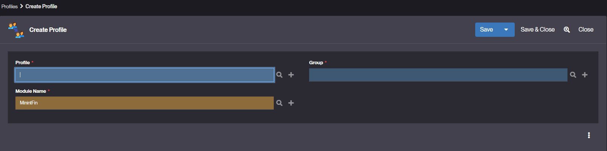

# Profile 

## What is Profile ?

In Simplicité®, a Profile is a sub-group used to structure and modularize the functions and permissions within a main Group. It represents a many-to-many (N-N) relationship between groups, allowing one [group](/make/usersrights/groups) to include multiple sub-groups (profiles), each encapsulating a specific set of permissions and functions.   

Profiles are managed via the "Member of profiles" tab on a Group or directly from the menu.

Example
The ADMIN Group may include the following Profiles:

- GRANT_ADMIN – Manages user grants  
- USER_ADMIN – Manages user accounts  
- DASHBOARD_MAKER – Designs and publishes dashboards

When a user is assigned the ADMIN responsibility, they automatically inherit all [permissions](/make/usersrights/permissions) and rights [functions](/make/usersrights/function) from the associated groups — without needing separate group assignments for each.

This system promotes modular and reusable access control, making it easier to manage complex permission structures.    

## How to create a Profile ?

To create a profile, follow the steps below: 

1. Go to Users and rights > Profiles.
2. Click **Create** a new Profile.  

3. Fill in the required fields:
    - Profile: the [group](/make/usersrights/groups) of rights representing the profile (this group exists or must be [created](/make/usersrights/groups#configuration)).  
    - Group: the [group](/make/usersrights/groups) of rights to be associated with the profile.  
    - Module name: The belonging module.  

A profile is associated with several rights groups.   