Building the "Order Management" Training App : Creating a Dataset
==================================================================

> Prerequisite : [The Supplier, Product, Client and Order objects are linked together and contain data](/tutorial/expanding/relations)

What is a Dataset?
------------------

A dataset is a structured collection of data used for testing or transferring information between instances.
Unlike technical exports, which may create inconsistencies, a dataset export ensures data integrity
by using functional keys instead of technical IDs...

[Learn more](/make/project/datasets)

Creating the dataset
--------------------

1. In the **Project > Datasets** menu, click **Create**
   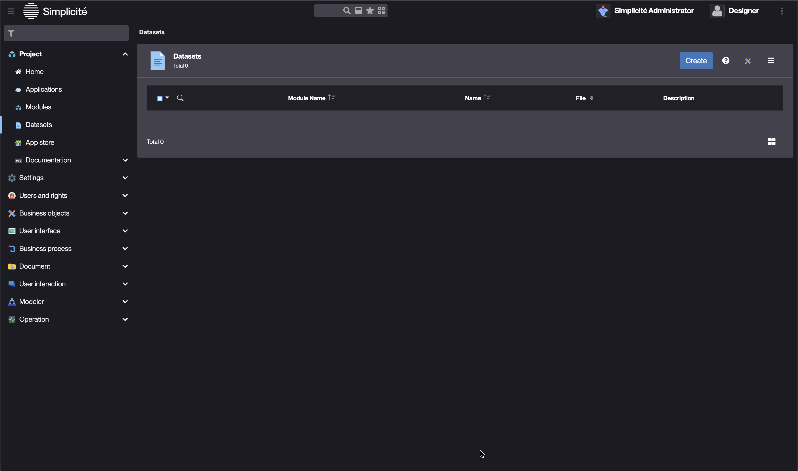
2. Pick a **Module** and a **Name** for your dataset
   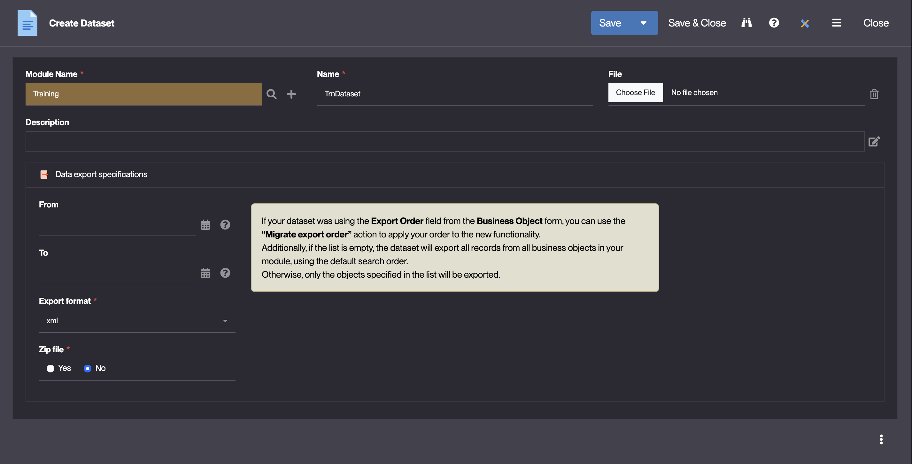
3. Click **Save**

Your dataset is now created, the default **export specifications** are XML format & unzipped file.

If you leave the dataset as it is, all of your datas will be included in it with no specified order.

> Note that the export could work, but most of the times a dataset serves to create specific datas, and thus we still need to do a few things.

Configuring the dataset
-----------------------

### Selecting the data

In our case we will export our 4 objects **TrnSupplier**, **TrnProduct**, **TrnClient** and **TrnOrder**, following the steps below :

1. On the **Dataset objects** list, click **Create on list**, then click the loop icon next to the **Business object** field.
   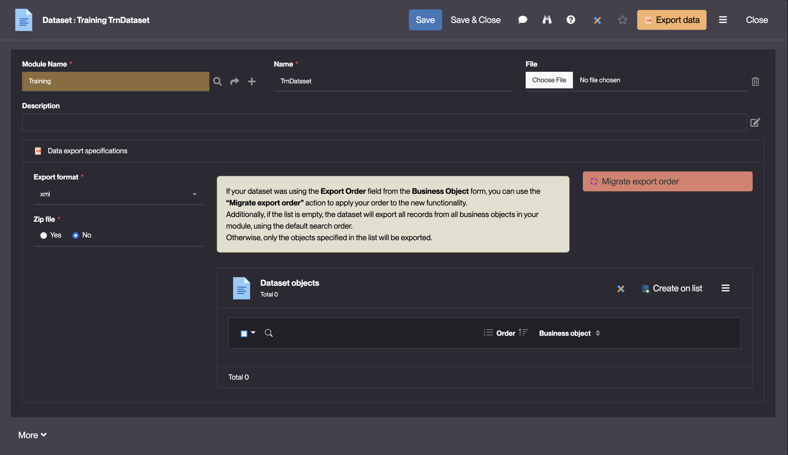
   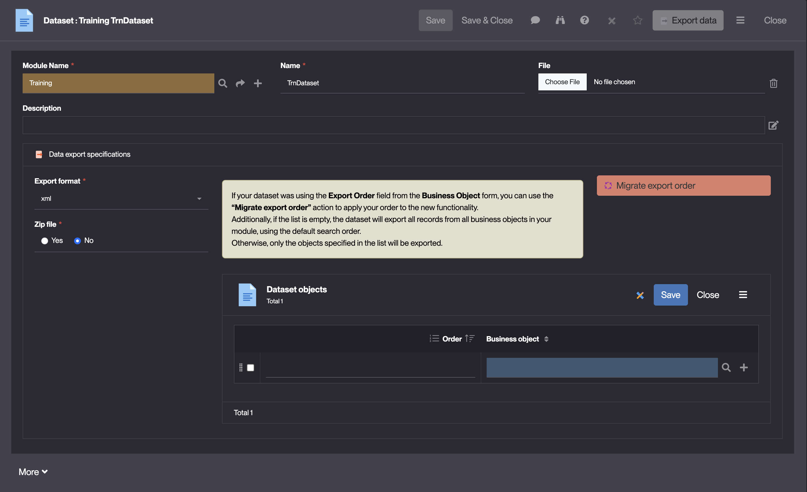
2. From the **Select Business object** list that appears, click the **TrnOrder** object to select it.
   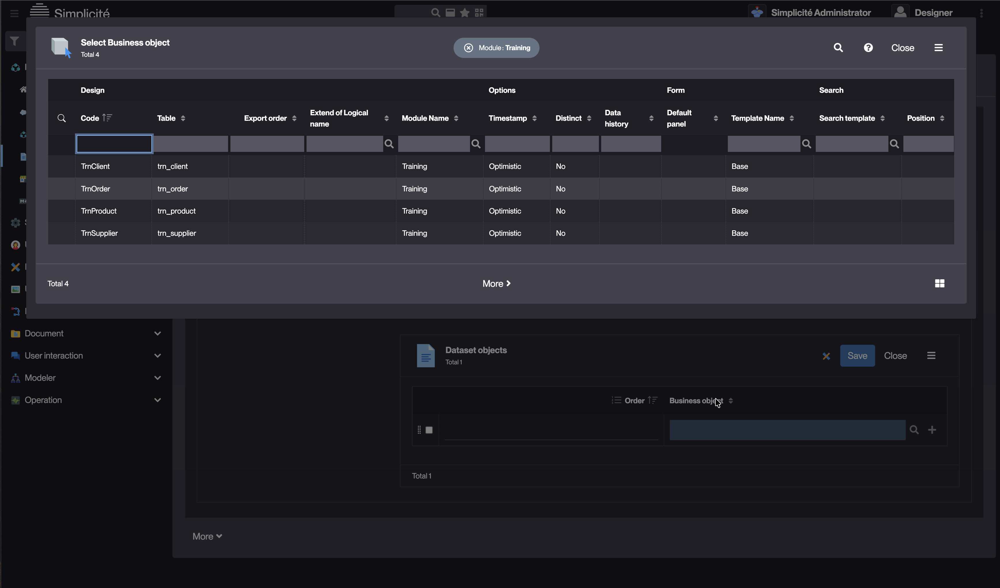
3. Back to the **Dataset objects** click save
   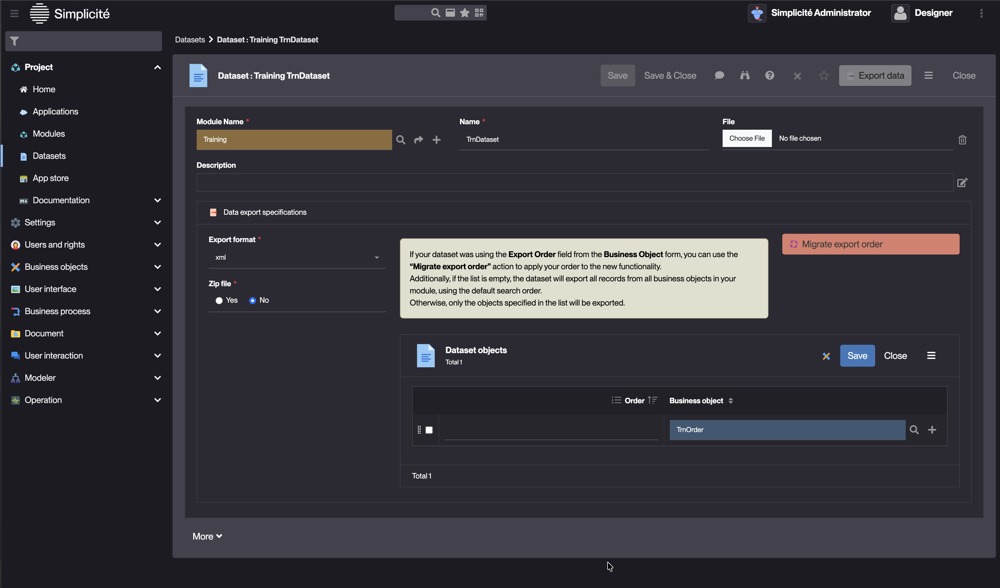
4. Now repeat the steps 1 to 3 until you have all 4 objects.
5. Click **Close** in the **Dataset objects** list's header.
   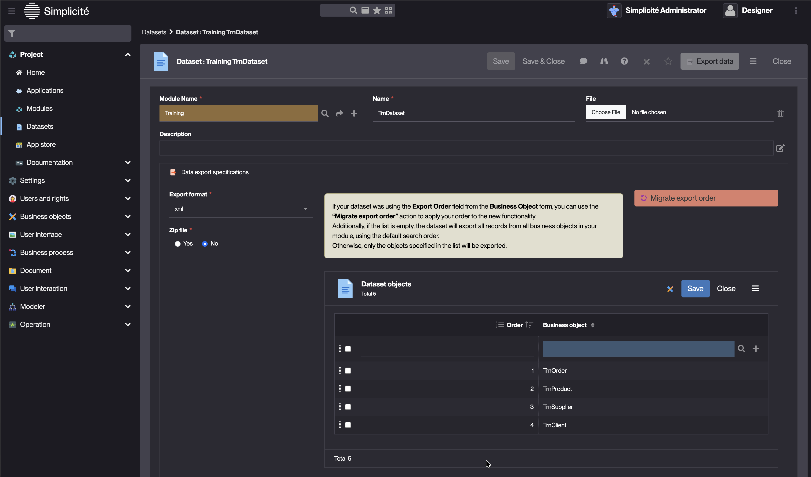

We now have specified the data that will be included in the dataset.
And the **Order** columns shows the specific order the objects will be imported when the dataset is played.

But as our objects have links between eachother, we need to pay attention to the order they're gonna be imported in.

> if the **TrnOrder** objects are imported referring a **TrnProduct** or **TrnClient** that wasn't imported yet, the data import will fail.

### Ordering the data

To re-order the rows in the desired order : **TrnClient** / **TrnSupplier** / **TrnProduct** / **TrnOrder**.

We will use the drag & drop feature, so you can use the dotted handles to drag the object rows in the final order that we want.

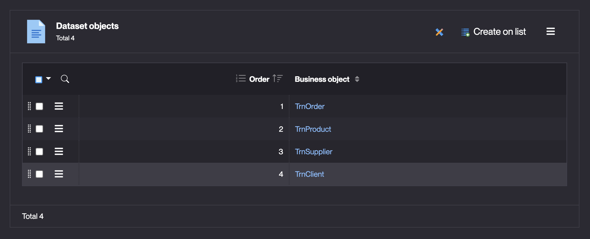
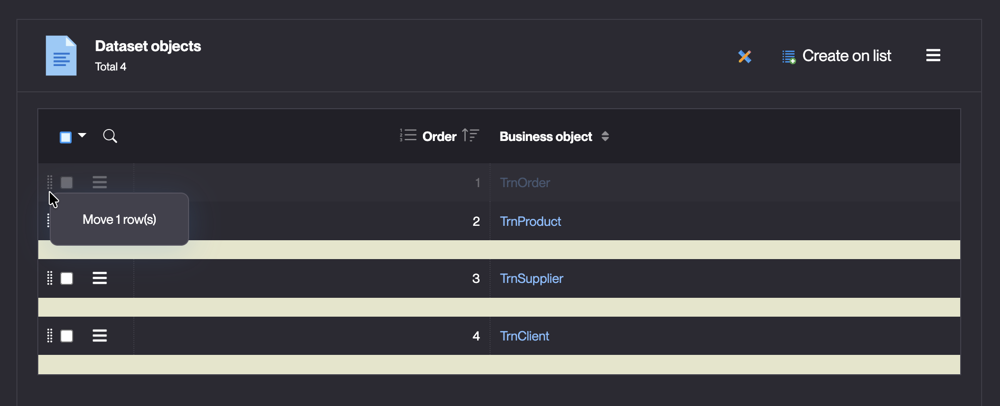

Once this is done, click **Save** in the Dataset's form header. Then create the dataset file by clicking on the **Export data** action button.

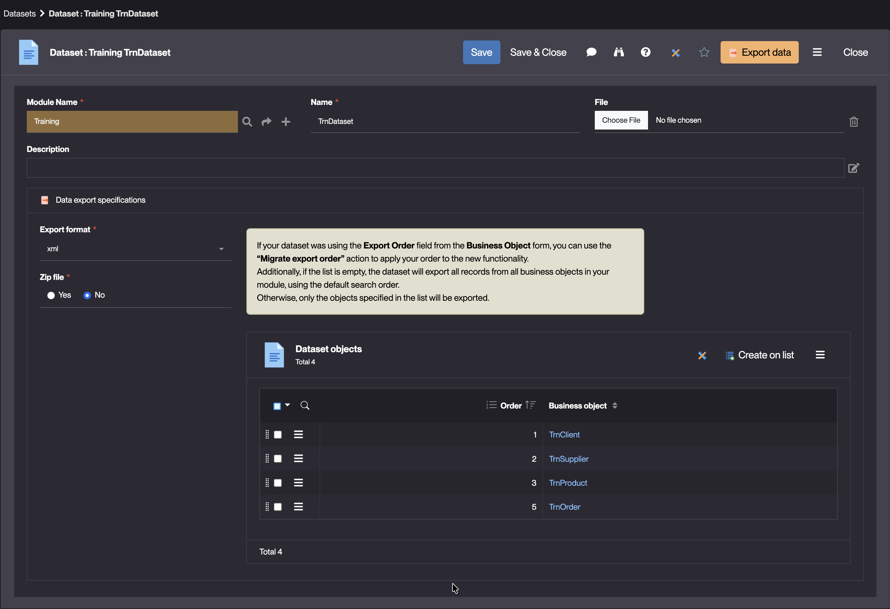

> Everything is now ready for the dataset to be "played" and thus all the data imported, but as it already exists, we'll first have to delete it.

Deleting data and importing the Dataset
---------------------------------------

### Deleting data

To delete existing Orders, follow the steps below:

1. Open the list of Orders
2. Select all rows
   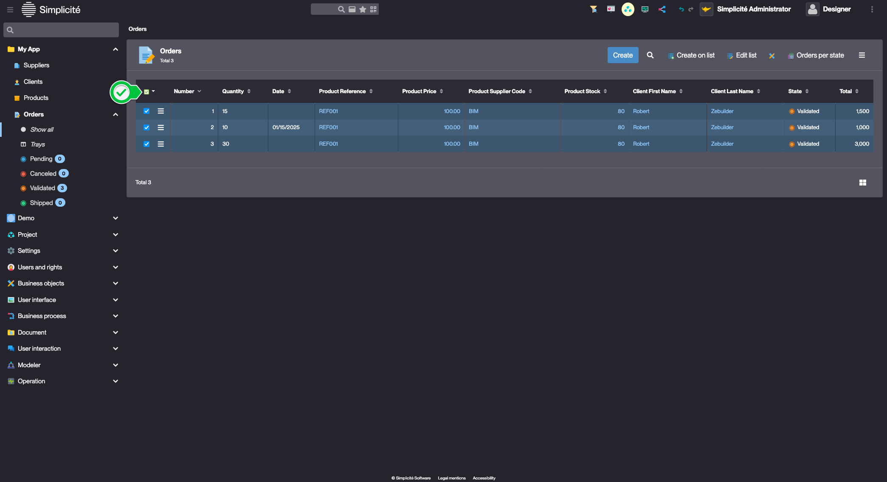
3. In the _plus_ menu, click **Delete all**
   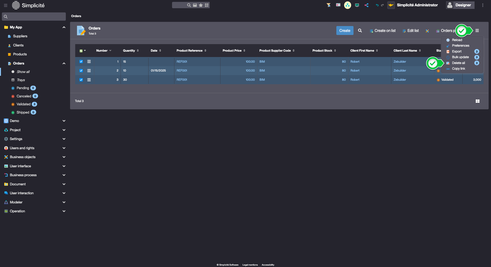
4. Click **Ok**

Repeat the steps above to delete existing Products, Suppliers and Clients.

### Importing the Dataset

1. In the **Project > Datasets** menu, click the _play_ button on the previously exported Dataset
   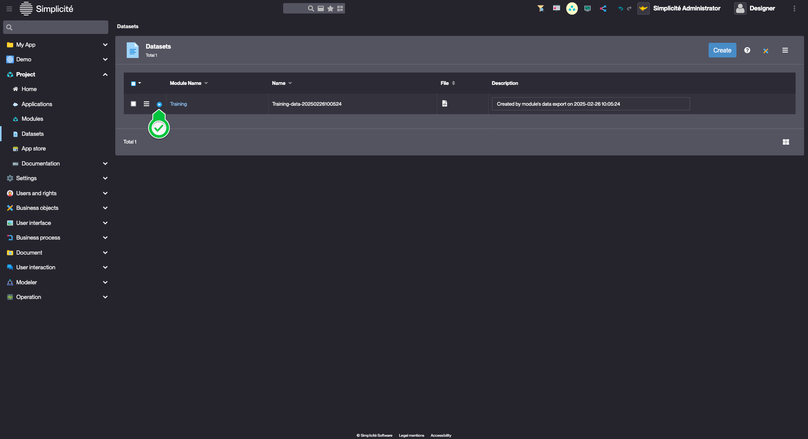
2. Click **Yes**

:::tip[Success]

The data is successfully imported

:::
