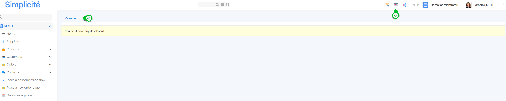
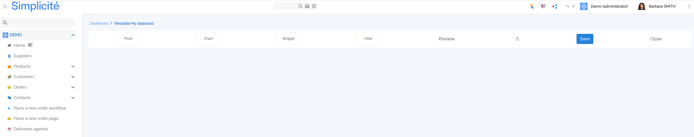

Building the "Order Management" Training App : Creating an inherited object
===========================================================================

> Prerequisite : [You have a basic understanding of the Simplicité platform, and the steps in "2. Expanding your app" are completed](/category/2-expanding-your-app)

What is a dashboard ?
--------------------

A dashboard is a customizable interface that displays key data and insights with interactive filtering and visualization.

[Learn more](/make/userinterface/views/dashboard)

Creating a dashboard
--------------------------

To create a dashboard, follow the steps below:

1. If you have DASHBOARD_MAKER rights and not have ADMIN rights (like designer), a dashboard icon will appear in the page header.
   It allows you to create your dashboard. Click on create.
   
2. Give a label. The dashboard editor is open.
   
   You have different choices :
   - Pivot : this will give you access to all the pivot tables available to you
    
   - Chart : this will give you access to all the pivot tables available to you with chart display.
     Choose your chart and click on Apply.
   
   - Widget : this will give you access to all the widgets (specific external objects) available to you.
     Choose one and place it.
   
   - Filter : allows to add a search bar (new view item) with optional time period and fields.
     - The item triggers a new event with user's filters `{ fromDate, toDate, fields..}`.
     - The filters are applied to lists, charts, and pivot tables (having a date/period or matching filtered fields).
       You can add filters on object attributes to this period filter bar by clicking on Add Filter.
      
   - Rights to drag a list from the menu : If the object has been set to allow dashboard listing.
     
   - Preview : to preview your dashboard
   - Up arrow icon : automatically arrange your dashboard
   - Save : to save your dashboard
   - Close : to close your dashboard
3. Once you have chosen the type of element (pivot, chart or widget), click on the element and drag it to the position of your choice.
4. Save your dashboard
5. If it exists Dashboard sharing GROUPS with DASHBOARD right, you can share your dashboard with these groups who will be able to read it.
   
   A Share button in the Dashboard editor allows you to select the dashboard sharing groups of your choice.
   Click on Apply.
