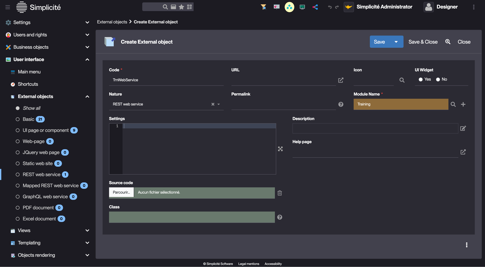
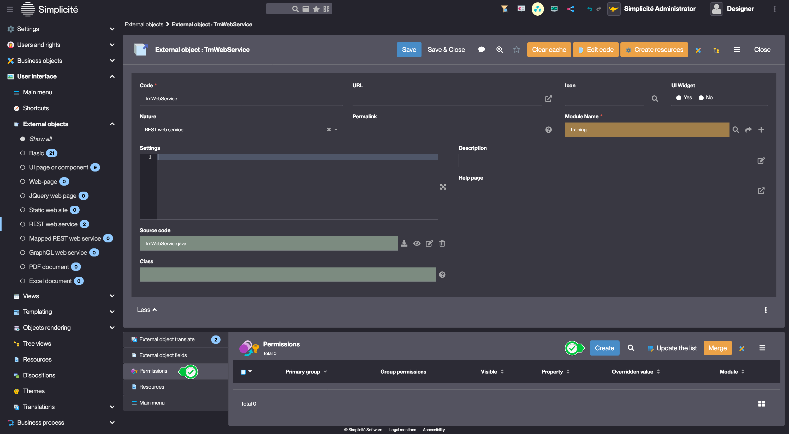
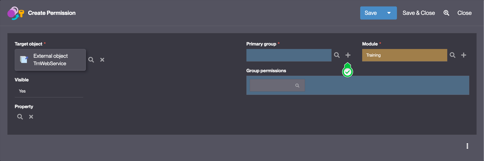
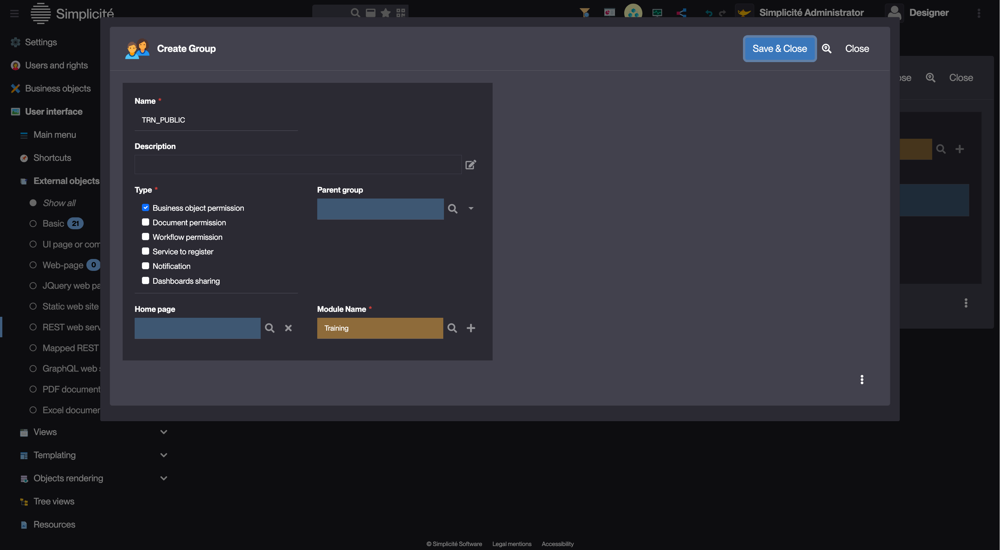
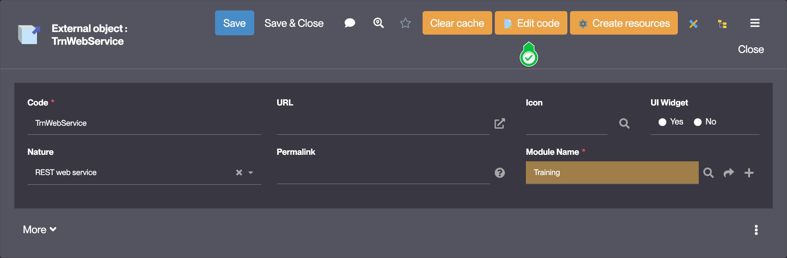

Building the "Order Management" Training App : Creating a custom REST endpoint
==============================================================================

:::note[Prerequisite]

[You have a basic understanding of the Simplicité platform, and the steps in "2. Expanding your app" are completed](/category/2-expanding-your-app)

:::

What is a custom web service?
-----------------------------

By default, for each object, Simplicité exposes default REST endpoints. Sometimes, the default REST endpoints don't cover the business requirements,
custom web services can be created with **External Objects**. An External Object can be used to implement a specific UI component,
a custom front-end, a specific web service...

[Learn more](/category/external-objects)

Creating an endpoint to retrieve the List of Suppliers
------------------------------------------------------

Let's say we want to call a custom endpoint that returns a list of Suppliers like so :

```json
{
    "found": true, // false if no results
    "suppliers": [
        {
            "code": <supplier code>
            "name": <supplier name>
            "nbPrdInStock": <nb of products in stock>
        },
        ...
    ]
}
```

To create a custom endpoint, follow the steps below:

1. In the **User interface > External Objects > Rest web service** menu, click **Create**
2. Fill in the form like so :
   - Code : **TrnWebService**
   - Nature : **REST web service**
   
3. Click **Save**

### Making the endpoint public

In the **Permissions** panel linked to the External Object:

1. Click **Create**
   
2. In the **Primary group** field, click `+` to create a new Group
   
3. Fill in the Group fields like so :
   - Name : **TRN_PUBLIC**
   - Module Name : **Training**
   
4. Click **Save & Close** to create the new Group
5. Click **Save & Close** on the `Create Permission` form to create the Permission

::::tip

The Endpoint is now granted to the users with the `TRN_PUBLIC` Responsibility

::::

### Implementing the web service GET method

1. Click **Edit code**
   
2. Select `Java`, and click **Confirm**

Implement the `TrnWebService` Class like so :

```simplicite-java title=TrnWebService.java
package com.simplicite.extobjects.Training;

import java.util.List;

import org.json.JSONArray;
import org.json.JSONObject;

import com.simplicite.util.AppLog;
import com.simplicite.util.ObjectDB;
import com.simplicite.util.exceptions.HTTPException;
import com.simplicite.util.exceptions.SearchException;
import com.simplicite.util.tools.Parameters;

/**
 * REST service external object TrnWebService
 * This class implements a custom REST endpoint to retrieve supplier information including product counts
 */
public class TrnWebService extends com.simplicite.webapp.services.RESTServiceExternalObject {
	private static final long serialVersionUID = 1L;

	/**
	 * GET method handler that returns a list of suppliers with their product counts
	 * The response format is:
	 * {
	 *   "found": boolean,      // true if suppliers found, false otherwise
	 *   "suppliers": [         // array of supplier objects
	 *     {
	 *       "code": string,    // supplier code
	 *       "name": string,    // supplier name
	 *       "nbPrdInStock": number  // count of products in stock for this supplier
	 *     }
	 *   ]
	 * }
	 * @param params Request parameters (not used in this implementation)
	 * @return JSONObject containing supplier data
	 * @throws HTTPException if there is an error processing the request
	 */
	@Override
	public Object get(Parameters params) throws HTTPException {
		ObjectDB supplier = new ObjectDB();
		try {
			supplier = borrowAPIObject("TrnSupplier"); // Borrow an API object instance from the pool (ZZZ must be returned, see below)

			// Initialize response object with empty results
			JSONObject results = new JSONObject()
				.put("found", false)
				.put("suppliers", new JSONArray());

			// Search for all suppliers
			List<String[]> rslts = supplier.search(false);
			if (rslts.isEmpty()) {
				return results; // Return early if no suppliers found
			}

			// Update found flag and get suppliers array
			results.put("found", true);
			JSONArray suppliers = results.getJSONArray("suppliers");

			// Process each supplier
			for (String[] row : rslts) {
				supplier.setValues(row);
				try {
					// Create supplier object with code, name and product count
					suppliers.put(new JSONObject()
						.put("code", supplier.getFieldValue("trnSupCode"))
						.put("name", supplier.getFieldValue("trnSupName"))
						.put("nbPrdInStock", countPrdInstock(supplier.getRowId())));
				} catch (SearchException e) {
					// Log error if product count fails for a supplier
					AppLog.error("Error counting products in stock for supplier " + supplier.getFieldValue("trnSupCode"), e);
				}
			}

			return results;
		} finally {
			returnAPIObject(supplier); // Return the API object instance to the pool
		}
	}

	/**
	 * Helper method to count products in stock for a supplier
	 * Counts only products with stock > 0
	 * @param supRowId Supplier row ID to count products for
	 * @return Number of products in stock for the supplier
	 * @throws SearchException If the product search fails
	 */
	private long countPrdInstock(String supRowId) throws SearchException {
		// Create filter for products with stock > 0 belonging to supplier
		JSONObject filters = new JSONObject().put("trnPrdSupId", supRowId).put("trnPrdStock", "> 0");
		ObjectDB obj = null;
		try {
			obj = borrowAPIObject("TrnProduct");  // Borrow an API object instance from the pool (ZZZ MUST be returned, see below)
			return obj.getTool().count(filters);
		} finally {
			returnAPIObject(obj); // Return the API object instance to the pool
		}
	}
}
```

[Source file](TrnWebService.java)

### Adding the TRN_PUBLIC Group to `public` user

Since the endpoint is available without authentication we need to add the TRN_PUBLIC responsibility to `public`:

1. In **Users and rights > Users > Show all**, open `public`
2. In the Responsibility panel, click **Associate** and associate the **TRN_PUBLIC** Group

### Granting READ ONLY rights to TRN_PUBLIC

For both the `TrnSupplier` and `TrnProduct` object, grant TRN_PUBLIC to the READ Functions:

1. In **Business objects > Business objects** open the object
2. In the **Functions** panel, open the _read only_ Function, click **Associate** and associate the **TRN_PUBLIC** Group

Test the endpoint
-----------------

Public endpoints are available on `<base_url>/api/ext/<External Object Name>`
Clear the platform's cache and call the endpoint via Postman or `curl`

:::tip[Success]

```shell
$ curl <instance_url>/api/ext/TrnWebService
> {"found":true,"suppliers":[{"code":"BIM","nbPrdInStock":1,"name":"Bim Computers Ltd."}]}
```

:::
