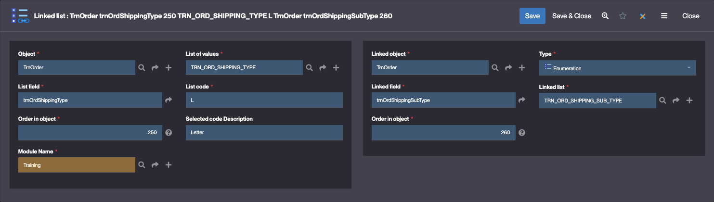

Building the "Order Management" Training App : Creating a dynamic dropdown - Linked lists
=========================================================================================

> Prerequisite : [You have a basic understanding of the Simplicité platform, and the steps in "2. Expanding your app" are completed](/category/2-expanding-your-app)

What is a Linked list?
----------------------

Linked lists allow you to create dynamic dropdown menus where the available options in one field change based on what's
selected in another field...

[Learn more](/docs/make/businessobjects/linkedlist.md)

Creating a _Shipping type_ and _Shipping sub-type_ field for the Order
----------------------------------------------------------------------

To do so, follow the step below :

1. Open the `TrnOrder` template editor
   > For a detailed step by step, see [Add a field](/docs/tutorial/getting-started/attribute.md)
2. Add a `Shipping type` enumeration field with the following values :

   | Code | Value  |
   | ---- | ------ |
   | L    | Letter |
   | P    | Parcel |

   

      
Configuration

      
   

    > For a detailed step by step, see [Add an enumeration field](/docs/tutorial/expanding/states.md#add-enum)

3. Add a `Shipping Sub Type` enumeration field with the following values :

   | Code | Value   |
   | ---- | ------- |
   | R    | Regular |
   | S    | Special |

   

      
Configuration

      
   

4. In the **Business objects > List of values** menu, click **Create**
   
5. Name the list: `TRNORDSHIPPINGPARCELTYPE`
6. Click **Save**
7. In the **List code** panel, click **Create**
   
8. Fill in the **List code** information like so:
   - Code: **24h**
   - Description: **Package 24h**
9. Update the _English_ **Translated list value**
   
10. Click **Save & Close**

Repeat the steps 7 -> 10 to create the code : `1w` : **Package 1 week**

Linking `P` list code to the _Parcel specific_ list
---------------------------------------------------

1. In the **Business objects > Linked list** menu, click **Create**
   
2. Fill in the form like so :
   - Object reference : select the **trnOrdShippingType** field
   - List of values : **TRN_ORD_SHIPPING_TYPE**, code **P**
     
   - Linked object reference : select **trnOrdShippingSubType**
   - Linked list : **TRNORDSHIPPINGPARCELTYPE**

   

3. Click **Save & Close**

Repeat these steps to link `L` to the **TRN_ORD_SHIPPING_SUB_TYPE** List

Test the Linked list with `usertest`
------------------------------------

1. Clear the platform's cache and log in using `usertest`
   > For a detailed step-by-step, see : [Testing the User](/tutorial/getting-started/user#activating-and-testing-the-user)

:::tip[Success]

On an Order's form, when selecting the "Parcel" shipping type, "Package 24h" and "Package 1 week" options are available in the _Shipping sub type_ field

:::
