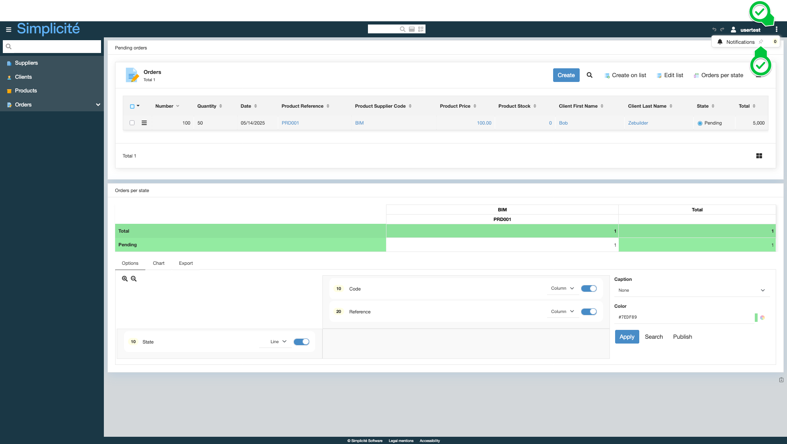

Building the "Order Management" Training App : Creating in-app notifications
============================================================================

> Prerequisite : [You have a basic understanding of the Simplicité platform, and the steps in "2. Expanding your app" are completed](/category/2-expanding-your-app)

What are Notifications?
-----------------------

Notifications allow to alert users, via different channels, when an event linked to a business object occurs...
[Learn more](/make/userinteraction/notifications)

Creating a notification for a Validated Order
---------------------------------------------

To create a notification for a Validated Order, follow the steps below :

1. In the **User interaction > Notifications > Notifications** menu, click **Create**
   
2. Fill in the **Notification** fields like so :
   - Name : **TrnOrderValidated**
   - Object : **TrnOrder**
   - Action : **Update**
   - Expression : `[OLDVALUE:trnOrdState] == 'P' && [VALUE:trnOrdState] == 'V'`
     

       
Configuration

       
     

3. In the **Broadcast channel** panel, click **Create**
   
4. Fill in the **Broadcast channel** fields like so :
   - Channel : **Internal**
5. Click **Save & Close**
6. In the **Content** panel, click **Create**
   
7. Fill in the **Content** fields like so :
   - Language : **English**
   - Subject : _empty_ (corresponds to the subject of an email or the title of a Web Push notification)
   - Content : **The order [VALUE:trnOrdNumber] has been validated**
8. Click **Save & Close**
9. In the **Recipients** panel, click **Create**
10. Fill in the **Recipients** fields like so :
    - Order : **10**
    - Type : **Group**
    - Group : **TRN_SUPERADMIN**
11. Click **Save & Close**

Adding the `NOTI_USER` group to the `TRN_SUPERADMIN` profile
------------------------------------------------------------

To add the `NOTI_USER` group to the `TRN_SUPERADMIN` profile, follow the steps below :

1. In the **Users and rights > Groups** menu, open **TRN_SUPERADMIN**
2. In the **Profile members** panel, click **Create**
   
3. Select the `NOTI_READER` group
   > If the `NOTI_READER` group isn't visible, [remove the Module filter](/make/project/module#module-filtering-and-default-module)
4. Click **Save & Close**

Testing the notification with `usertest`
----------------------------------------

1. Clear the platform's cache and log in using `usertest`
   > For a detailed step-by-step, see : [Testing the User](/tutorial/getting-started/user#activating-and-testing-the-user)
2. Pin the **Notifications** counter in the platform's header
   

:::tip[Success]

When validating an order, the notification bell in the platform's header is updated

The notification is displayed when clicking on the bell

:::
