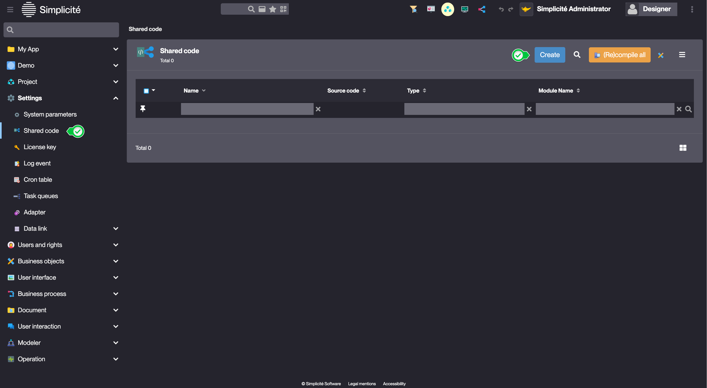
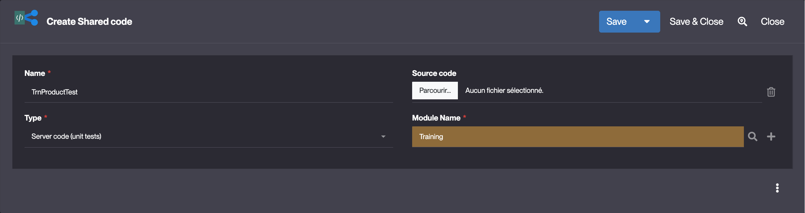
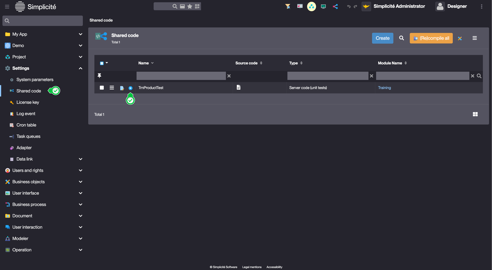
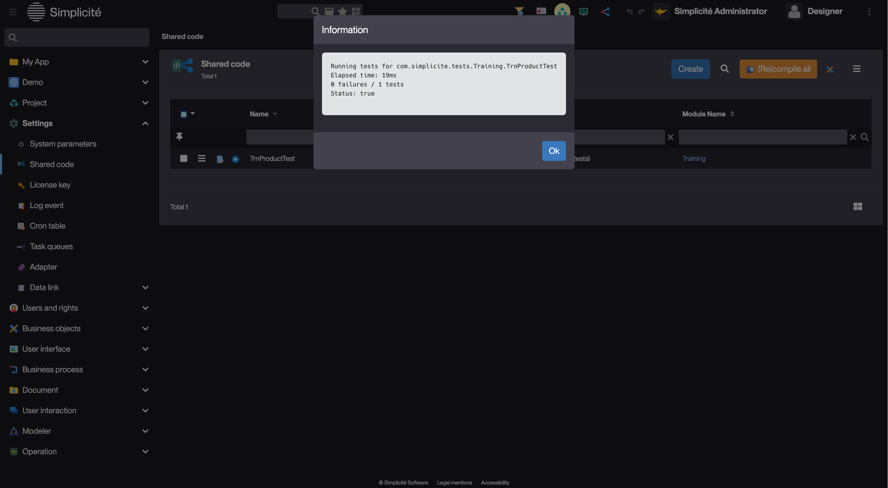

# Building the "Order Management" Training App : Writing unit tests - Shared code

> Prerequisite : [You have a basic understanding of the Simplicité platform, and the steps in "2. Expanding your app" are completed](/category/2-expanding-your-app)

## What is a Shared code ?

Shared code is a configuration object that lets you write reusable code that can be accessed across your entire application. It can be used to write unit tests, extending Platform base classes, writing SQL scripts, etc... [Learn more](/make/settings/shared-code)

## Unit testing the `increaseStock` method

[Previously](/tutorial/expanding/hooks#increase-stock-method) we created an `increaseStock` method for the `DemoProduct` object. Let's write a unit test for this method. 

To do so, follow the steps below :
1. In the **Settings > Shared code** menu, click **Create**

2. Fill in the **Shared code** fields like so : 
    - Name : **TrnProductTest**
    - Type : **Server code (unit tests)**
    
3. Click **Save**
4. Click **Edit**
5. Select **Java** and click **Confirm**

Implement the `TrnProductTest` class like so : 

```simplicite-java title=TrnProductTest.java
package com.simplicite.tests.Training;

import static org.junit.Assert.assertEquals;
import static org.junit.Assert.fail;

import org.json.JSONObject;
import org.junit.Test;

import com.simplicite.util.Grant;
import com.simplicite.util.ObjectDB;
import com.simplicite.util.ObjectField;

/**
 * Unit tests for the TrnProduct business object
 * Tests the product stock management functionality
 */
public class TrnProductTest {

    /**
     * Helper method to get system admin grant for testing
     * @return Grant with system admin privileges
     */
	public Grant getGrant() {
        // Using the system admin grant for testing
        return Grant.getSystemAdmin();
    }
    
    /**
     * Test the increaseStock action
     * Verifies that calling increaseStock increases the product stock by 10 units
     */
    @Test
    public void testIncreaseStock() {
        try {
            // Create a test product with initial stock of 5
            ObjectDB product = getGrant().getTmpObject("TrnProduct");
            // Set test product data using JSON
            product.setValuesFromJSONObject(new JSONObject()
                .put("trnPrdCode", "TEST001")
                .put("trnPrdName", "Test Product")
                .put("trnPrdStock", 5), true, false, false);
            // Save the test product to database
            product.save();
            
            // Get reference to stock field and store initial value
            ObjectField stockField = product.getField("trnPrdStock");
            int initialStock = stockField.getInt(0);
            
            // Execute the increaseStock action on the product
            product.invokeAction("IncreaseStock", null);
            
            // Assert that stock increased by exactly 10 units
            assertEquals("Stock should be increased by 10", initialStock + 10, stockField.getInt(0));
            
            // Cleanup by removing test product from database
            product.delete();
        }
        catch (Exception e) {
            // Fail test and show error if any exception occurs
            fail("Test failed: " + e.getMessage());
        }
    }
}
```
[Source file](TrnProductTest.java)

6. Click **Save**

## Adding `TRN_SUPERADMIN` to the `ADMIN` Group

In the previous code excerpt, we use `Grant.getSystemAdmin()` to instantiate `TrnProduct`. For this to work, we need to add the `TRN_SUPERADMIN` profile to `ADMIN` :

1. In **Users and rights > Groups**, open **ADMIN** 
    > You might need to [remove the module filter](/make/project/module#module-filtering) if ADMIN doesn't appear in the list
2. In the **Profile members** panel, create **TRN_SUPERADMIN** Profile in the **Training** module. 
3. Clear the platform's cache

## Running the unit test

1. Log in using `designer`
2. Access the previously created Shared code
3. Click **Run**
    

:::tip[Success]

:::
