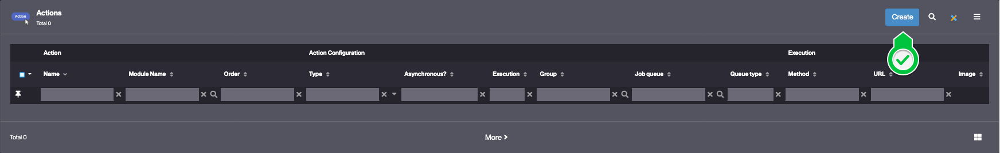

Building the "Order Management" Training App: Adding actions
============================================================

:::note[Prerequisite]

[The Supplier, Product, Client and Order objects must be complete before starting this tutorial](/tutorial/expanding/addobjects)

:::

What is an Action?
------------------

Actions in Simplicité allow users to interact with business objects.

While some actions are built into the platform (e.g., create, edit, bulk update), custom actions can be added
for specific business needs. Actions can be executed on the front end or the back end...
[Learn more](/make/businessobjects/actions)

Creating a front-end Action for the Product Business object
-----------------------------------------------------------

To create an Action for the Product Business object, follow the steps below:

1. In the **Business objects > Actions** menu, click **Create**
   
2. Fill in the Action information like so :
   - Name : **IncreaseStock**
   - Type : **Form**
   - Execution : **Front**
   - URL : `javascript:alert("To be implemented...")`
3. Click **Save**
4. In the **Functions** panel linked to the Action, click **Create**
   
5. Fill in the Function information like so :
   - Function : **TRN_PRD_INCREASE_STOCK_A**
   - Object : **TrnProduct**
   > For more information about Functions, see [Functions](/make/usersrights/function)
6. Click **Save**
7. In the **Grant** panel linked to the **Function**, click **Associate Groups**
   
8. Select the **TRN_SUPERADMIN** Group and click **Apply the selection**
   
9. Click **Save & Close**

:::tip[Success]

The **Increase stock** Action is now granted to the **TRN_SUPERADMIN*** Group.

:::

Test the Action with the usertest User
--------------------------------------

1. Clear the platform's cache and log in using **usertest**
   > For a detailed step-by-step, see : [Testing the User](/tutorial/getting-started/user#activating-and-testing-the-user)

2. Open an existing Product

:::tip[Success]

The "Increase stock" button is visible

An alert is displayed when clicked

:::
