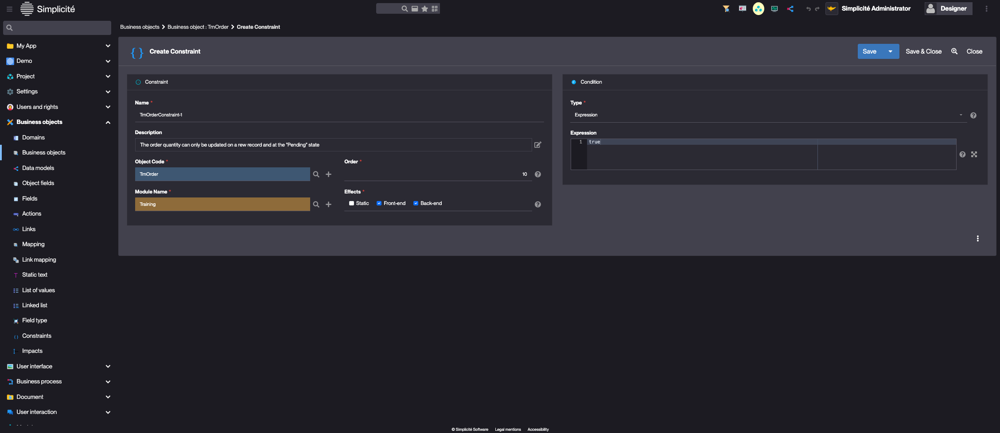
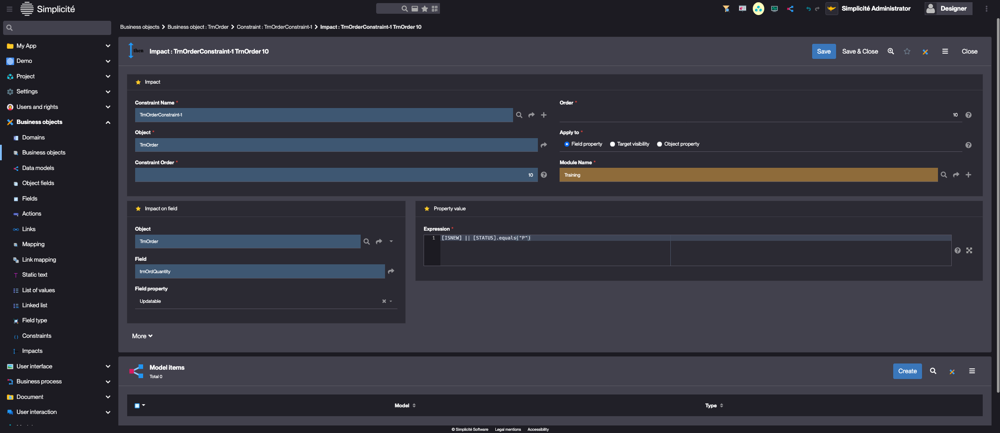

Building the "Order Management" Training App : Configuring business rules - Constraints
=======================================================================================

:::note[Prerequisite]

[The Order object has a state model](/tutorial/expanding/states)

:::

What is a Constraint?
---------------------

In Simplicité, constraints allow to enforce business rules by dynamically controlling object properties, visibility,
and behavior, while ensuring secure backend validation...

[Learn more](/make/businessobjects/constraints)

Adding a Constraint to the Order Business Object
------------------------------------------------

Create a Constraint to implement the following business rule:
_The order quantity can only be updated on a new record and at the "Pending" state_

To do so, follow the steps below:

1. In the **Business objects > Business objects** menu, open **TrnOrder**
2. In the **Constraints** panel linked to the Business object, click **Create**
   
3. Fill in the Constraint information like so :
   - Name : **TrnOrderConstraint-1**
   - Description : "The order quantity can only be updated on a rew record and at the "Pending" state" (click the _edit_ button to change the description)
   - Order : **10**
   - Effects **Front-end | Back-end**
   - Type : **Expression**
   - Expression : **true**
   
4. Click **Save**
5. In the **Impacts** panel, click **Create**
   
6. Fill in the Impact information like so:
   - Order : **10**
   - Apply to : **Field property**
   - Object / Field : **trnOrdQuantity** (use the _magnifying glass_ button to select the field)
   - Field property : **Updatable**
   - Expression : `[ISNEW] || [STATUS].equals("P")`
   > `[ISNEW]` returns `true` if the record is in a Creation context
   > `[STATUS]` return the value of the `trnOrdState` field

   

7. Click **Save & Close**

Test the Constraint with the usertest User
------------------------------------------

Clear the platform's cache and log in using **usertest**
> For a detailed step-by-step, see : [Testing the User](/tutorial/getting-started/user#activating-and-testing-the-user)

:::tip[Success]

For a new Order, the **Quantity** field is updatable

For a Validated Order, the **Quantity** field is read-only

:::
