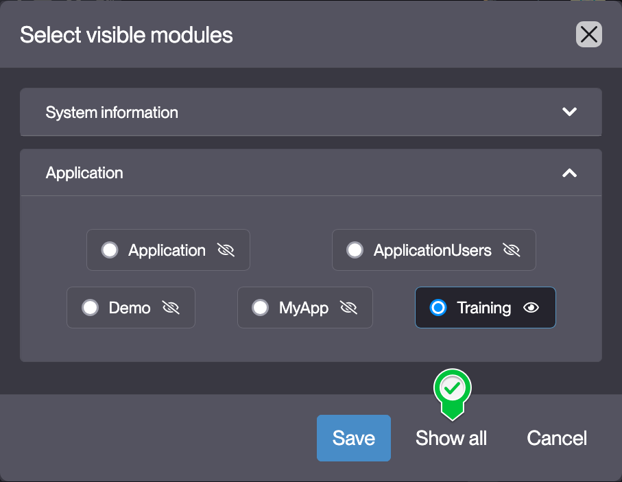
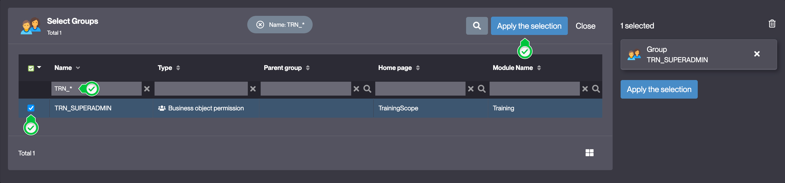
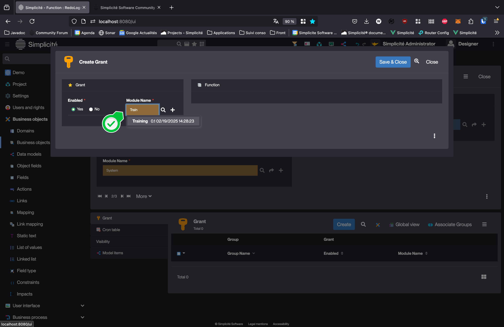

# Building the "Order Management" Training App : Adding a Change Log

> Prerequisite : [The Supplier, Product, Client and Order objects are linked together](/tutorial/expanding/relations)

## What is a Change Log ?

A Change Log allows to monitor all of the changes done to a record... [Learn more](/make/operation/sessions/change-log)

## Adding a Change Log to the Order Business Object

To add a Change Log to the TrnOrder Business object, follow the steps below : 

1. In the **Business objects > Business objects** menu, open **TrnOrder**
2. In the **Options** tab, check "Change log" in the **Data history** field  
    
3. Click **Save**

The system object **RedoLog** is now linked to the **TrnOrder** Business object. For users to access it, it has to be granted to them.

### Granting the RedoLog object

To grant the RedoLog object to the TRN_SUPERADMIN Group, follow the steps below :
1. Click the **Visible modules** button in the header   
    
2. Click **Show all**  
    
    > For more information about module filters, see [Module filters](/make/project/module#module-filtering)
3. In the **Business objects > Business objects** menu, open **RedoLog**  
    
4. Open the **RedoLog-R** Function in the Functions list linked to the RedoLog object  
    
5. Click **Associate Groups** in the Grant list linked to the Function object  
    
6. Search "TRN_*" in the **Name** column, check **TRN_SUPERADMIN** and click **Apply the selection**  
    
7. Change the **Module Name** to "Training" :
    - Click inside the field, and start typing "Training"a
    - Click the *magnifying glass* button and select Training  
    
8. Click **Save & Close**

## Test the Change Log with the usertest User

1. Clear the platform's cache and log in using *usertest*
    > For a detailed step-by-step, see : [Testing the User](/tutorial/getting-started/user#activating-and-testing-the-user)
2. Open an Order
3. Change the value of the **Quantity** field
4. Click **Save**

:::tip[Success]
  The "Change Log" list shows the change in quantity
    
:::