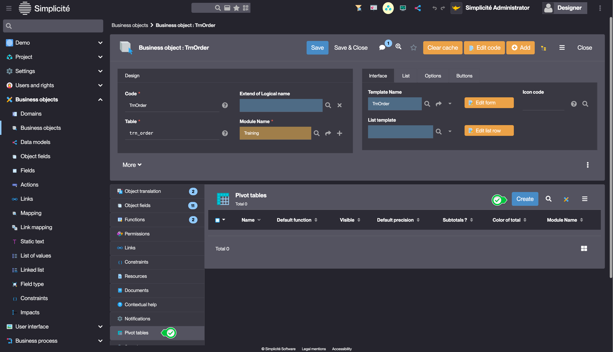
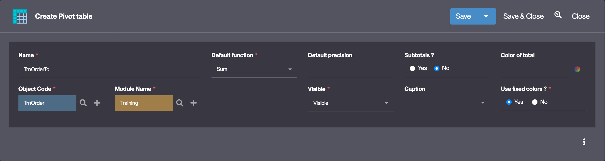
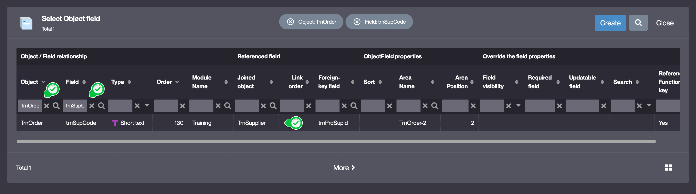
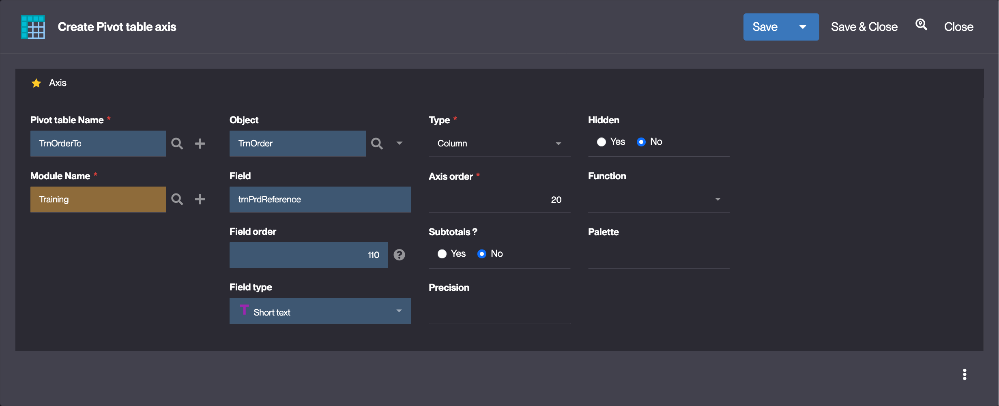
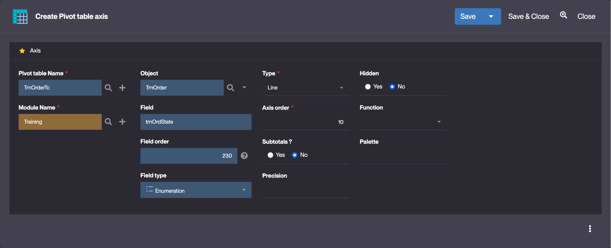
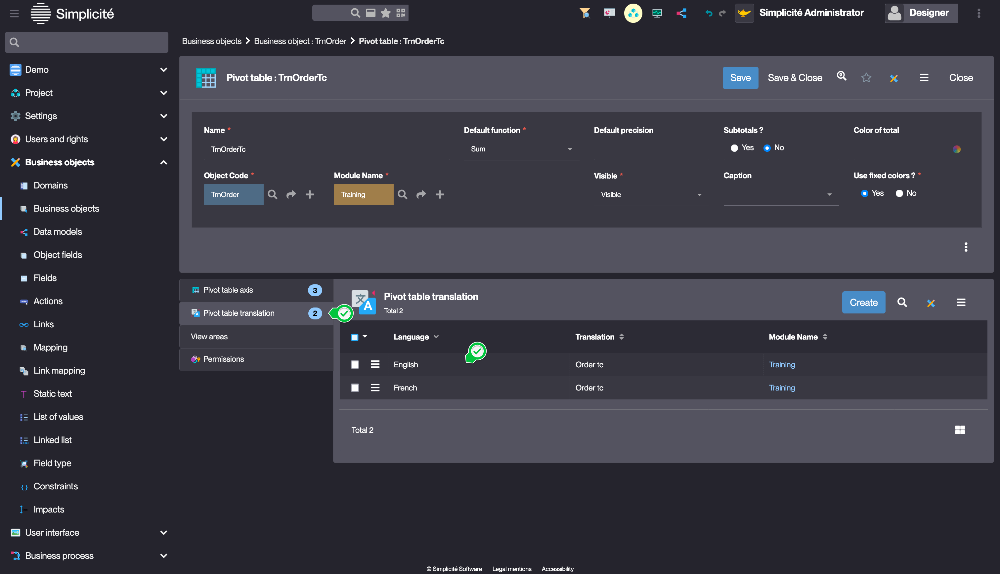
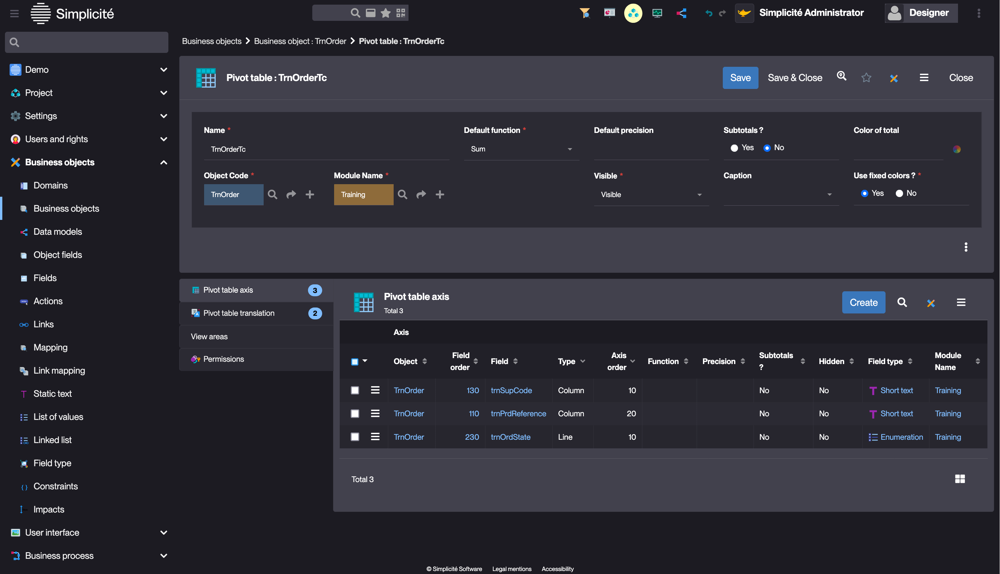
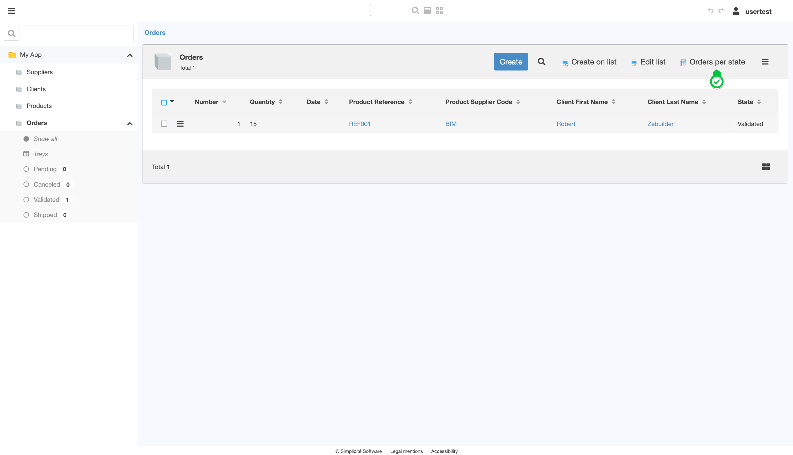
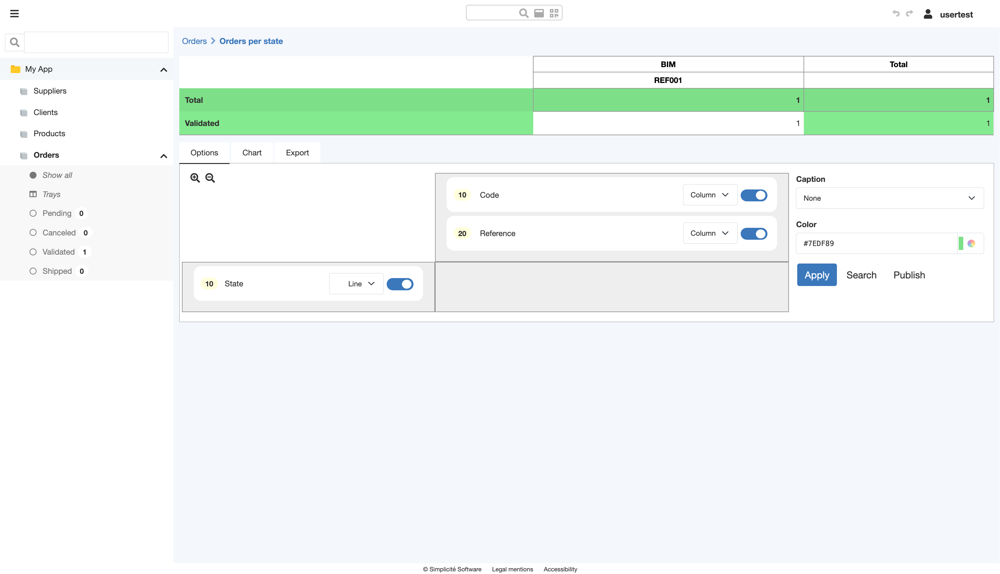

# Building the "Order Management" Training App : Creating a Pivot table

> Prerequisite : [The Order object has a state model](/tutorial/expanding/states)

## What is a Pivot table ?

Pivot tables provide a powerful way to analyze data by cross-referencing fields within a business object. Users can configure tables by selecting which fields appear as rows, columns, and values, with various customization options like filtering, axis swapping, and export capabilities... [Learn more](/make/userinterface/objectsrendering/pivot-table)

## Adding a Pivot table to the Order Business object

To add a Pivot table to the TrnOrder Business object, follow the steps below : 

### Creating the pivot table

1. In the **Business objects > Business objects** menu, open **TrnOrder**
2. In the **Pivot tables** list linked to the Business object, click **Create**  
    
3. Fill in the Pivot table information like so :
    - Name : **TrnOrderPt**
    - Default function : **Sum**
    - *other required values should be set by default*  
    
4. Click **Save**

### Adding axes to the pivot table

1. In the **Pivot table axis** list linked to the Pivot table, click **Create**  
    
2. Fill in the Pivot table axis information like so :
    - Object : 
        - Click the **magnifying glass* icon 
        - Search "TrnOrder" in the **Object** column and "trnSupCode" in the **Field** column  
         
        - Click on the **trnSupCode** field (the Supplier Code linked to the order)
    - Type : **Column**
    - Axis order : **10**  
    
3. Click **Save & Close**

Add another axis to the pivot table (Product reference) :

-  Fill in the Pivot table axis information like so :
    - Object : 
        - Click the **magnifying glass* icon 
        - Search "TrnOrder" in the **Object** column and "trnPrdReference" in the **Field** column  
        - Click on the **trnPrdReference** field
    - Type : **Column**
    - Axis order : **20**  
    

Add another axis to the pivot table (Order state) :

-  Fill in the Pivot table axis information like so :
    - Object : 
        - Click the **magnifying glass* icon 
        - Search "TrnOrder" in the **Object** column and "trnOrdState" in the **Field** column  
        - Click on the **trnOrdState** field 
    - Type : **Line**
    - Axis order : **10**  
    

### Adding a label to the Pivot table 

1. In the **Pivot table translation** list linked to the Pivot table, open the **English** item  
    
2. Change the translation :
    - Translation : **Orders per state**
3. Click **Save & Close**

The Pivot table should be configured like so : 

## Test the Pivot table with the usertest User

1. Clear the platform's cache and log in using *usertest*
    > For a detailed step-by-step, see : [Testing the User](/tutorial/getting-started/user#activating-and-testing-the-user)

2. Open the list of Orders and click **Orders per state**  
    

:::tip[Success]

- The "Orders per state" pivot table is displayed
    
- You can create more orders in different states to add data to the pivot table.
- In the <b>Chart</b> tab, you can generate a chart for the pivot table.
- The <b>Search</b> button filters the data used for the pivot table

:::