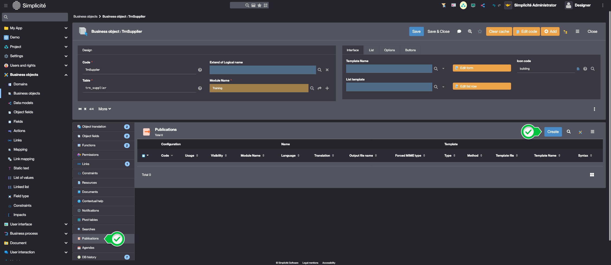
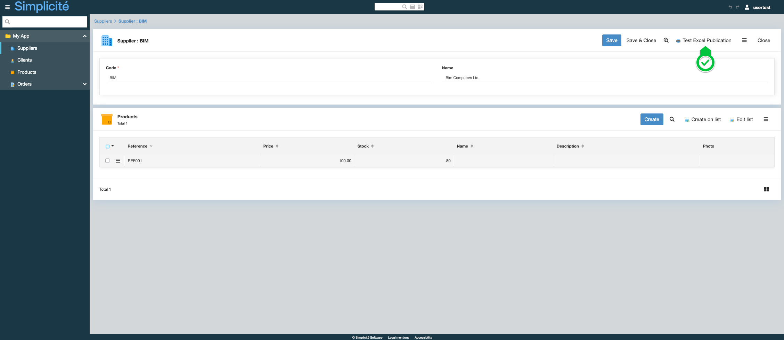

Building the "Order Management" Training App : Customizing exports - Publications
=================================================================================

:::note[Prerequisite]

[The Supplier, Product, Client and Order objects are linked together](/tutorial/expanding/relations)

:::

What is a Publication?
----------------------

In Simplicité, publications allow you to generate custom exports. Whether using template files, expressions,
or Java methods, publications offer flexible ways to produce structured documents and reports...

[Learn more](/make/userinterface/objectsrendering/publications)

Exporting in Excel the list of a Supplier's Products
----------------------------------------------------

To add a Publication to TrnSupplier, follow the steps below :

1. In the **Business objects > Business objects** menu, open **TrnSupplier**
2. In the **Publications** panel, click **Create**
   
3. Fill in the Publication information like so :
   - Code : **TrnSupPublication**
   - Usage : **On object only**
   - Visibility : **Visible**
   - Translation : **Test Excel Publication**
   - Output file name : **Export-[VALUE:trnSupName]**
   - Forced MIME type : **Microsoft Excel**
   - Type : **Method**
   - Method : **printExcel**
     
4. Click **Save & Close**
5. Open the Code editor by clicking 
6. Click **Confirm**
7. Add the `printExcel` method to the `TrnSupplier` Class :

   ```java
   import org.apache.poi.ss.usermodel.Sheet;
   [...]
   public byte[] printExcel(PrintTemplate pt) {
       //SQL query : List of products linked to the Supplier
       String sqlQuery = "select trn_prd_reference, trn_prd_name, trn_prd_stock, trn_prd_price from trn_product where trn_prd_sup_id="+getRowId();
       try {
           ExcelTool xls = new ExcelTool(true);
           Sheet sheet = xls.addSheet("Simple sheet");
           int line = 0;
           // use Grant.query to retrieve a List<String[]> containing the results from the query defined above
           for(String[] row : getGrant().query(sqlQuery)){
               ExcelTool.ExcelRow nRow = new ExcelTool.ExcelRow(line++);
               int col=0;
               for (String cell : row)
                   nRow.add(new ExcelTool.ExcelCell(col++, cell));
               xls.addRow(sheet, nRow);
           }
           return xls.generateToByteArray();
       } catch(Exception e){
           AppLog.error(e, getGrant());
           return null;
       }
   }
   ```

8. Click **Save**

Test the Pivot table with the usertest User
--------------------------------------------

1. Clear the platform's cache and log in using **usertest**
   > For a detailed step-by-step, see : [Testing the User](/tutorial/getting-started/user#activating-and-testing-the-user)

2. Open a Supplier
3. Create Products for the Supplier if it has none

:::tip[Success]

An Excel spreadsheet is downloaded when the Publication button is clicked



:::
