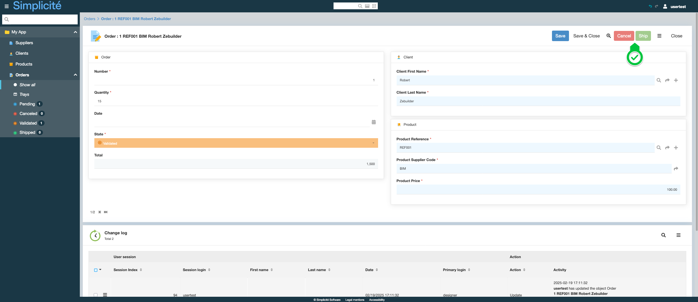

Building the "Order Management" Training App : Adding icons and a theme
=======================================================================

:::note[Prerequisite]

[The Order has a state model](/tutorial/expanding/states) and a [home page](/tutorial/expanding/views) exists

:::

What is a Theme?
----------------

A theme defines the logo and the main colors of the interface...

[Learn more](/make/userinterface/themes)

Creating a Theme
----------------

To create a Theme and add it to the App, follow the steps below :

1. In the **User interface > Themes** menu, click **Create**
   
2. Fill in the Theme's information like so :
   - Name : **TrnTheme**
   - Base theme : **Dark**
   - Module Name : **Training**
   - Header logo : 
   
3. Click **Save**
4. In the **User interface > Views > Home page** menu, open **TrainingScope**
5. In the **Home page** tab, click on the _magnifying glass_ button next to the **Theme name** field
   
6. Select the previously created **TrnTheme** theme
   
7. Click **Save**

Adding icons to the Supplier, Product, Client and Order
-------------------------------------------------------

To add an icon to a Supplier Business object, follow the steps below :

1. In the **Business objects > Business objects** menu, open **TrnSupplier**
2. Click the _magnifying glass_ on the **Icon code** field to select an icon
   
3. Click **Save**

Repeat these steps for the TrnProduct, TrnClient and TrnOrder objects.

Styling the Order's state field
-------------------------------

To add colours and icons to the Order's state field, follow the steps below :

1. Open the **trnOrdState** field :
   - Via the list of Orders, click on the **State** label
     
   - Via the **Business objects > Fields** menu
     
2. Click on the _arrow_ next to the **List of values** field, to open the **TRN_ORD_STATE** List of values
   
3. In the **List code** list linked to the List of values, open the first (Pending) List code
   
4. Fill in the List code information like so :
   - Background color : **#6fa8dc**
   - Icon : **icon/color/btn_blue**
   - Text color : **#ffffff**
   - Display on list : **Icon | Label**
   
5. Click **Save & Close**

Repeat these step 3 -> 5 for:

- Canceled:
  - Background color : **#e06666**
   Icon : **icon/color/btn_red**
  - Text color : **#ffffff**
  - Display on list : **Icon | Label**
- Validated
  - Background color : **#f6b26b**
  - Icon : **icon/color/btn_orange**
  - Text color : **#ffffff**
  - Display on list : **Icon | Label**
- Shipped
  - Background color : **#93c47d**
  - Icon : **icon/color/btn_green**
  - Text color : **#ffffff**
  - Display on list : **Icon | Label**

Test the Theme with the usertest User
-------------------------------------

1. Clear the platform's cache and log in using **usertest**
   > For a detailed step-by-step, see : [Testing the User](/tutorial/getting-started/user#activating-and-testing-the-user)

:::tip[Success]

- The new Theme and header logo are applied to the App
- The objects have icons
- The Order's state field have icons
  
- The Order's state transition actions have colours
  

:::
