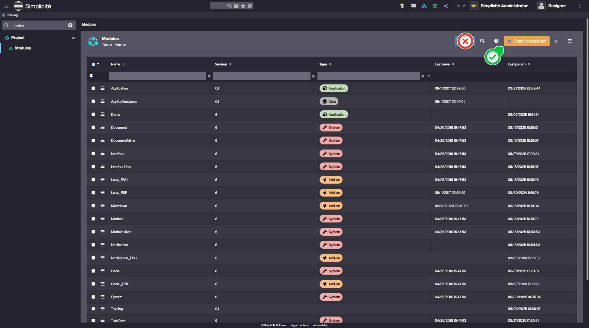
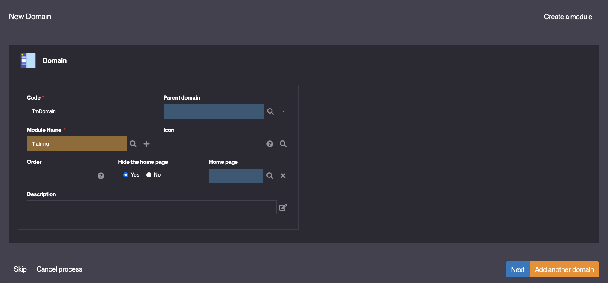
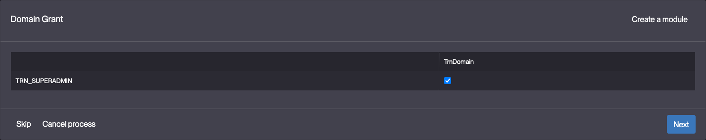
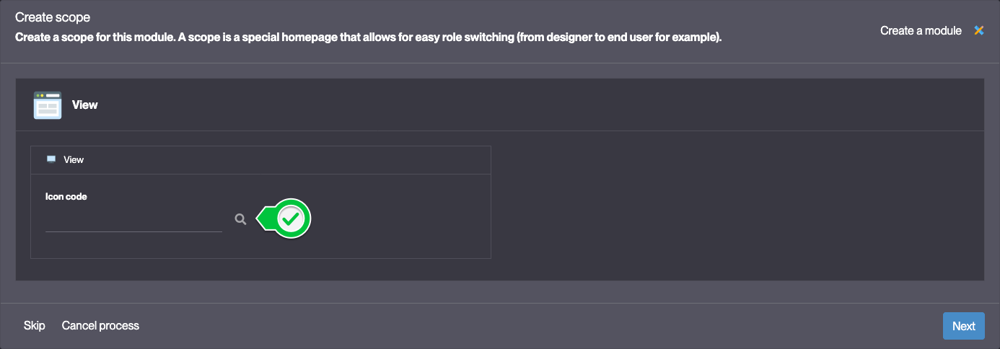
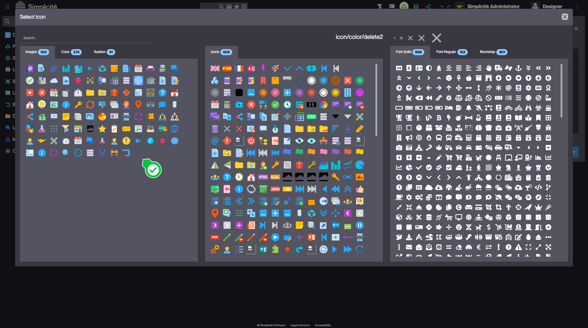

# Building the "Order Management" Training App : Creating a Module

## What is a Module ?

A module in Simplicité is the fundamental unit that encapsulates all configuration objects of an application, serving as its exportable configuration package... [Learn more](/make/project/module)

## Creating a Module

The first step to building an app in Simplicité is by creating a module.  

To create a module, follow the steps below :

1. Do one of the following :
    - Click **Start by creating a new module** on Simplicité's home page
    - Click **Creation assistant** in Project > Modules 
    
2. Fill in the Module fields like so :
    - Name : **Training**
    - Type : **Application**
    - Prefix : **trn**  
    
3. Click **Next**
4. Fill in the Group fields like so :
    - Name : **TRN_SUPERADMIN** *(if you entered a prefix in the previous step, the platform will suggest a group name that respects the conventions)*  
        
    > For more information about Groups, see the [Groups](/make/usersrights/groups) section. 

5. Click **Next**
6. Fill in the Domain (in Simplicité, a Domain is a menu) fields like so :
    - Name : **TrnDomain**  
        
    > For more information about Domains, see the [Domain](/make/businessobjects/domains) section. 
7. Click **Next**
8. Fill in the Translations (Menu display label) for your Domain :
    - English : **My App**  
         
9. Click **Next**
10. Grant the Group to the Domain :
    - Check the box  
         
11. Click **Next**
12. Fill in the View field like so :
    - Icon : click the magnifying glass and pick an icon
        
        
    > For more information about Views, see the [View](/make/userinterface/views/home-page) section.
13. Click **Next**

:::tip[Success]
The <b>Training</b> Module is created and opened.
    
:::
