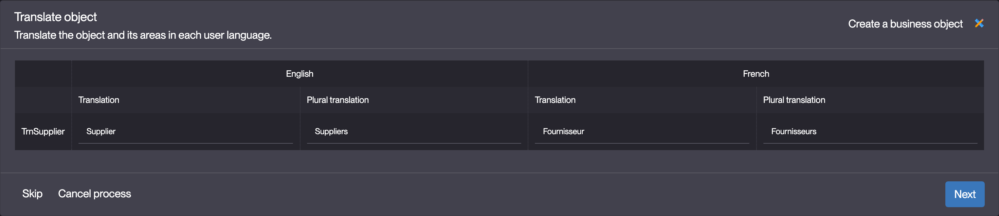

Building the "Order Management" Training App : Creating a Business object
=========================================================================

:::note[Prerequisite]

[A module, domain and group must be created before starting this tutorial](/tutorial/getting-started/module).

:::

What is a Business object?
--------------------------

Business objects are the cornerstone of the platform, structuring data, enforcing rules, and driving key features...
[Learn more](/make/businessobjects/business-objects)

Creating a Business object
--------------------------

To create a Business object, follow the steps below :

1. Click **Creation assistant** in Business objects > Business objects
   
   > This assistant is also available via the Modeler, for more information see the [How to create an object using the modeler](/make/businessobjects/business-objects#creation-assistant-via-the-modeler)
2. Fill in the Object information like so :
   - Code : **TrnSupplier**
   - Table : **trn_supplier**
   - Module Name : **Training**
   - Prefix : **sup**
   
3. Click **Next**
4. Fill in the Translation (label displayed to the end user) for your Object :
   - English Translation : **Supplier**
   - English Plural translation : **Suppliers**
   
5. Click **Next**
6. Select a Function for the [previously](/tutorial/getting-started/module) created Group :
   - **Read, create, update, delete**
   
7. Click **Next**
8. Add the Object to the [previously](/tutorial/getting-started/module) created Domain
   - Should be selected by default
   
9. Click **Next**

:::tip[Success]

The `TrnSupplier` Object is created and opened.

:::
